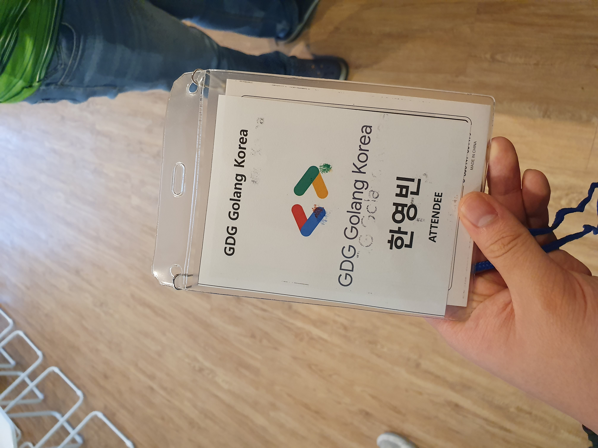
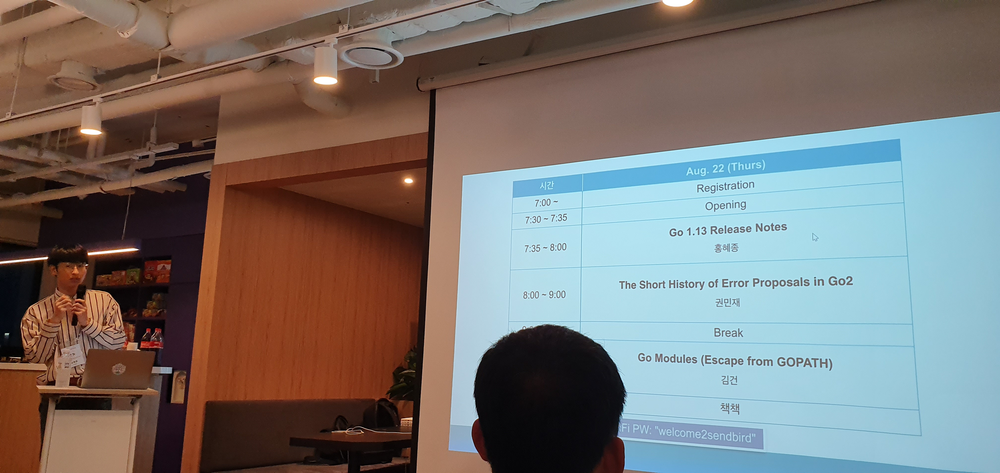
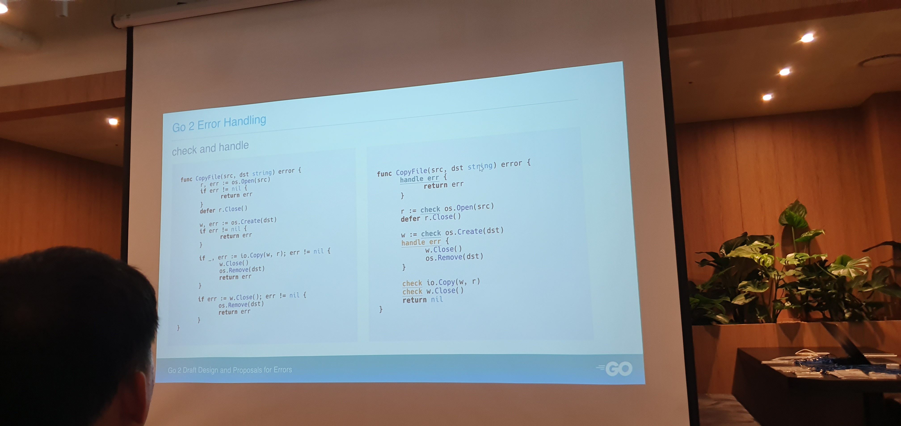
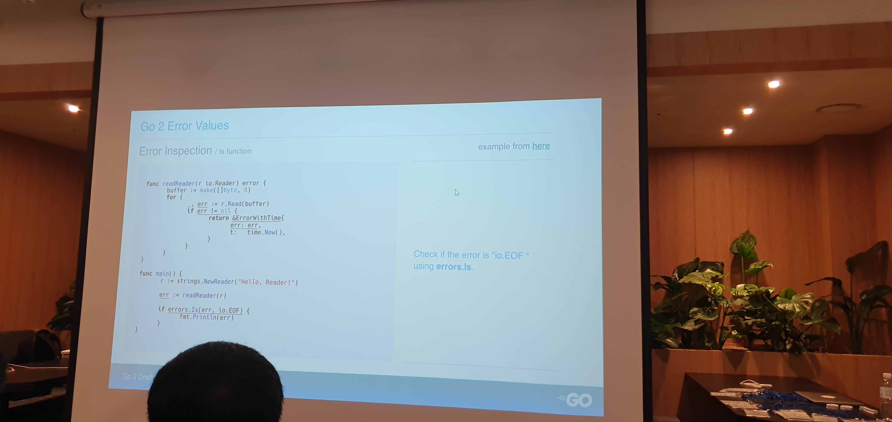

최근 3~4주간 Go언어에 관심이 생겨 참조문서 보면서 사용해 보고 있는데요, 때마침 이번 휴가중에 Go 1.13 Release Party 행사가 있어서 참석하고 왔습니다.
장소는 선릉역 근처에 있는 센드버드 코리아(Sendbird Korea) 에서 진행되었습니다.

## Go 1.13 Release notes

홍혜종 님께서 곧 나올 Go 1.13 에서 달라진 점을 릴리스 노트 초안을 보여 주시면서 소개해 주셨습니다.
알려주신 내용을 간단히 정리하자면 아래와 같습니다.

- Go 는 RC, Beta 등 정식 버전이 아닌 버전을 `go get` 으로 설치하면, `go` 명령어와 별개로 사용이 가능합니다.
  - 예: GO 1.13 RC1 의 경우 `go1.13rc1` 이라는 별도의 명령어 사용.
- 릴리스 노트 페이지에서 소스보기를 하면, 각 항목마다 CL 코드가 달려있는데, 이 코드로 해당 변경사항과 관련 이슈 등에 대해 더 자세히 알아볼 수 있다고 합니다.

### 문법
- Go 는 스타일 숫자 리터럴 채택. 지난 약 10년간 다른 언어는 C스타일 리터럴 표현이 달라졌는데 이를 반영하여 변경
  - 원래 이진수 초기화 시 앞에 0b 붙여서 하는 기능이 없었음.
  - 8진수는 소문자/대문자 O 붙여서 표현 가능
  - 10진수 숫자 끊어세기를 언더바로 가능(예: 10,000 -> 10_000)

- 쉬프트 연산(<<, >>)이 부호 없는 정수만 가능했으나, 부호 붙은 것도 가능.
  - 17년에 Russ Cox 가 제안했는데, 이제야 반영되었다고 합니다. 오버플로우가 없다 하네요.

### 툴링(Tooling)
- `go env` 명령으로 Go 에서 사용하는 환경변수를 관리할 수 있습니다.
  - `go env -m` : 지정된 곳에 환경변수 저장
  - `go env -u` : 환경변수 삭제
- `go version -m "bin"` : Go 바이너리 파일의 의존성 정보를 출력
- `go build -trimpath` : 실행 파일에 로컬 디렉토리 경로 제거
- Escape Analysis(컴파일 시 각 변수나 함수, 구조체 등을 스택과 힙 중 어디에 할당할 지 분석하는 프로세스) 구현체가 새것으로 바뀜
- 바이너리에 더 이상 `godoc`이 포함되지 않는다고 합니다. 이는 Go 툴체인 바이너리의 용량을 줄이기 위해서 라고 합니다.
- 패닉 메시지 더 자세히 표시
- `defer` 가 한번만 호출되면 스택에 할당

### 런타임
#### Garbage Collector
Go의 GC는 메모리 해체를 너무 느슨하게 해서 실행하는 동안 OOM(Out of Memory)위험이 크다고 합니다(저도 Go 써본지 얼마 안 되었지만... 공감이 좀 많이 되는거 같네요.) 해결책은 `debug.FreeOSMemory()` 함수를 직접 호출하는 것인데. 이건 비용이 너무 크다고 합니다. 이를 보완하기 위해 여러 해결책이 도입되어 왔다고 하는데요.
- 1.11 에서는 2.5분마다 소거 프로세스 작동. 5분 이상 미사용 된 메모리 제거
- 1.12 에서는 힙 할당 전 소거 프로세스가 돌아갑니다.
- 1.13 에서는 별도의 백그라운드로 소거 프로세스가 추가로 돌면서 불필요한 메모리를 해체한다고 합니다.

### 코어 라이브러리
- TLS 1.3 기본 지원
- `context` 패키지 `fmt` 의존성 제거
- `sync.Pool` 
  - 기존에 `mutex` 로 동기화를 해서 충동 방지를 했으나, 이제 이를 제거해서 속도를 빠르게 함
  - `sync.Pool` 은 원래 작은 사이즈 다루기에 좋음. 큰거는 오히려 느림
- 점진적인 맵(Map) 초기화
- 마이크로초, 밀리초 지원 추가
- `Format()`, `Parse()` 함수에 day-of-year 지원 추가




## Go 2, Go 1.13 Error Proposals
바로 이어서 권민재 님께서 Go 에서의 오류 핸들링 방법과 함께 Go 2, Go 1.13 에 오기 까지 제안된 `Error` 와 관련되어 제안된 것들을 소개해 주셨습니다.
Go 에서는 Go 2 초안에서 주요 주제로 다룰 정도로 오류와 관련된 것이 많이 부족한 것이 많다고 합니다. 이를 개선하기 위해 어떤 논의가 있었는지도 알려주셨습니다.

### Error Handling

- 지금 사용되는 Error Handling 방법
  - Check & Return - if 로 체크하고 리턴
  - Panic, recover and return - recover() 를 미리 준비
- 오류 핸드링 문제점
  - 오류 추적이 어려움

지금까지 수많은 Proposal 이 있었는데, 그 중 제대로 논의 된 것은 아래와 같다고 합니다.
- Handling : `check` and `handle`, `try`, `if err != nil`
- Value : Error inspection(`Unwrap`, `Is`, `As`), Error formatting, Error stack

`check`, `handle` 은 `panic`, `recover` 와 유사합니다.
handling 코드를 하나의 블록으로 합칠 수 있고. 스코프 작동은 defer 와 유사합니다.  
`defer` 블록 안에서는 `check` 사용 불가.(defer 보다 `handle` 이 먼저 돌아가기 떄문입니다.)
```go
func printSum(a, b string) error {
	handle err { return err } // 오류 핸들링 블록
	x := check strconv.Atoi(a) // 오류가 발생할 수 있는 함수 호출시 check 를 앞에 붙임
	y := check strconv.Atoi(b)
	fmt.Println("result:", x + y)
	return nil
}
```

`try` - 1.14 에 들어갈 뻔 하다가 반려 되었다고 합니다. 아래와 같은 특징이 있습니다.
- 내장 함수 형태. 핸들러는 따로 없고, `error` 라는 `named results` 를 이용
- 하위 호환성 보장(새로운 키워드가 아닌 새로운 내장 함수를 추가하는 것이여서 polyfill 형태로 하위 버전에 제공도 가능하다 합니다.)
하지만 Go 커뮤니티에서는 이 방식이 도입될 경우, 핸들링 방식이 파편화 되고 코드 일관성이 깨지는 등의 이유로 부정적으로 보았으며, 결국 반려 되었다고 합니다.

> `try` 적용 전 오류 핸들링
```go
f, err := os.Open(filename)
if err != nil {
	return …, err  // zero values for other results, if any
}
```
> `try` 적용 후 오류 핸들링 예시
```go
f := try(os.Open(filename))
```



### Error Value
- Sentinal error - 오류 값 그 자체. 동일성 확인 가능
- Type assertion - 오류가 특정 타입 오류 가지는지 여부 확인 / 타입 캐스팅으로 타입 확인
- Ad-hoc check - 패키지가 구현하는 함수 사용
- Substring search - 오류 메시지 검사(권장 안함)

Error inspection
오류의 근본적 원인과 생성된 순서를 자세히 표시

감싸진(Wrap) 오류를 한 단계식 까면서, 각 단계별 오류를 검사하고 근본적인 원인까지 확인 가능한 기능에 대해 논의가 이뤄졌다고 합니다. 이를 통해 `Wrapper` 인터페이스가 제안 되었습니다.
- Wrapper 인터페이스. 
  - 내부 오류를 반환하는 함수(`Unwrap`) 구현
- `Is`, `As` 로 체이닝된 오류를 검사
- `As` 는 `Is` 와 유사하나, 하나의 오류만 검사할 수 있음.

오류 포매팅을 위한 `Formatter` 인터페이스 제안 되었으나, `Errorf()` 사용시, `%w` 서식문자를 사용하면 자동으로 레핑되기 떄문에 포함하지 않기로 했다고 합니다.

이렇에 논의 된 것중, Go 1.13 에는 `Unwrap`, `Is`, `As`, `%w` 이렇게 4가지가 추가될 예정이라 합니다.




## Go Modules
Go 1.11 부터 Go Modules 이 추가 되면서 의존성 관리가 편리해 졌는데요, 그 전에는 어떻게 의존성 관리가 이뤄졌는지 그리고 Go Modules 명령어에 대해서도 김건 님께서 간단히 설명해 주셨습니다. 이 때는 10쯤 되어서 조금 피곤하다보니 중간에 살짤 졸아서 발표 내용을 다 정리 하지는 못했습니다.

- 2009: 초기에는 makefiles 사용
- 2010: goinstall 로 대체, 별다른 설정 없이 패키지 바로 다운로드하여 사용 가능.(Import Path Convention)
- 2011: 흩어진 툴을 묶고 대체 가능한 go 커멘드 발표. 패키지 버저닝이 없어, 업데이트 시 변경점 예측이 불가능한 점 등의 큰 문제점을 가져옴
- 2013: 공용 패키지 하위 호환성 준수, 하위 호환성 꺠지면 path 바꿔서 새 패키지 생성
- 2014: gopkg.in - github 의 리다이렉트 + import path 를 통한 버전 참조 기능
- 2015: semantic versioning 채택
- 2016: gophercon - 패키지 관리 도구 토론, 관련 그룹 형성
- 2017: 1.9 출시와 함께 dep 도구 추가
- 2018: 패키지 버저닝 제안(Russ Cox)
  - 임포트 호환성 규칙 - 임포트 경로가 동일하면 반드시 호환 가능해야 함.
- Go Modules 도입과 함께 `go mod` 명령어 추가

Go Modules in Go 1.13
- `go get` - 이제 Go Modules 환경까지 고려하여 작동한다고 합니다
- Proxy 가 기본 활성화 되어, 가까운 모듈 미러에서 모듈을 더 빨리 받을 수 있다고 합니다.

## 먹을거리(?)
행사 시작 시간이 저녁 시간임을 고려해서, 피자와 음료를 제공해 줘서 두 조각 정도 맛있게 먹었습니다.


## 결론
휴가 중 운이 좋게도 행사 날짜가 겹처서 참석하고 왔는데, 저녁 시간이라 조금 피곤했지만 발표 내용이 꽤 알차가 좋아서 참석하기 잘 했다는 생각이 듭니다.
마지막에 경품 당첨은 안 되었지만. 그래도 많은것을 알아가는 행사였던 것 같습니다.

## 참고 링크
- [GDG Golang Korea Go 1.13 릴리즈 파티](https://www.meetup.com/ko-KR/GDG-Golang-Korea/events/263743219/)
- [발표자료 모음](https://github.com/golangkorea/gophercon-talks?fbclid=IwAR1rVAg45ndqBW-Pw61jA2Kr0jzS7spt99b7P_1TC3GWdQf36UGCnT1b53Y#gdg-golang-korea-go-113-release-party-201908)
- [Go 1.13 Release Notes](https://tip.golang.org/doc/go1.13)
- [Error Handling — Draft Design](https://go.googlesource.com/proposal/+/master/design/go2draft-error-handling.md)
- [Proposal: A built-in Go error check function, "try"](https://github.com/golang/go/issues/32437)
- [Proposal: Go 2 Error Inspection](https://go.googlesource.com/proposal/+/master/design/29934-error-values.md)
- [Using Go Modules](https://blog.golang.org/using-go-modules)