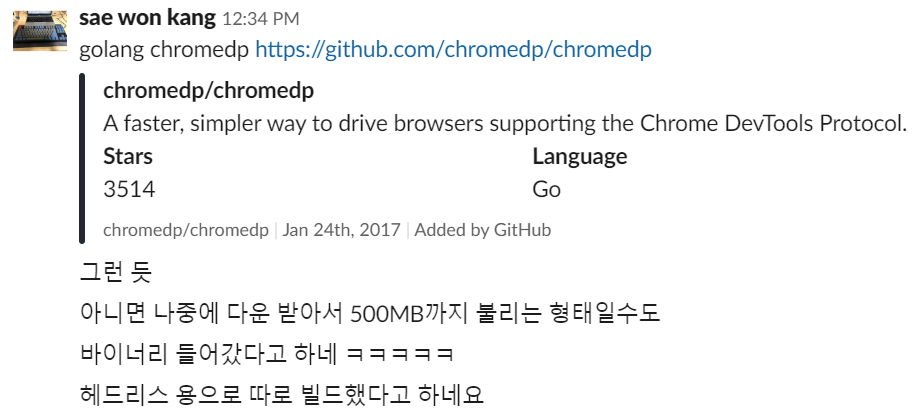

2016년 8월 쯤 부터 지금까지 거의 3년 가까의 참여해 온 프로젝트가 하나 있습니다. SKHU's 모바일 앱 프로젝트 입니다. 2016년 여름에 학교(성공회대학교)의 종합정보시스템을 모바일에서도 사용하고 싶다는 열망이 모여 당시 두명의 같은 학과 선배와 개발하여 출시한 프로젝트 입니다. 프로젝트는 크게 두가지 부분으로 구성됩니다. 사용자 휴대전화에서 돌아가는 모바일 앱, 그리고 학교 종합정보시스템과 모바일 앱 사이에서 통신을 돕는 앱 백엔드 입니다.

이 백엔드는 기존에 Node.js, Express.js, Puppeteer.js, jsdom 등을 이용하여 작성되어 있었는데요. 지난 8월에 Go 기반으로 모두 다시 작성하면서 많은 부분에서 이득을 보았습니다. 이 글에서는 기존 백엔드는 어떻게 변해 왔는지 간단히 설명해 보고, 이를 Go 기반으로 전환한 과정과 실제 배포 과정 등에 대해 이야기 하고자 합니다.

## 기존 Node.js 기반의 백엔드

일반적으로 웹 서비스에서 백엔드는 프론트엔드와 통신을 해서 서버에 데이터를 저장하거나 제공을 하는 역할을 주로 하는데요, SKHU's 앱의 경우는 이미 있는 웹사이트인 [성공회대학교 종합정보시스템](https://forest.skhu.ac.kr)의 데이터를 모바일 앱에 가져와야 했습니다. 하지만 보통의 학교 웹사이트는 페이스북, 구글, 카카오 등과 같은 거대하고 대중적인 서비스에서 서드파티 앱을 통한 API 를 통해 권한이나 데이터를 제공하는 것과 달리 API 가 따로 없습니다. 그래서 데이터를 종합정보시스템에서 가져오려면 크롤링(Crawling) 혹은 웹 스크래핑(Web Scraping) 을 해서 페이지에 직접 접속하여 필요한 데이터를 긁어오는 비공식적인 방법을 통해야 합니다.

인증이 따로 필요 없고, 그냥 들어가면 정보가 표시되는 웹사이트라면 앱에서 크롤링을 간단히 구현해서 불러올 수 있습니다. 하지만 종합정보시스템은 로그인을 먼저 해야하고, 로그인을 해서 얻은 세션값이 있어야 데이터를 긁어올 수 있습니다. 그리고 강의계획서 조회 같은 기능은 과목을 검색해서 나오는 목록을 긁어오도록 구현해야 합니다. 아무래도 앱에서 처리 하기에는 복잡합니다.

그래서 Node.js 기반의 백엔드를 개발하여 종합정보시스템에서 데이터를 긁어오는 작업을 하도록 했습니다. 초반에는 Node.js 에 [Phantom.js](https://phantomjs.org/)를 사용 했습니다. Phantom.js 는 서버에 웹 브라우저를 하나 두고, 이를 정해진 인터페이스를 통해 코드로 브라우저 동작을 제어하여 사람이 폰이나 PC 에서 웹브라우저에서 하는 행위(클릭, 스크롤 등등)을 프로그램이 할 수 있도록 해 주는 일종의 웹 드라이버 입니다.

초기에는 이런 Phantom.js 를 이용하여 아래와 같은 방식으로 로그인을 구현 했습니다. 사용자로부터 받은 학번과 비밀번호를 서버가 종합정보 시스템에 Phantom.js 를 통해 대신 접속하여 로그인울 수행하는 방식입니다.

> [ph_login.js](https://github.com/s-owl/skhu-backend/blob/415b0b61ad5a0ee939d78453edd316aa6c51fd79/routes/ph_login.js)
```js
var system = require('system');
var webPage = require('webpage');
var page = webPage.create();

var logInPageUrl = "https://forest.skhu.ac.kr/Gate/UniLogin.aspx";
var mainPageUrl = "https://forest.skhu.ac.kr/Gate/UniMyMain.aspx";

var ID = system.args[1];
var PW = system.args[2];

// User Agent(웹 브라우저가 서버에 보내는 브라우저 정보)를 IE 로 설정
page.settings.userAgent = "Mozilla/5.0 (compatible; MSIE 10.0; Windows NT 6.1; Trident/6.0)";
page.settings.javascriptEnabled = true;

// 페이지 열기
page.open(logInPageUrl, function(status) {
});

// 페이지 로딩 완료 이벤트
page.onLoadFinished = function(status) {
  if(page.url == logInPageUrl){
    logIn(); //로그인 페이지면 로그인 시도
  }else if (page.url == mainPageUrl) {
    // 메인 페이지면 로그인 완료 처리
    console.log(JSON.stringify(page.cookies));
    phantom.exit();
  }
};

function logIn(){
    // 로그인 페이지에서 학번, PW 입력
  page.evaluate(function(id, pw){
    document.querySelector("input[name='txtID']").value = id;
    document.querySelector("input[name='txtPW']").value = pw;
    document.all.ibtnLogin.click();
  }, ID, PW);
}


page.onError = function(msg, trace) {

  var msgStack = ['ERROR: ' + msg];

  if (trace && trace.length) {
    msgStack.push('TRACE:');
    trace.forEach(function(t) {
      msgStack.push(' -> ' + t.file + ': ' + t.line + (t.function ? ' (in function "' + t.function +'")' : ''));
    });
  }

  console.error(msgStack.join('\n'));
  phantom.exit();
};
```

## Phantom.js 프로젝트의 중단과 Puppeteer 도입
앱이 런칭된지 1년 쯤 되어 2017년 4월 쯤, [Phantom.js 프로젝트의 메인테이너가 메인테이너를 그만 두겠다는 소식이 올라왔습니다.](https://groups.google.com/d/msg/phantomjs/9aI5d-LDuNE/5Z3SMZrqAQAJ)

>**Vitaly Slobodin**   	
>
>Hi,
>
>I want to make an announcement.
>
>Headless Chrome is coming - https://www.chromestatus.com/features/5678767817097216  
>(https://news.ycombinator.com/item?id=14101233)
>
>I think people will switch to it, eventually. Chrome is faster and more stable than PhantomJS. And it doesn't eat memory like crazy.
>
>I don't see any future in developing PhantomJS. Developing PhantomJS 2 and 2.5 as a single developer is a bloody hell.  
>Even with recently released 2.5 Beta version with new and shiny QtWebKit, I can't physically support all 3 platforms at once (I even bought the Mac for that!). We have no support.  
>From now, I am stepping down as maintainer. If someone wants to continue - feel free to reach me.
>
>I want to give credits to Ariya, James and Ivan! It was the pleasure to work with you. Cheers!  
>I also want to say thanks to all people who supported and tried to help us. Thank you!
>
>With regards,  
>Vitaly.

Headless Chrome 이라는 Chrome 기반의 비슷한 프로젝트가 생겼고 점차 현실화 되는 반면, Phantom.js 는 한명에서 개발을 해서 유지보수 하는것과 많은 사람들의 기대에 충족하도록 하는것이 힘들고 어렵다는 이유 였습니다. 새로운 프로젝트 메인터이너가 등장하지 않는 이상 프로젝트 업데이트가 끝난 것과도 같으니, Phantom.js 를 대체할 것을 찾아보았고, 그 결과 [Puppeteer](https://github.com/GoogleChrome/puppetee) 라는 Chrome 기반의 프로젝트를 발견하게 됩니다.

Puppeteer 의 경우 Google Chrome 팀에서 관리를 하다 보니, 상대적으로 프로젝트도 잘 유지되고 제공하는 문서도 좋은것은 물론, API 도 쓰기 좋으면서도 다양하게 잘 구성되어 있었습니다. 팀원들과 의논해서 Phantom.js 에서 Puppeteer 로 전환 하기로 했고, 2017년 12월 부터 Puppeteer 로 전환하는 작업을 시작 하였습니다. 추가적으로 오래된 라이브러리 버전 업데이트 하는 작업까지 같이 진행하였습니다.

또한 2017년 말이 되자, [학사정보시스템](https://sam.skhu.ac.kr) 이라는 기존 종합정보시스템을 점진적으로 대체하는 새로운 시스템이 등장합니다. 이에 대해 대응하는 작업도 같이 진행하여야 했습니다.

Pupeteer 로 전환하는 작업과 오래된 버전의 라이브러리를 업데이트 하는 작업은 생각보다 지지부진 했습니다. 2018년 말에서 2019년 초가 되어서야 작업이 모두 끝났기 때문입니다. 여러 이유가 있지만, 주요한 원인은 생각보다 많은 작업량 그리고 연락 안되는 팀원과 자주 바뀌는 팀원 구성이 작업을 많이 지연 시켰습니다. 초기 팀을 구성했던 선배 둘은 구직이나 대외활동으로 팀에서 빠졌고, SKHU's 프로젝트에 참여하고 싶어 들어온 새 팀원들은 다양한 이유로 연락이 끊기거나, 그렇지 않은 경우 대부분 프로그램을 잘 이해하지 못해 기능을 구현하거나 수정하는데 많은 어려움을 겪었습니다.

결국 혼자 거의 모든 작업을 다 해서 2019년 초에 업데이트를 배포 했습니다. 어떻게든 하긴 했습니다. 로그인의 경우 종합정보시스템과 학사행정시스템까지 모두 처리해야 하다 보니 이전에 비해 많이 복잡해 졌습니다.

> [login.js](https://github.com/s-owl/skhu-backend/blob/cafc9032bee8789468bb549983ecdc66799ca17f/routes/user/login.js)
```js
...
// Prepare headless chrome browser
  const browser = await puppeteer.launch({ignoreHTTPSErrors: true});
  const page = await browser.newPage();
  await page.setJavaScriptEnabled(true);
  await page.setUserAgent(utils.userAgentIE);

  // 페이지 로드 완료 이벤트
  page.on('load', () => {
    if(page.url() == logInPageUrl){
      if(tried){
        // 로그인 페이지 두 번 나오면 로그인 실패
        res.send("LOGIN FAILED!");
      }else{
        // 2. 종합정보시스템 로그인
        (async ()=>{
          let elementHandle = await page.$('#txtID');
          await elementHandle.type(ID);
          elementHandle = await page.$('#txtPW');
          await elementHandle.type(PW);
          elementHandle.press("Enter")
        })();
      }
    }else if(page.url() == mainPageUrl){
      // 5. 종합정보시스템 로그인 완료
      (async ()=>{
        try{
          // 6.페이지 쿠키 추출
          const cookieObj = await page.cookies();
          for(let i in cookieObj){
            credentialOld += `${cookieObj[i].name}=${cookieObj[i].value}; `;
          }
          // 7. 학사행정시스템으로 이동
          await page.goto(utils.samBaseUrl);

        }catch(e){
          console.log(e);
        }
      })();
    }else if(page.url().startsWith(newLogInPageUrl)){
      (async ()=>{
        try{
            // 학사행정시스템 로그인 수행
          let elementHandle = await page.$('#login-username');
          await elementHandle.type(ID);
          elementHandle = await page.$('#login-password');
          await elementHandle.type(PW);
          elementHandle.press("Enter")
        }catch(e){
          console.log(e);
        }
      })();
    }else if(page.url().startsWith(utils.samBaseUrl)){
      //10. 학사행정시스템 로그인 완료 및 쿠키 추출
      (async ()=>{
        const cookieObj = await page.cookies();
        for(let i in cookieObj){
          credentialNew += `${cookieObj[i].name}=${cookieObj[i].value}; `;
        }
        //11.인증 토큰 추출
        console.log("sam.skhu.ac.kr - logged in");
        credentialNewToken = await page.evaluate(() => {
          return document.body.getAttribute("ncg-request-verification-token");
        });

        // 12. 클라이언트에 전송
        res.json({
          "credential-old": credentialOld,
          "credential-new": credentialNew,
          "credential-new-token": credentialNewToken
        });
      })();
    }
  });

  try{
    // 1. 로그인 실행
    await page.goto(logInPageUrl);
  } catch(e){
    console.log(e);
  }
  ```

## Go 로의 전환
서론이 많이 길었는데요, 여기서부터는 최근 있었던 Go 기반 백엔드로의 전환에 대해 예기하겠습니다. 2019년 들어서 서버가 자주 죽으면서 서비스가 중단되는 경우가 잦아 졌습니다. 다양한 원인이 있었는데, 대략 추려보자면 아래와 같습니다.

- 사용하는 AWS EC2 사양이 낮고 디스크 용량도 작음
  - 그런데 Node.js 기반의 도커 이미지는 백엔드 이미지와, 백엔드 이미지가 의존하는 Browserless 이미지(Headless Chrome 컨테이너 이미지)는 합이 약 1GB 가량 할 정도로 큼
- Browserless 이미지를 컨테이너로 띄우면 항상 CPU와 메모리를 너무 많이 소비함

그래서 디스크 용량이 가득 차서 가상머신이 갑자기 죽어 버리거나, 메모리 사용량이 너무 많이 많은 비용이 지출되었습니다. 비용을 더 지불해서 가상머신 사양을 올리고 디스크 용량을 조금 늘려도 그때만 잠깐 해결될 뿐, 얼마 가지 않아 같은 문제가 반복되었습니다. 그러던 중, 2019년 봄 쯤에 새로 들어온 팀원이 GitHub 에 있는 Chromedp 프로젝트와 그 프로젝트에 있는 chromedp, headless-shell 저장소를 소개해 줍니다.



[headless-shell](https://github.com/chromedp/docker-headless-shell) 프로젝트가 아주 인상적이더군요. Chromium 기반의 Headless Shell 형태 프로그램인데도, 서버에서 돌아가는데 필요한 것만 남기고 불필요한 부분을 다 날려서 Docker 이미지 용량이 고작 70~80MB 정도밖에 하지 않습니다. 이걸 보고 바로 기존 백엔드를 Go 로 전환해 볼까에 대한 생각을 하게 됩니다. 아무래도 Go 언어 자체가 동시성 처리에 강하고, 컴파일 하면 간단히 바이너리 하나만 나오는건 물론, 리소스 사용량도 적은 많은 장점이 있어 Go 로 전환을 하기로 결정하고, 어떻게 할지에 대해 검토를 시작했습니다.

- 웹 프레임워크 : [Gin](https://github.com/gin-gonic/gin) 을 선택 했습니다.
  - SKHU's 백엔드는 종합정보시스템, 학사행정시스템과 모바일 앱 사이에서 중간자 역할을 주로 하지 DB 쿼리나 세션 관리 같은 작업이나 프론트엔드를 서버에서 렌더링 하지도 않아. 사용이 간편하면서도 어떤 형태의 웹 서버 개발에 써도 괜찮고, 어느정도 검증된 것을 선택 했습니다. 많은 Go 기반 웹 프레임워크중 GitHub에서 가장 많은 Star 을 가진 것도 선택에 한몫 했습니다. 
- 웹 드라이버 : 앞에서 언급한 headless-shell 을 개발한 팀의 [Chromedp](https://github.com/chromedp/chromedp)를 쓰기로 했습니다.
- HTML Parser, Web Crawler 혹은 Web Scraper : 초반에는 [Colly](https://go-colly.org) 를 고려 했다가, 불필요한 기능이 많기도 하고, Colly 에서 의존성으로 쓰는 GoQuery 만으로도 충분할 듯 하여, [GoQuery](https://github.com/PuerkitoBio/goquery)를 선택했습니다.

저는 Go 를 이때 처음 다뤄보는지라, 가장 먼저 [Tour of Go](https://tour.golang.org/) 를 훝어보면서 문법을 먼저 익혔습니다. Go 문법이 다른 프로그래밍 언어와는 다르게, 키워드도 적고 문법도 심플해서 기본적인 문법을 숙지 하는데 하루 정도면 충분했던 것 같습니다. 예전에 잠깐 Go 를 접해봤을 때는 GOPATH 때문에 제대로 다뤄보지도 못하고 포기 했었는데, 이제는 Go Modules 가 나오면서 그런것도 필요가 없어져 시작 하기가 더 쉬워졌습니다.

Gin 으로 간단한 라우팅 구현부터 시작 했고, 로그인 부분을 먼저 구현 했습니다. Goroutine 과 Channel 을 이용해서 두 사이트에서 로그인을 동시해 하도록 구현 했습니다.

```go
...
type LoginData struct {
	Userid string `form:"userid" json:"userid" xml:"userid"  binding:"required"`
	Userpw string `form:"userpw" json:"userpw" xml:"userpw"  binding:"required"`
}

func Login(c *gin.Context) {

	var loginData LoginData
	if err := c.ShouldBindJSON(&loginData); err != nil {
		c.String(http.StatusBadRequest,
			`Wrong login data form.
			올바르지 않은 로그인 데이터 양식입니다.`)
		return
	}

	if utf8.RuneCountInString(loginData.Userid) < 1 || utf8.RuneCountInString(loginData.Userpw) < 8 {
		c.String(http.StatusBadRequest,
			`ID or PW is empty. Or PW is shorter then 8 digits.
			If your using password with less then 8 digits, please change it at forest.skhu.ac.kr
			학번 또는 비밀번호가 비어있거나 비밀번호가 8자리 미만 입니다.
			8자리 미만 비밀번호 사용 시, forest.skhu.ac.kr 에서 변경 후 사용해 주세요.`)
	}

	// User Agent 를 IE 로 설정
	opts := append(chromedp.DefaultExecAllocatorOptions[:],
		chromedp.UserAgent(consts.UserAgentIE))

	//탭 2개 생성
	allocCtx, cancelCtx := chromedp.NewExecAllocator(context.Background(), opts...)
	defer cancelCtx()
	forestCtx, cancelForestCtx := chromedp.NewContext(allocCtx, chromedp.WithLogf(log.Printf))
	defer cancelForestCtx()
	samCtx, cancelSamCtx := chromedp.NewContext(allocCtx, chromedp.WithLogf(log.Printf))
	defer cancelSamCtx()

	credentialOldChan := make(chan string)
	credentialNewChan := make(chan string)
	credentialNewTokenChan := make(chan string)
	loginErrorChan := make(chan string)

	var credentialOld, credentialNew, credentialNewToken string

  // goroutine 2개 생성하여 동시에 작업 수행
	go loginOnForest(forestCtx, &loginData, credentialOldChan, loginErrorChan)
	go loginOnSam(samCtx, &loginData, credentialNewChan, credentialNewTokenChan, loginErrorChan)

// 채널 통해서 결과 데이터 수신
CREDENTIALS:
	for {
		select {
		case errorMsg := <-loginErrorChan:
			c.String(http.StatusUnauthorized, errorMsg)
			return
		case credentialOld = <-credentialOldChan:
			if credentialNew != "" && credentialNewToken != "" {
				break CREDENTIALS
			}
		case credentialNew = <-credentialNewChan:
			if credentialOld != "" && credentialNewToken != "" {
				break CREDENTIALS
			}
		case credentialNewToken = <-credentialNewTokenChan:
			if credentialOld != "" && credentialNew != "" {
				break CREDENTIALS
			}
		}
	}
	c.JSON(http.StatusOK, gin.H{
		"credential-old":       credentialOld,
		"credential-new":       credentialNew,
		"credential-new-token": credentialNewToken,
	})
	return
}

func loginOnForest(ctx context.Context, loginData *LoginData,
	credentialOld chan string, loginError chan string) {
	loginPageURL := "..."
	agreementPageURL := "..."
	mainPageURL := "..."
	triedLogin := false
	isCredentialSent := false

  // 탭에서 이벤트 받기
	chromedp.ListenTarget(ctx, func(ev interface{}) {
		go func() {
      // 로딩 완료 이벤트
			if _, ok := ev.(*page.EventFrameStoppedLoading); ok {
				targets, _ := chromedp.Targets(ctx)
				currentURL := targets[0].URL
				switch currentURL {
				case loginPageURL:
					if triedLogin {
						errorMsg :=
							`Login Failed: Can't log in to forest.skhu.ac.kr, Check ID and PW again.
							로그인 실패: (forest.skhu.ac.kr 에 로그인 할 수 없습니다. 학번과 비밀번호를 다시 확인하세요.`
						loginError <- errorMsg
						break
					}
				case agreementPageURL:
					errorMsg :=
						`Please complete the privacy policy agreement on forest.skhu.ac.kr
						forest.skhu.ac.kr 에서 개인정보 제공 동의를 먼저 완료해 주세요.`
					loginError <- errorMsg
					break
				case mainPageURL:
					// 쿠키 추출
					if !isCredentialSent {

						chromedp.Run(ctx, chromedp.ActionFunc(func(ctx context.Context) error {
							cookies, err := network.GetAllCookies().Do(ctx)
							if err != nil {
								return err
							}

							var buf bytes.Buffer
							for _, cookie := range cookies {
								buf.WriteString(fmt.Sprintf("%s=%s;", cookie.Name, cookie.Value))
							}
							result := buf.String()

							credentialOld <- result
							isCredentialSent = true
							return nil
						}))
					}
				}
			}
		}()
	})

  // 로그인 작업 수행
	chromedp.Run(ctx, chromedp.Tasks{
		chromedp.Navigate(loginPageURL),
		chromedp.WaitReady(`txtID`, chromedp.ByID),
		chromedp.SetValue(`txtID`, loginData.Userid, chromedp.ByID),
		chromedp.SetValue(`txtPW`, loginData.Userpw, chromedp.ByID),
		chromedp.SendKeys(`txtPW`, kb.Enter, chromedp.ByID),
	})
	triedLogin = true
}

// 학사행정시스템 로그인
func loginOnSam(ctx context.Context, loginData *LoginData,
	credentialNew chan string, credentialNewToken chan string,
	loginError chan string) {
	isCredentialSent := false
	chromedp.ListenTarget(ctx, func(ev interface{}) {
		go func() {
			if _, ok := ev.(*page.EventFrameNavigated); ok {
				targets, _ := chromedp.Targets(ctx)
				currentURL := targets[0].URL
				switch {
				case strings.HasPrefix(currentURL, consts.SkhuCasURL):
					// 로그인 수행
					chromedp.Run(ctx, chromedp.Tasks{
						chromedp.SendKeys(`#login-username`, loginData.Userid),
						chromedp.SendKeys(`#login-password`, loginData.Userpw),
						chromedp.SendKeys(`login-password`, kb.Enter, chromedp.ByID),
					})
				case strings.HasPrefix(currentURL, consts.SkhuSamURL):
					// 로그인 완료 후 처리
					if !isCredentialSent {
						var tmpToken string
            var tokenOK bool
            // 쿠키와 토큰 추출
						chromedp.Run(ctx, chromedp.Tasks{
							chromedp.AttributeValue(`body`, `ncg-request-verification-token`, &tmpToken, &tokenOK, chromedp.ByQuery),
							chromedp.ActionFunc(func(ctx context.Context) error {
								cookies, err := network.GetAllCookies().Do(ctx)
								if err != nil {
									return err
								}

								var buf bytes.Buffer
								for _, cookie := range cookies {
									buf.WriteString(fmt.Sprintf("%s=%s;", cookie.Name, cookie.Value))
								}

								result := buf.String()

								credentialNew <- result
								if tokenOK {
									credentialNewToken <- tmpToken
								}
								isCredentialSent = true
								return nil
							}),
						})
					}
        }
        // 요소 속성 변경 이벤트
			} else if ev, ok := ev.(*dom.EventAttributeModified); ok {
        // 로그인 오류 처리
				if ev.Name == "class" && ev.Value == "ng-scope modal-open" {
					errorMsg :=
						`Login Failed: Can't log in to sam.skhu.ac.kr, Check ID and PW again.
						로그인 실패: sam.skhu.ac.kr 에 로그인 할 수 없습니다. 학번과 비밀번호를 다시 확인하세요.`
					loginError <- errorMsg
				}
			}
		}()
	})
	chromedp.Run(ctx, chromedp.Tasks{
		chromedp.Navigate(consts.SkhuSamURL),
	})
}
```

Chromedp 는 Puppeteer 와 다르게 구성도 특이하고 쓰기도 조금 복잡한 편입니다. Puppeteer 에서는 대부분의 기능을 쉽게 사용할 수 있고 문서화도 잘 되어 있는 편인데, Chromedp 는 먼저 Chrome Dev Protocol 스팩에서 자동으로 코드를 생성한 라이브러리인 [cdproto](github.com/chromedp/cdproto) 가 있고, 이를 Chromedp 가 추상화 해 놓은 형태인데 모든 부분을 추상화 한 것 아니여서, 제대로 사용 하려면 Chromedp 문서와 cdproto 문서를 같이 봐 가면서 사용해야 했습니다. 예전에 C 언어로 GObject 를 써보면서 받은 절차지향에 객체지향은 어거지로 넣은것을 쓰는것과 약간 비슷한 느낌 이였던 것 같네요.

개설과목 검색 기능을 구현하면서, 특정 스크립트 로드를 막는 것을 구현해야 했는데, 그때 이 느낌을 좀 더 많이 받은 것 같네요. Puppeteer 에서는 제공하는 함수 중에 HTTP 요청을 잡아서 떨구거나 수정하는 API 가 있는데, Chromedp 의 경우는 cdproto 의 함수를 가져다 써야 했습니다.

```go
import (
  ...
	"github.com/chromedp/cdproto/network"
	"github.com/chromedp/cdproto/page"
  "github.com/chromedp/chromedp"
  ...
  
)
chromedp.Run(ctx, chromedp.Tasks{
		chromedp.Navigate(consts.ForestURL),
		chromedp.ActionFunc(func(context context.Context) error {
      // Chromedp 가 아닌 cdproto 의 network 패키지에 있는 Enable() 로 네트워크 추적 활성화
			network.Enable().Do(context)

			// 쿠키 설정도 마찬가지
			for _, item := range cookies {
				cookieParam := network.SetCookie(item.Name, item.Value)
				cookieParam.URL = targetURL
				ok, err := cookieParam.Do(context)
				if ok {
					fmt.Println("Cookie Set")
				} else if err != nil {
					fmt.Println(err)
				}
			}

			// 특정 URL 차단도 마찬가지
			network.SetBlockedURLS(
				[]string{
					consts.CoreSecurity,
				}).Do(context)
			return nil
		}),
    chromedp.Navigate(targetURL),
    ...
})
```

jsdom 을 대체하는 GoQuery 는 jsdom 보다 훨씬 쓰기 편했습니다. 문서화는 GoDoc 을 통해 충분히 잘 되어 있고, API 도 쓰기 쉽게 잘 구성되어 있습니다. 아래는 GitHub의 GoQuery 저장소에서 발췌한 예제입니다.

```go
package main

import (
  "fmt"
  "log"
  "net/http"

  "github.com/PuerkitoBio/goquery"
)

func ExampleScrape() {
  // Request the HTML page.
  res, err := http.Get("http://metalsucks.net")
  if err != nil {
    log.Fatal(err)
  }
  defer res.Body.Close()
  if res.StatusCode != 200 {
    log.Fatalf("status code error: %d %s", res.StatusCode, res.Status)
  }

  // Load the HTML document
  doc, err := goquery.NewDocumentFromReader(res.Body)
  if err != nil {
    log.Fatal(err)
  }

  // Find the review items
  doc.Find(".sidebar-reviews article .content-block").Each(func(i int, s *goquery.Selection) {
    // For each item found, get the band and title
    band := s.Find("a").Text()
    title := s.Find("i").Text()
    fmt.Printf("Review %d: %s - %s\n", i, band, title)
  })
}

func main() {
  ExampleScrape()
}
```

Gin 의 미들웨어 기능으로 사용자가 HTTP Header 에 넣어 보낸 세션 데이터를 검증하고 변환하는 과정을 구현한 코드가 중복되지 않도록 했습니다. 미들웨어 기능은 사실은 Express.js 에도 있는 기능인데, 이번에 Gin 을 쓰면서 부터야 활용해 보게 되었네요.

```go

func CredentialOldCheckMiddleware() gin.HandlerFunc {
	return func(c *gin.Context) {
    credential := c.GetHeader("Credential")
    //비어 있는지 확인
		if credential == "" {
			fmt.Println("empty credential")
			c.String(http.StatusBadRequest, consts.CredentialMalformedMsg)
			c.Abort()
			return
    }
    // 필요한 데이터가 모두 있는지 확인
		for _, item := range []string{"ASP.NET_SessionId", ".AuthCookie", "UniCookie", "KIS"} {
			if !strings.Contains(credential, item) {
				fmt.Println("not full cookie")
				c.String(http.StatusBadRequest, consts.CredentialMalformedMsg)
				c.Abort()
				return
			}
    }
    // 값 갯수 확인
		if len(strings.Split(credential, ";")) != 5 {
			fmt.Println("cookie number wrong")
			c.String(http.StatusBadRequest, consts.CredentialMalformedMsg)
			c.Abort()
			return
    }
    // 쿠키로 변환
		cookies, err := ConvertToCookies(credential)
		if err != nil {
			fmt.Println("Wrong Cookie")
			c.String(http.StatusBadRequest, consts.CredentialMalformedMsg)
			c.Abort()
			return
    }
    //Context 에 저장해서 http 요청 핸들러에서 사용하도록 구성
		c.Set("CredentialOldCookies", cookies)
		c.Set("CredentialOld", credential)
		c.Next()
	}
}
```

이런 씩으로 시간 여유가 있을 때 마다 가능한 많은 시간을 투자해서, 기존 Node.js 백엔드를 Go 로 전환하는 작업을 했는데요. 이렇게 전환해서 어느정도 작동하는 버전이 나오는데 2주 정도. 이후 1주 정도 더 걸려서 실제 서비스에 적용 가능한 버전이 나왔습니다. 아무래도 로직 자체는 이미 정해져 있고, 다른 문법으로 옮기기만 하면 되는 점. 그리고 군대에서 교대근무를 하다 보니 개인 시간이 많은 편인 것도 한몫 한 것 같습니다. 예전과는 달리, 프로젝트에 적극적으로 참여하는 팀원도 있어 빠르게 진행할 수 있었습니다.

이렇게 해서 Docker 이미지로까지 빌드를 하고, 실제 배포까지 했는데요. 결과는 꽤나 성공적 이였습니다.
컨테이너 이미지 용량은 headless-shell 까지 다 포함 했음에도, 200MB 수준. 기존의 5분의 1로 줄었고. 메모리 사용량은 7~8분의 1 수준으로 감소 했습니다.

로그인 수행 속도는 기존에 비해 2배 더 빨라 졌습니다. 짧은 시간에 훨씬 더 많은 수의 로그인 요청을 수행할 수 있게 되었습니다.

이렇게 Go 로의 전환을 성공적으로 마쳤고, 기존에 자주 발생한 스토리지 포화나 리소스 부족으로 인한 서비스 중단 문제 등을 드디어 해결하게 되었습니다.

사실 Go 로 전환한 새로운 백엔드도 문제가 아직 좀 있는 편입니다. 하지만 예전 Node.js 기반 백엔드를 운영할 때에 비해 상황이 훨씬 좋아졌으며, 개인적으로 SKHU's 프로젝트를 하면서 "진작 Go 로 바꿀 껄" 이라는 생각이 들 정도로 굉장히 잘 한 선택 이였던 것 같습니다.