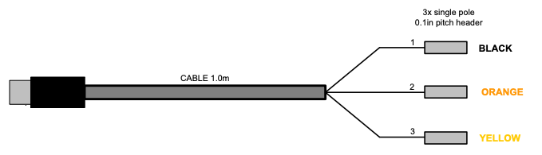
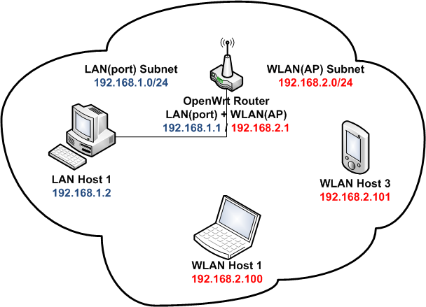
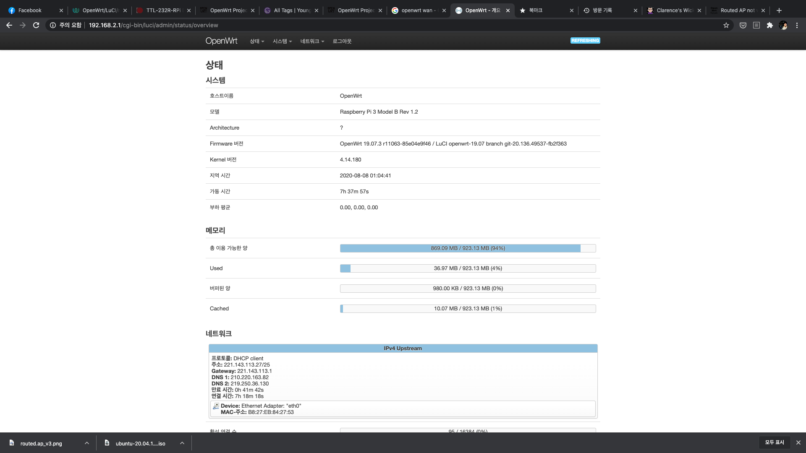
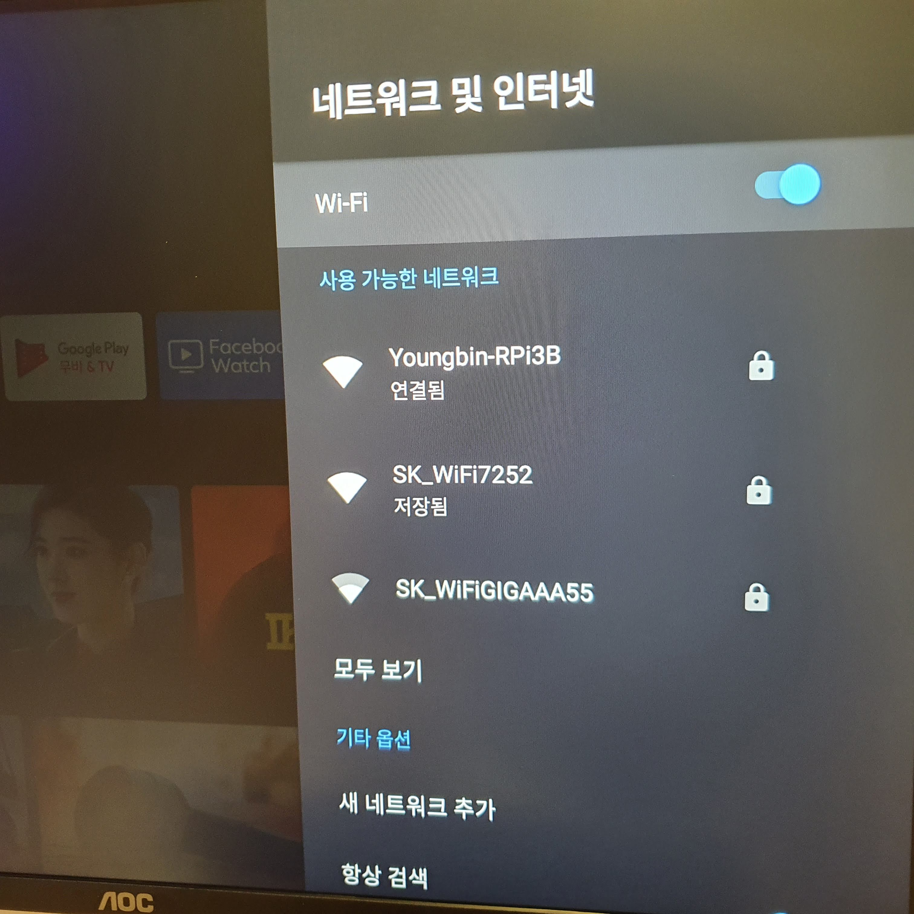
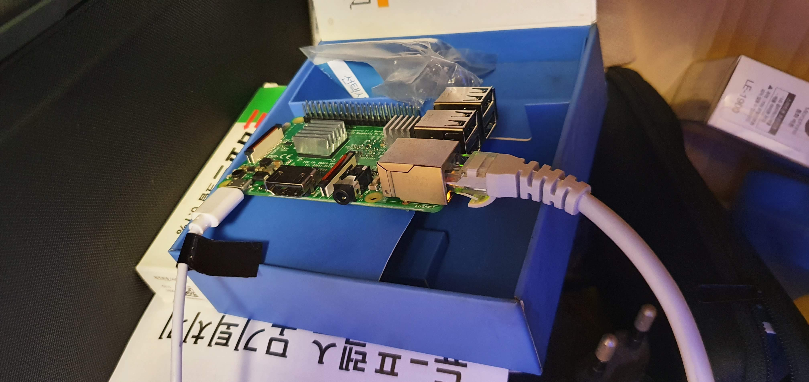

최근 모니터와 Mi TV Stick 을 구입했다. Mi TV Stick 은 안드로이드 TV 스틱인데, 잘때 침대에서 모니터에 연결해다가 넷플릭스 보려고 같이 구입했다.
쿠폰 적용하면 2만원 아래로 구입이 가능해서 구입에 별 부담이 없다. 어제 수령해다가 셋팅하기 위해 모니터에 연결하고 집에있는 WiFi 에 연결을 시도했다.
그런데 통신사 공유기여서 그런지, 이게 말로만 듣던 통신사 공유기 접속 기기 수 제한 떄문인지, 연결 시도중 계속 오류가 발생했다.
연결이 되었어도, 인터넷 사용이 불가능했다. (다른 기기는 멀쩡한데...) 여러번 연결을 다시 시도해서 연결을 했더니, 이번에는 노트북 쪽 연결이 끊긴다.

통신사 공유기에 연결하는건 포기하고, 여분의 공유기 찾아서 설치해다 해보기로 했다. 잡동사니 박스에 예전에 쓰던 Mi WiFi Router 가 구석에 박혀 있어,
꺼내다가 설치를 시도했다. 그러나 아무리 박스를 휘저어 보아도 어댑터가 보이지 않았다(...) 그렇게 Mi WiFi Router 도 포기했다.

그러던 중 서럽에 라즈베리파이3 모델B 가 있는걸 발견했다. 그리고 여기에다가 OpenWRT 올려다 굴리면 대충 공유기로 사용할 수 있을 거라는 생각이 들었다.
때마침 방 안에있는 벽에 랜 포트가 있어 노트북에 직접 연결하니 잘 연결된다. 그렇게 통신사 공유기 때문에 삽질이 시작되었다.

## OpenWRT 설치하기
[이 글](https://codedosa.com/649)의 도움을 받아 설치를 진행해 보았다. Raspberry Pi 3 Model B 에 대한 OpenWRT 이미지는 운이 좋게도 공식 홈페이지에서 제공하고 있어 이를 다운로드 받았다. [여기](https://openwrt.org/toh/raspberry_pi_foundation/raspberry_pi)]로 들어간 다음. 
*Installation* 에서 *Model: Raspberry Pi 3, Version: B* 의 *Firmware OpenWrt Install* 링크로 이미지를 다운로드 하였다.

파일을 받았으면 SD 카드에 설치할 차례, USB SD 어댑터에 SD 카드를 넣어 노트북에 연결하고. [Etcher](https://www.balena.io/etcher/)를 이용하여 이미지 플래싱 작업을 진행했다. 필자는 MacBook Pro에 Homebrew 를 사용하니, 아래 명령으로 간단히 설치하였다.

```bash
brew cask install balenaetcher
```

Etcher 가 딱 디스크 이미지 파일을 디스크나 USB 드라이브 등에 플래싱 하는 기능만 제공하는 프로그램이라 사용 방법은 간단하다.
- *Flash from file* 을 누르고 앞서 받은 이미지 파일을 선택한다.
- *Select taeget* 을 눌러 이미지를 플래싱 할 SD 카드를 고른다.
- *Flash!* 를 눌러 플래시 한다.

라즈베리파이로 이것저것 삽질 조금 해봤다면 이건 어렵지 않다.

## 시리얼 연결하여 설정하기

이제 부팅을 하고 접속을 해 보자. SD 카드를 라즈베리파이에 넣고 전원을 넣기 전에 몇가지 준비를 해야 한다. 통신사 공유기가 거실에 있어 귀찮고(?) 도움 받은 글에서도 시리얼 연결을 하라고 하니(?) 시리얼 연결을 위해 몇가지를 준비해야 했다.

먼저 드라이버 설치다. 필자는 FTDI Chip 사의 TTL-232R-RPi 케이블로 연결을 시도했는데, 이를 위해 [FTDI Chip 홈페이지](https://www.ftdichip.com/Drivers/VCP.htm) 에서 VCP(Virtual COM Port) 드라이버를 받아 설치했다. 그리고 재부팅을 한번 해 줬다.

이제 시리얼 케이블로 연결을 해 주자. [TTL-232R-RPi 의 데이터시트](https://www.ftdichip.com/Support/Documents/DataSheets/Cables/DS_TTL-232R_RPi.pdf)와 [라즈베리파이의 GPIO 문서](https://www.raspberrypi.org/documentation/usage/gpio/) 를 참고하여 GPIO 핀에 시리얼 케이블의 헤더를 연결해 주었다.

  
> 사진 출처: https://www.raspberrypi.org/documentation/usage/gpio/  

  
> 사진 출처: https://www.ftdichip.com/Support/Documents/DataSheets/Cables/DS_TTL-232R_RPi.pdf  

- 검은색 헤더 - GND 헤더이다. 라즈베리파이의 GND 핀에 연결하였다.
- 주황색 헤더 - TXD(출력) 헤더이다. 라즈베리파이의 RXD(입력) 핀인 15번 핀에 연결했다.
- 노란색 헤더 - RXD(입력) 헤더이다. 라즈베리파이의 TXD(출력) 핀인 14번 핀에 연결했다.

이제 노트북에도 연결하고, 명령줄로 연결 되었는지 조회 해 보자. 아래처럼 `tty.usbserial-XXXXXXXX`,`cu.usbserial-XXXXXXXX` 형태로 조회가 가능할 것이다.

```bash
> ls /dev | grep usb
cu.usbserial-XXXXXXXX
tty.usbserial-XXXXXXXX
```

`screen` 명령을 이용해 접속해 보자. 아래 명령어와 같이 115200 으로 속도를 설정하여 접속을 시도하면 된다. 부팅 로그 쭉 지나가고, 엔터키 한번 눌러주면 명령줄 입력할 수 있도록 프롬프트가 나올것이다. 아무것도 안 나오는거 같고 연결도 잘 안 되는 것 같으면...~~군대에서 전산실에 전화오면 일단 해보라고 하는~~ USB 케이블 다시 연결해보기, 전원 다시 연결 해보기 등도 한번 시도해 보자.

```bash
screen /dev/tty.usbserial-XXXXXXXX 115200
```

대충 아래처럼 OpenWRT 로고~~와 와이어리스 프리덤!~~ 이 나오면서 명령줄 입력이 가능해 지면, 일단 `root` 계정이 비밀번호를 먼저 설정해 주자.
SSH 접속에도 사용되고, OpenWRT의 웹 인터페이스인 LuCI 로그인에도 사용된다.
```bash
BusyBox v1.30.1 () built-in shell (ash)

  _______                     ________        __
 |       |.-----.-----.-----.|  |  |  |.----.|  |_
 |   -   ||  _  |  -__|     ||  |  |  ||   _||   _|
 |_______||   __|_____|__|__||________||__|  |____|
          |__| W I R E L E S S   F R E E D O M
 -----------------------------------------------------
 OpenWrt 19.07.3, r11063-85e04e9f46
 -----------------------------------------------------
root@OpenWrt:~# 
```

```bash
passwd root
```
## AP 설정하기

`root` 비밀번호 설정을 했다면, 일단 이더넷 포트로(유선으로) 인터넷에 연결을 해야 하니 DHCP 로 IP 받아오도록 설정 해 주자.
그리고 `/etc/init.d/network restart` 를 실행하여 바로 설정을 적용 해 주자. 

```bash
uci set network.lan.proto=dhcp
uci commit
/etc/init.d/network restart
```

그리고 이더넷 케이블을 연결하면, 2~3페이지 분량의 이더넷 케이블이 연결 되었다는 메시지(?) 가 지나가면서 연결된다.
메시지 한번 다 출력되면, 엔터키를 눌러 다시 명령줄 입력이 가능하다. 이어서 무선랜 셋팅을 해 보자

```
root@OpenWrt:~# uci get wireless.radio0.disabled
1
```
위 명령으로 무선랜이 **비활성화** 되었는지 조회하면, `1`로 나온다. `0`으로 설정하여 무선랜을 활성화 해 보자.

```bash
uci set wireless.radio0.disabled=0
uci commit
/etc/init.d/network restart
```

그러면 무선랜이 활성화과 되고, 이제 노트북과 휴대푠에서 SSID가 `OpenWrt`인 WiFI 를 볼 수 있을 것이다.
이번에는 SSID와 연결 비밀번호도 설정해 보자.

먼저 SSID 를 설정해 보자
```bash
uci set wireless.default_radio0.ssid=Youngbin-RPi3B
uci commit
/etc/init.d/network restart
```

이후, 비밀번호를 설정해 보자. 필자는 WPA-PSK2 방식으로 설정하였다.
```bash
uci set wireless.default_radio0.encryption=psk2
uci commit

```
비밀번호 설정값은 초기에 없으므로, 항목을 넣어주어야 한다. `uci add` 명령을 이용한다. 비밀번호는 8자 이상으로 설정하면 된다.
```bash
uci add wireless.default_radio0
uci set wireless.default_radio0.key = password1234
uci commit
/etc/init.d/network restart
```
이렇게 하면, 이제 라즈베리파이로 비밀번호가 걸린 WiFi 를 간단하게는 아니고 어렵게 구축하여 사용할 수 있다.

## LuCI 설치하기
이어서 LuCI 를 설치하고 설정해 보자. 공유기 설정을 항상 콘솔에서 할 건 하니고, 폰에서 간단히 웹으로 접속해서 관리할 때도 있을테니 셋팅 해두면 유용하다.
일단 이미 설치가 되어 있는지 조회 해 보자, 아마 이미 설치 되어 있을 것이다.

```b
root@OpenWrt:~# opkg update && opkg list-installed | grep luci
Downloading http://downloads.openwrt.org/releases/19.07.3/targets/brcm2708/bcm2710/packages/Packages.gz
...
Signature check passed.
...
liblucihttp-lua - 2019-07-05-a34a17d5-1
liblucihttp0 - 2019-07-05-a34a17d5-1
luci - git-20.216.62629-4d5c88b-1
luci-app-firewall - git-20.136.49537-fb2f363-1
luci-app-opkg - git-20.136.49537-fb2f363-1
luci-base - git-20.136.49537-fb2f363-1
luci-lib-ip - git-20.136.49537-fb2f363-1
luci-lib-jsonc - git-20.136.49537-fb2f363-1
luci-lib-nixio - git-20.136.49537-fb2f363-1
luci-mod-admin-full - git-20.136.49537-fb2f363-1
luci-mod-network - git-20.136.49537-fb2f363-1
luci-mod-status - git-20.136.49537-fb2f363-1
luci-mod-system - git-20.136.49537-fb2f363-1
luci-proto-ipv6 - git-20.136.49537-fb2f363-1
luci-proto-ppp - git-20.136.49537-fb2f363-1
luci-theme-bootstrap - git-20.136.49537-fb2f363-1
rpcd-mod-luci - 20191114
root@OpenWrt:~# 
```

설치 안 되어 있다면, `luci` 패키지와 한국어 언어팩인 `luci-i18n-ko` 를 설치하면, 나머지 필요한건 같이 설치된다. `luci` 패키지가 메타 패키지여서 그렇댜.
```bash
opkg update
opkg install luci luci-i18n-ko
```
이미 설정되어 있겠지만, LuCI 기본으로 사용하는 `uhttpd` 가 부팅시 자동 시작 되도록 설정 해 주자.
```bsah
/etc/init.d/uhttpd enable
/etc/init.d/uhttpd start
```

그리고, 192.168.0.1 / 192.168.1.1 / 192.168.2.1 등의 주소로 접속을 시도하면...? 아마 안될 거다.
기본적으로 브릿지 모드로 설정 되어 있어 라즈베리파이에 연결된 상위 장비의 IP 대역을 써서 그렇다. 라즈베리파이에 연결한 기기에서 IP 확인하면
IP 대역이 공인 IP 대역이거나(벽에 있는 이더넷 포트에 연결 했다면), 라즈베리파이 를 공유기에 유선으로 물린 경우 해당 공유기가 할당하는 IP 대역이 나온 걸 볼 수 있다. 때문에 공유기 모드로 추가적인 셋팅을 해서, 라즈베리파이의 DHCP 서버가 사설 IP 를 할당하도록 해줘야 한다.

## Routed AP 로 설정하기

이번에는 OpenWRT 홈페이지의 [이 문서](https://openwrt.org/docs/guide-user/network/wifi/routedap) 를 참고해서 한번 설정해 보자.


> 사진 출처: https://openwrt.org/docs/guide-user/network/wifi/routedap

먼저 `/etc/config/network` 를 수정하여, `wifi` 라는 이름의 인터페이스를 새로 정의한다.

```bash
vi /etc/config/network
```
```
config 'interface' 'wifi'
        option proto      'static'
        option ipaddr     '192.168.2.1'
        option netmask    '255.255.255.0' 
```
여기서 `ipaddr` 대역은, 상위 장비(라즈베리파이에 유선으로 연결된 네트워크 장비)의 IP 대역과 달라야 한다. 그리고 이 주소는 나중에 다른 기기에서 LuCI 접속할때 쓸 IP 주소라고 보면 된다.

다음으로, `/etc/config/wireless` 를 열면, 앞서 설정한 무선랜 설정 색션(`wifi-iface`)이 보일것이다.
```
config wifi-iface 'default_radio0'
	option device 'radio0'
	option network 'lan'
	option mode 'ap'
	option ssid 'Youngbin-RPi3B'
	option encryption 'psk2'
	option key 'password1234'
```
`option network 'lan'` 을 아래처럼 `option network 'wifi'` 로 변경하여, 앞서 정의한 `wifi` 인터페이스를 사용하도록 설정한다.
```
config wifi-iface 'default_radio0'
	option device 'radio0'
	option network 'wifi'
	option mode 'ap'
	option ssid 'Youngbin-RPi3B'
	option encryption 'psk2'
	option key 'password1234'
```
그리고, 라즈베리파이에 접속하는 기기에 라즈베리파이가 IP 를 자동으로 할당하도록 DHCP 풀 설정을 한다.
`/etc/config/dhcp` 를 수정하면 된다.
```
config 'dhcp' 'wifi'
        option interface  'wifi'
        option start      '100'
        option limit      '150'
        option leasetime  '12h' 
```

이제 방화벽 설정을 변경하여, `wifi` 인터페이스에 인터넷 연결을 해 주자. `/etc/config/firewall` 을 열고,
`zone` 을 하나 새로 추가하자. `wifi` 인터페이스에 대한 `zone` 설정이다.
```
config zone
        option name       wifi
        list   network    'wifi'
        option input      ACCEPT
        option output     ACCEPT
        option forward    REJECT
```

그리고 트래픽 포워딩 설정을 해 주자. `wifi` 가 `wan` 을 사용하도록 아래와 같은 내용을 같은 파일에 추가한다.
```
config forwarding
        option src        'wifi'
        option dest       'wan'
```

유선랜 클라이언트가 무선랜 클라이언트에 연결하는걸 허용하여면 아래와 같은 포워딩 규칙을 추가할 수 있다.
```
config 'forwarding'
        option 'src'        'lan'
        option 'dest'       'wifi' 
```

반대로 무선랜 클라이언트가 유선랜 클라이언트에 연결하는걸 허용하려면 아래와 같은 내용을 추가하면 된다.
```
config forwarding
        option src        'wifi'
        option dest       'lan' 
```

이제 수정 사항을 적용하자. 먼저 새로 정의한 `wifi` 인터페이스를 아래 명령으로 활성화 한다.
```bash
ifup wifi
wifi
```

그리고 방화벽(`firewall`) 과 DHCP 서비스(`dnsmasq`) 를 다시 시작해서 설정을 적용하자.
```bash
/etc/init.d/firewall restart
/etc/init.d/dnsmasq restart
```
## `wan` 인터페이스 정의
이렇게 하고, 라즈베리파이 AP 에 연결하면. 일단 사설 IP 할당되는걸 확인할 수 있다. 그러나 인터넷 연결이 없다.
`wan` 인터페이스는 정의가 안 되어있고, `lan` 인터페이스가 인터넷 연결을 사용중이기 때문이다.

`wan` 인터페이스를 새로 정의하고, `lan` 인터페이스는 그냥 지우면 된다. `/etc/config/network` 파일을 열고, 아래 내용을 추가하여 `wan` 인터페이스를 추가한다.
```
config interface 'wan'
	option ifname 'eth0'
	option proto 'dhcp'
```
`lan` 색션을 보면, `ifname`(물리적 인터페이스 이름) 을 `wan` 가 동일한 `eth0` 인걸 확인할 수 있다. `lan` 이 사용하고 있으면, `wan` 이 사용을 못하니, `lan` 인터페이스 정의 부분을 그냥 지워주면 된다. 그러면 파일 내용이 아래처럼 될 것이다.(여러분들이 다른것 추가하지 않았다면.)
```
config interface 'loopback'
	option ifname 'lo'
	option proto 'static'
	option ipaddr '127.0.0.1'
	option netmask '255.0.0.0'

config globals 'globals'
	option ula_prefix 'fd9f:afc6:6a9d::/48'

config interface 'wan'
	option ifname 'eth0'
	option proto 'dhcp'

config interface 'wifi'
	option proto 'static'
	option ipaddr '192.168.2.1'
	option netmask '255.255.255.0'
```
이제 저장하고, `wan` 인터페이스 활성화 하고, 네트워크 서비스 다시한번 다시 시작 해 주면. 무선공유기 처럼 잘 작동할 것이다.
```bash
ifup wan
/etc/init.d/network restart
```
`192.168.2.1` 에 접속하면 LuCI 웹 인터페이스도 잘 나온다.


Mi TV Stick 과의 연결도 문제 없다.


라즈베리파이 케이스가 없어서 일단 빈 박스에 대충 넣었다. 낮에 종이로 케이스 만들기 시도했으나 실패했다. 그냥 케이스 하나 빨리 주문하는게 좋을 것 같다.


근데 만역 집에 여분의 공유기가 있다면 그냥 그 공유기 써라. 그게 속 편하다. 필자는 공유기 배송 기다리지 못하고 당장 있는게 라즈베리파이라 그걸로 삽질을 했을 뿐...
이제 침대에 누워서 라즈베리파이 AP 에 연결된 Mi TV Stick 에 연결된 모니터로 넷플릭스나 보면서 잠이나 자야겠다.

## 참조
- [OpenWRT를 라즈베리파이 3 B+에 올려보기](https://codedosa.com/649)
- [라즈베리파이에 OpenWRT 로 무선 AP 만들기(RaspberryPi 3 B+)](https://codedosa.com/687)
- [FTDI Chip 홈페이지 - VCP 드리이버 다운로드](https://www.ftdichip.com/Drivers/VCP.htm)
- [TTL-232R-RPi 의 데이터시트](https://www.ftdichip.com/Support/Documents/DataSheets/Cables/DS_TTL-232R_RPi.pdf)
- [라즈베리파이의 GPIO 문서](https://www.raspberrypi.org/documentation/usage/gpio/)
- [LuCI essentials](https://openwrt.org/docs/guide-user/luci/luci.essentials)
- [Routed AP](https://openwrt.org/docs/guide-user/network/wifi/routedap)
- [TP-Link TL-MR3020 as AP and router with OpenWrt](https://www.clarenceho.net/2012/08/tp-link-tl-mr3020-as-ap-and-router-with.html)