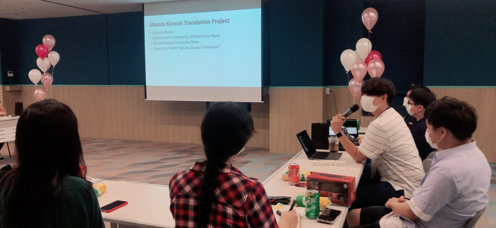
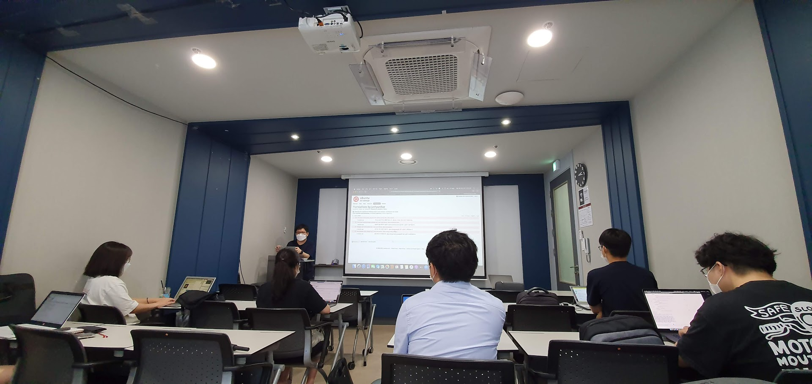
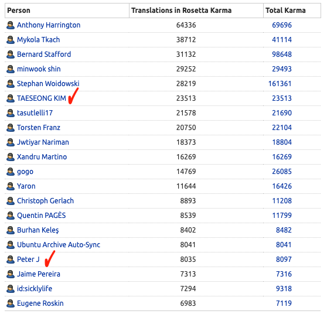
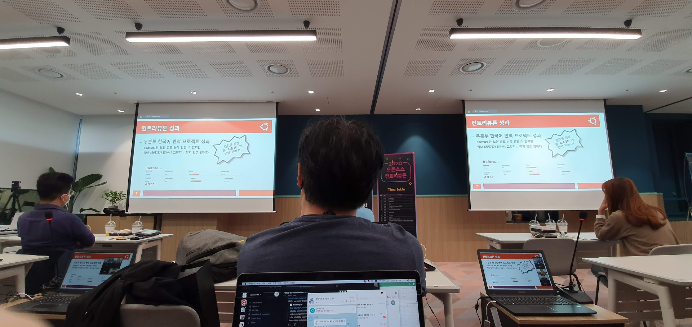
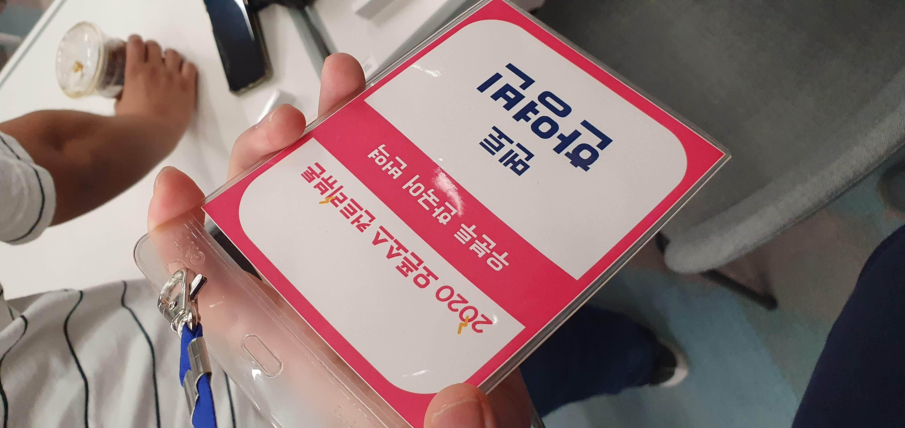

2020년 8월 1일부터 9월 23일 까지, 정보통신산업진흥원(NIPA) 산하 기관인 OpenUp(오픈소스 소프트웨어 통합 지원 센터)에서 주최한 "2020 오픈소스 컨트리뷰톤"에 참여했다.
2020년 7월 26일 군 복무 마치고 전역을 했으니, 전역한지 얼마 안 되어 참여하게 된 셈이다. 
멘티가 아닌 멘토로 참여하게 되었는데, 컨트리뷰톤 기간 시작 몇달 전 아직 군 복무 중 일때 우분투한국커뮤니티 대표를 하고 있는 윤건영님으로부터 컨트리뷰톤에 우분투 한국어 번역 팀으로 참여 하려는데 같이 참여하자는 제안을 받아 참여하게 되었다.

대충 단어를 보면 예상 가능 하겠지만. 컨트리뷰톤(Contributhon)은 기여하다(Contribute)와 마라톤(Marathon)을 합성해서 만든 단어이다.
마치 마라톤 하는 것 처럼 긴 시간동안 오픈소스에 참여하며 목표 지점까지 함께 도달하는 것이라고 생각하면 될 것 같다.

## 사전 일정과 발대식

공식 일정은 발대식을 진행했던 8월 1일부터 시작 했지만, 그 전부터 일정이 진행 되었다. 일단 컨트리뷰톤에 참가 프로젝트 지원을 해야 했고, 프로젝트가 선정되면 멘티분들을 선발하고 미리 연락해서 안내 드리는 등 많은 것들이 진행되었다.
참여 프로젝트 선정 후, 멘티 분들 명단을 기다리면서 지원이 그다지 많지 않을 것이란 생각을 조금 했지만. 그와는 달리 생각보다 많은 분들께서 지원해 주셔서 좀 놀랐었던 것 같다.
그 중에는 물론 성의 없는 짧은 한 문장의 지원 동기로 지원한 분들도 한두명 정도 있었지만, 우분투 지역화(Localization, l10n)에 기여하고 싶다는 열망을 표현하신 분들도 많았었다.

자신의 영어 전공을 살려보고 싶다는 분도 있었고, 현업에서 소프트웨어 지역화 QA 를 하시는 분이 우분투에서의 지역화에 대해 알고 싶어서 참여하시는 분도 있었다.
우분투 데스크탑을 사용하면서 UI번역에 기여하고 싶다는 분, man 페이지 번역을 하고 싶다는 분(안타깝게도 Ubuntu l10n 은 UI번역 위주이다.)도 있었다.
이렇게 많은 분들이 지원해 주셨지만 모든 분들을 모실 수 없었고, 그 중 15분 정도 추려내야 했다. 같이 멘토로 참여한 윤건영님, 신민욱님(우분투 한국어 L10n팀 담당), 배준현님과 함께 주로 지원동기 내용을 중점으로 검토하여 최종 참여 멘티를 추려냈다.

이후, 최종 선발된 멘티 분들의 명단을 받아 일괄적으로 메일을 전송하여 연락을 취했다. 우분투 한국 커뮤니티의 경우 IRC와 Slack이 개설되어 있어 이를 통해 채팅을 많이 하는데, 
비교적 쓰기 쉬운 커뮤니티 Slack 에 채널을 하나 개설하여 이용했다. 그렇게 멘토와 멘티가 모두 Slack채널에 모이고, 컨트리뷰톤 발대식 날짜가 다가왔다.

컨트리뷰톤 발대식에서는 먼저 컨트리뷰톤에 [크로미움 팀 멘토로 참여 하신 방진호님의 영상과](https://www.youtube.com/watch?v=dY4VAbVt-Ro), [멘티로 먼저 참여 하셨다가 RustPython/gpython 프로젝트 멘토로도 참여하신 나동희님의 영상](https://www.youtube.com/watch?v=m5QWGfTtMCQ)이 참여 멘티분들을 격려했다.
이후, 우분투와 우분투한국 커뮤니티에 대한 소개하고, 번역 프로젝트에 대해서도 소개한 뒤, 컨트리뷰톤 기간동안 진행할 일정에 대해 간단히 소개하는 시간을 가졌다.
우리 프로젝트 팀의 경우 멘토까지 모두 포함하면 20명 가까이 되는 많은 인원이여서 아랫층 회의실로 내려가서 발대식을 진행했다.

## 번역 참여 교육과 팀별 주 번역 패키지 선정

발대식이 끝난 몇일 후, 다시 오프라인으로 모여 이번에는 런치패드를 통해 우분투 번역에 참여하는 방법에 관한 교육을 진행하고 4개 정도의 팀으로 나눠서 각 팀로 번역할 주 패키지를 선정하는 시간을 가졌다.
번역 참여 교육의 경우, 1~2년 전 쯤에 신민욱님이 우분투 l10n 워크샵 행사를 진행하신 경험이 있으셔서 그때 경험과 자료를 활용하여 진행 하기로 했다.
아무래도 그때나 지금이나 코로나19 유행도 있고, 멀리 사는 분도 계셔서 많은 분들께서 참석 하시지는 못하셨다.
그래도 교육 자체는 그대로 진행 하였고, 참석하지 못하신 분들께는 교육 자료를 공유해 드리고 모르는 부분에 대한 질의 응답을 하는 것으로 대신 하였다.

* Launchpad(launchpad.net) 가입.
* GPG(Gnu PG) 키 생성, GPG 키서버 업로드.
* 우분투 행동 강령 2.0(Ubuntu Code of Conduct 2.0) 에 GPG 키로 서명하여 제출하기.
* Launchpad 상의 우분투 한국 팀과 우분투 한국 번역 팀 가입하기.

위와 같이 이미 우분투 관련 프로젝트에 참여했다면 뻔하지만, 오픈소스를 많이 했었어도 우분투 관련 프로젝트가 처음이라면 생소한 내용들을 순서대로 진행했다.
예상은 했지만, GPG 키 생성과 우분투 행동 강령 서명 과정에서 다들 많이 생소해 하고 해매는 모습이였다. 그래도 다들 아려운 부분에서는 바로바로 도움을 청해 해쳐나가는 모습이였다.
[Launchpad 에 있는 우분투 한국어 번역 팀에는 가입 조건이 있다. Launchpad 상에서의 활동에 대한 성과를 수치화된 점수로 보여주는 카르마(Karma)가 50 이상이여야 가입이 가능하다.](https://wiki.ubuntu.com/UbuntuKoreanTranslators)
이를 위해 멘티분들 우분투 번역 참여에 대한 감도 잡는 겸 카르마 점수도 올리기 위해, [`app-install-data`](https://launchpad.net/ubuntu/+source/app-install-data-ubuntu)패키지를 번역해 보는 시간을 가졌다.
이후, 무작위로 배치된 조별로 모여서 컨트리뷰톤 기간동안 주로 번역할 패키지를 선정하는 시간을 가졌다. 필자가 담당한 팀은 아쉽게도 교육에 참석하신 분이 많이 없어, Slack 에서 논의를 진행했다.

## 주 번역 패키지 선정과 개인별 주간 번역 목표 설정

번역 참여 교육 이후, 팀별로 주 번역 패키지를 확정한 팀도 있었지만 그렇지 않은 팀도 있었다. 우리 팀의 경우 아직 선정하지 못해 Slack 에서 멘티분들 의견을 취합하여 패키지를 선정했다.
우분투 번역 컨트리뷰톤 팀 전 인원이 모인 채널에서 "처음 번역 참여하는 경우 시도해 보기 좋은 패키지" 목록을 전달 하기도 하고, 멘티 분들이 많은 우분투 패키지 목록 중 희망하는 패키지 몇개를 선택해 공유하기도 했다.
그러면 그 중에서 최종적으로 3~4개 정도의 주요 번역 패키지를 선정하여 번역을 진행 하였다.

멘티 분들께 개인별로 주간 번역 목표도 정해서 알려달라고 공지했는데, 그 목표를 달성했는지 체크하는 목적 보단 본인이 달성 가능한 목표를 설정하여 "꾸준히" 번역에 기여할 수 있도록 하기 위함이였다.
프로그램 코드 짜서 기능을 새로 구현 하거나 버그 패치를 만들어 기여하는 것과 달리, 영어에서 한국어로 번역 하는 작업이 끝없이 반복된다. 짤막한 단어가 반복 되기도 하고, 긴 문장이 계속 나오기도 한다.
코드로 기여하는 것에 비해 비교적 입문하기 쉬운 편이지만, 금방 지루하고 피로해지는 작업이기도 하다. 또, 패키지 버전 업데이트로 번역했던 문자열이 사라지거나 바뀌기도 하고, 새 문자열이 추가되기도 하기 때문에 
번역을 한번에 많이 하거나 질적으로 좋은 번역을 하는 것도 중요 하지만. 한번에 조금씩만 번역 하더라도, **꾸준히** 그리고 **지속적으로** 참여하는 것이 더 중요하다.
애초에 컨트리뷰톤에 프로젝트 지원 할 때도 그냥 잠깐 참여하고 사라지는 기여자 보단, 한번에 기여하는 번역 문자열이 적다고 해도 꾸준히 참여하는 기여자가 조금이라도 생기기도록 하는 쪽으로 방향을 잡았다.

## 본격적인 번역 기여와 리뷰 시작

팀별 주 번역 패키지도 선정하고, 개인별 주간 번역 목표도 설정 했으니 이젠 긴 시간동안 번역을 기여할 차례다. 멘티 분들은 주로 팀별로 선정한 패키지나 본인이 관심있는 패키지에 번역을 기여하는 활동을 진행했고,
나와 다른 멘토분들은 멘티분들이 제출하신 번역 제안에 대한 리뷰를 주로 진행했다. 번역 기간 동안 Slack 채널은 주로 번역 중 질의응답(서식 문자에 대한 번역, 특정 용어에 대한 번역 등)용도로 많이 사용했고, 
번역 리뷰 중 잘못된 번역이나 개선의 여지가 있는 번역에 대한 피드백을 전달 하기도 했다. 예를 들면 Configure 를 "구성" 이 아닌 "설정" 으로 번역 했다거나(보통 Configure 를 "구성", Setting 을 "설정" 으로 번역한다.),
Editor 를 "편집기", "에디터" 두 단어를 혼용해서 번역 하는 경우, 한 단어로 통일 하도록 피드백을 전달 하기도 했다. 긴 시간동안, 많은 멘티 분들이 열정적으로 번역에 참여해 주셨다.
번역 리뷰의 경우 필자도 참여 했지만, 주로 신민욱 님께서 번역 제안 리뷰 대부분을 처리해 주시는 중 많은 고생을 해 주셨다.

멘티분들 중에는 회사 근무 하시면서 퇴근 후 번역에 참여 하시는 분들도 많이 있었는데, 그럼에도 불구하고 몇몇 멘티 분들이 우분투 한국어 번역에서 쉽게 보지 못한 압도적인 양의 번역을 기여하셔서 정말 놀랐었다.
얼마나 압도적이냐면, 런치패드 전체 번역 기여 부분 순위에서 상위 20위 안에 들어간 멘티분이 등장했고.(한국어 번역 참여자만이 아닌 전세계 번역 참여자 대상 순위이다.) 그걸로 모자라 전체 부분에서도 상위권에 진입한 멘티분도 있었다.
보고 그냥 놀랍다는 생각밖에 들지 않았다. 심지어 그때 상위 순위권에 들어간 그 멘티분들은 지금도 순위권 안에 머물러 계신다(!!!!!) 

## 서면 평가와 최종 성과 발표

긴 컨트리뷰톤 활동 기간이 끝나고, 활동 평가 기간이 다가왔다. 멘티 분들로부터 그동안의 활동 내역을 취합해서 최종 활동 보고서를 제출했고, 서면 평가와 발표 평가가 진행되었다.
서면 평가는 각 프로젝트 팀이 제출한 최종 활동 보고서를 기반으로 점수와 의견을 정리하여 제출하는 형태로 진행되었고, 윤건영님이 서면평가에 참여하셨다.
발표 평가는 말 그대로, 각 팀별로 활동과 성과에 대한 발표를 듣고 평가하는 방식이다. 아무래도 코로나19 유행 때문에, 발표 평가의 경우 각 팀별 멘토 1명씩 그리고 전문 초청 평가위원 서너분이 모여 평가를 진행했다.
각 팀 멘티 분들이 Zoom 을 통해 활동과 성과에 대해 발표하는 방식으로 진행 되었다. 우리 팀에서는 다른 멘토 분들은 개인 사정으로 바빠서 필자가 발표 평가 위원으로 참여했다. 

발표 평가 정말 힘든 시간이였다. 일단 18팀 이라는 많은 숫자의 팀의 발표를 들으며 평가해야 하다보니, 발표에 집중하느라 긴 시간 앉아있는게 힘들었다. 
(중간에 쉬는 시간도 딱 한번만 주셔서... 다음번엔 두세번 정도 주시면 좋을 것 같다.) 
각 팀별로 10분씩 한다고 해도 180분이면 3시간 가까이 진행되어 그랬던 것 같다. 그리고, 각 팀별 멘티 분들이 다들 발표를 너무 잘 하셨다.
그것도 각 팀별로 시간이 딱 10분만 주어졌는데, 그 시간 안에 모든 팀이 발표를 정말 잘 해서 평가가 더더욱 쉽지 않았다.
우리 팀도 발표 깔끔하게 잘 마쳐서 다른 팀 멘토 평가위원 분들이 칭찬하기도 하셨다.

## 평가 결과

발표 평가를 마치고 몇일 후, 최종 수상 결과가 나왔다. 우리팀은 "가비아기업후원상" 을 수상했다. 컨트리뷰톤 기간동안 꾸준히 참여한 멘티분들이 이룬 의미있는 성과였다.
발표 평가때 평가위원으로 참여하면서 정말 모든 팀이 잘 하다 보니 상 받을지 안 받을지 어느 상 받을지도 예상이 어려웠다. (근데 사실 상 받는걸 크게 신경 안쓰고 진행한지라...ㅎㅎㅎ)
멘티 분들이 열정적으로 참여한 결과로 이렇게 상도 받았지만. 이제 시작에 불과할 뿐이다. 대부분의 오픈소스 프로젝트가 그렇듯, 이제부턴 지속적으로 꾸준히 기여하는 것이 중요하다.
컨트리뷰톤이 끝난 후에도 멘티 분들이 적은 양이라도 꾸준히 번역을 기여해서 성장해 나가면 좋을 것 같다.

## 마무리

오픈소스 컨트리뷰톤은 프로젝트에 기여해 줄 사람을 찾는 기존 오픈소스 프로젝트 기여자(메인테이너든, 커미터든, 참여 시작한지 얼마 안 된 사람이든)와, 오픈소스 프로젝트에 참여해 보고 싶은 사람들을 연결해 주는 정말 좋은 프로그램 이였다고 생각한다.
프로젝트 기존 참여자 입장에서는 같이 프로젝트에 참여할 사람들 찾기 위해 홍보하는 사람 모으는 것이 쉽다면 쉽고, 어렵다면 어렵다. 이미 국내에서 유명해서 국내 사람들이 많이 참여하는 프로젝트가 있기도 한 반면, 해외에서 유명하지만 국내에서는 잘 알려지지 않아 우리나라 사람들 참여가 저조한 프로젝트도 있고. 이제 막 시작한 신생 프로젝트여서 기여자를 어떻게 모을 지 고민하는 프로젝트도 있다.
컨트리뷰톤은 이러한 프로젝트가 비교적 쉽게 참여자를 지원받을 수 있는것은 물론 새 참여자(멘티) 분들과 같이 프로젝트에 참여하며 앞으로는 프로젝트를 어떤 방향으로 운영해야 할지, 컨트리뷰톤을 통해 프로젝트에 참여한 멘티 분들이 어떻게 컨트리뷰톤 이후에도 참여하도록 격려할지 등에 대해 생각 해 볼 수 있는 기회를 제공한다.
멘티 입장에서는 오픈소스 프로젝트에 참여해 보고 싶지만, 어떻게 시작해야 할 지 막막한 부분을 참여한 프로젝트의 멘토의 도움으로 해소하는 것은 물론, 앞으로는 어떤 오픈소스에 어떤 방식으로 기여할 지에 대해서도 생각할 기회도 제공한다.
멘티로 참여했던 참가자들이 멘토로 참여하여 새로운 멘티분들의 참여를 격려 하기도 한다.

결과적으로 기존 프로젝트 참여자와 새 참여자 모두가 성장하고 발전할 수 있는 기회를 제공하는 좋은 프로그램이다. 이 프로그램은 매년 주기적으로 진행하니, 이제 막 오픈소스 프로젝트를 만들어 시작한 메인테이너와 오픈소스 프로젝트에 참여하고 싶어 이제 막 발을 들인 사람 모두 내년 컨트리뷰톤 때 한번 참여해 보면 좋을 것 같다.

## 참고 링크
- [오픈소스 컨트리뷰톤 소개](https://www.oss.kr/contributhon)
- [Launchpad - Ubuntu Korean Translators 팀 페이지](https://launchpad.net/~ubuntu-l10n-ko)
- [우분투 한국어 번역팀 규정](https://wiki.ubuntu.com/UbuntuKoreanTranslators)