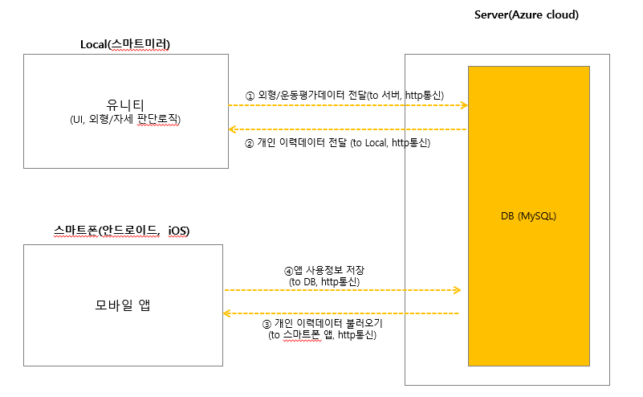
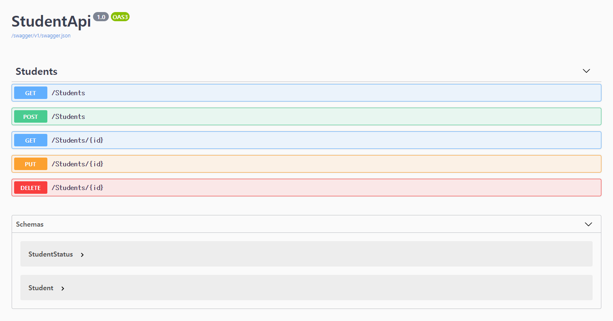
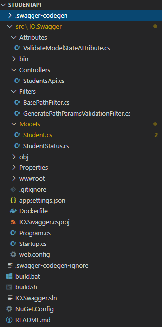
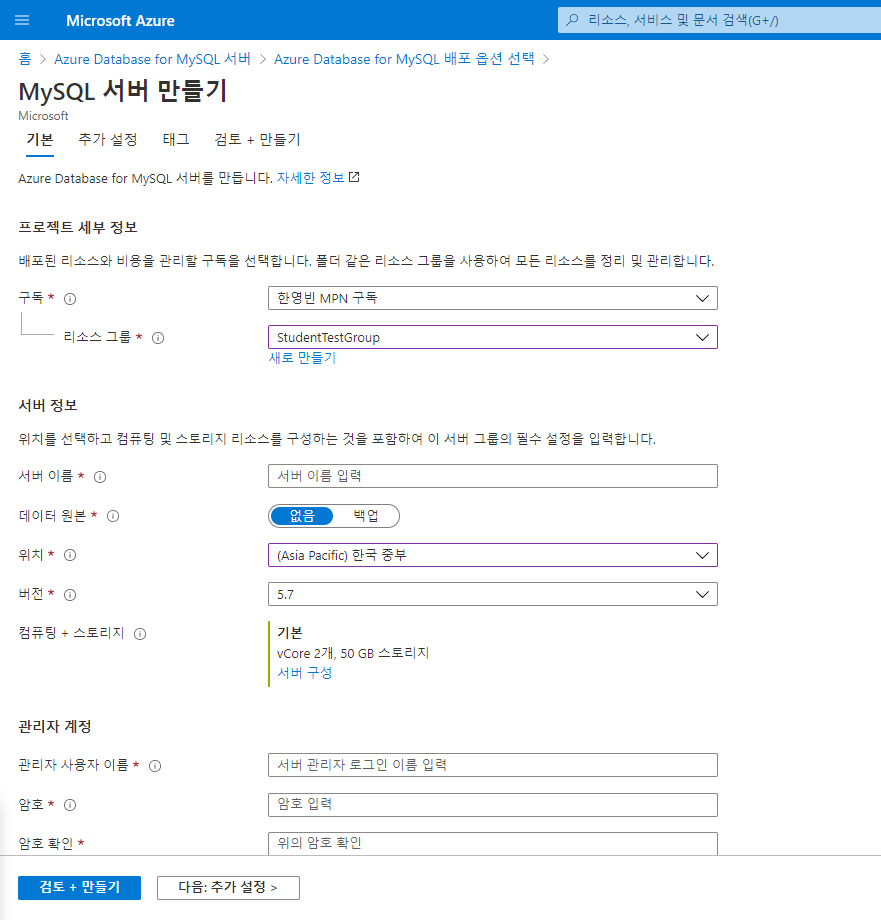

> [클라우드메이트 기술 블로그에서도 동일 게시물을 읽으실 수 있습니다.](https://tech.cloudmt.co.kr/2020/11/15/quick-aspnet-dev-azmanaged-deploy-part1/)

# 목차
이 글은 내용이 길어서 둘로 나눠져 있다. 아래 목차를 참고하여 읽는것을 권장한다.
- [1부. 코드 자동 생성을 통한 개발시간 단축 👈](2020-11-15-quick-aspnet-dev-azmanaged-deploy-part1/)
  - 서론
  - 그냥 데이터만 간단히 쌓아주는 백엔드
  - ASP.NET Core 백엔드 만들기
  - Open API 명세로 코드를, 코드에서 다시 API 문서 생성하기.
  - EF Core ORM 코드도 자동으로 생성하기
- [2부. 관리형 서비스로 빠르게 구축하고 배포하기](2020-11-15-quick-aspnet-dev-azmanaged-deploy-part2/)
  - 배포
  - 인증기능 구현하기
  - 이메일 발송
  - API Management
  - Azure Front Door
  - 결론

# 서론
이번에 고객사가 기획중인 서비스에 RESTful API 백엔드가 필요하게 되어 백엔드 개발과 Azure 에서 배포와 운영을 어떻게 할지 등을 계획하여 진행하게 되었는데, 이를 통해 간단한 .Net 백엔드를 만들어 Azure 에 배포해 보면서 웹앱 배포와 관련된 제품을 사용해 보았다.
백엔드는 .Net 기반으로 개발하기로 했는데, 기획안 중, 키오스크 기획 부분에 키넥트 장비와 C# 기반 Unity 프로그램이 들어가는 점, 
프로젝트에 같이 참여하는 같은 시기 입사한 경력자 분이신 정우님께서 .Net에 정통한 경력자 분 이신것도 한 몫 한 것 같다.
결론부터 말하자면, 프로젝트는 제대로 시작 하기도 전에 고객사의 사정으로(?) 틀어졌다. 
그래도 한달 가까운 시간동안 처음 접해보는 .Net 도 깊게는 다뤄보진 못했지만, 간단한 RESTful API 백엔드도 만들어 봤고 Azure 에 배포 해보면서 써본 제품도 다양하니, 그냥 잊고 지나가기 보단 글로 한번 정리해 보는 것도 좋을 것 같아 글을 써 보게 되었다.

# 그냥 데이터만 간단히 쌓아주는 백엔드
라고 하지만, 그렇게 간단할리가 없다. 아래 그림을 한번 보자.

뭔가 허전하지 않은가? 어떻게 앱이 MySQL DB 와 바로 통신을? 중간에 백엔드가 있어야 할 것 같지 않은가?
그 간단(할 것 같은) .Net 백엔드를 만들어 Azure 에 배포 하는것이 미션 이였다. 위 그림을 보면 그 다음도 조금은 예상이 가능하겠지만, 
백엔드에 대해서도 어떤 기능이 필요한 지 정의가 부족했다. 고객사와의 소통을 통해 필요한 기능을 정의하는 것이 먼저였다.

고객사와 메일로 소통을 통해 요구사항을 구체화 했고, 동시에 어떤 도구를 활용해서 어떻게 만들어 배포할지 논의했다.
Azure 제품 중에서는 Front door, API Management, App Service, Database for MySQL 를 이용하여 배포와 운영을 하고
개발 과정에서 버전 관리와 CI/CD, 문서화 등은 Azure DevOps 를 활용하기로 했다. 아직 어떤 기능을 개발해야 할 지 확정된 것은 아니기 때문에,
백엔드 개발에 사용할 .Net Core 와 Azure 제품을 사용해 보면서 일정이 시작되면 어떻게 진행할지 검토하는 시간을 가졌다.

.Net 기반 백엔드 개발에는 .Net 기반 백엔드 개발에 많이 사용하는 ASP.NET Core, DB ORM 프레임워크인 EF Core를 검토했고,
추가적으로 개발 일정이 시작 되었을 때 미리 설계한 API 명세로 코드를 자동 생성하여 빠르게 진행할 수 있게 Swagger Codegen,
그리고 Swagger UI로 API 문서를 자동 생성하는 ASP.NET 미들웨어인 Swashbuckle 까지 사용해 보는 시간을 가졌다.

# ASP.NET Core 백엔드 만들기
개인적으로 Node.js, Python(Flask), Go(Gin) 으로 간단히 RESTful API 백엔드를 만들어 본 경험이 있고. 최근 들어서야 Java와 Spring을 사용해 보기 시작했는데, Spring은 앞에서 언급한 3가지 프레임워크와는 다르게 시작부터 간단하진 않았다. 전에는 그냥 라우팅 간단히 설정하고 각 라우팅별로 함수 연결해서 각 함수에서 처리할 내용을 넣으면 간단히 시작이 가능하고, 필요하면 미들웨어 작성해서 끼워넣어주거나, 상황에 따라 적절한 패키지를 활용하여 조합했었다. Spring은 듣던대로 대규모 시스템에 많이 사용해서 그런지, 처음 생성된 프로젝트 코드부터 구조가 잡혀있고 말로만 듣던 제어 반전(Inversion of Control), 종속성 주입(Dependency Injection) 을 주로 활용하는 프레임워크여서 그런지 익숙해지기 쉽진 않았다. 써보면서 느낀 점은 확실히 규모 큰 프로젝트 할 수록, 유지보수 하기엔 좋을 것 같은 느낌을 받았다. 

그리고 이제 ASP.NET Core. 이걸 처음 코드를 보면서 느낌 점은 Spring Framework 쓰는것과 비슷한 느낌 이라는 것이다. Spring 처럼 제어 반전과 종속성 주입을 집중접으로 활용하는 모습. 
Java 에서는 Annotation 에 해당하는 C#의 특성(Attribute) 를 클래스나 함수에 붙여서 API 컨트롤러나 데이터베이스 모델로 설정하는 것 등. 많은 점이 닯은 모습이였다. 
아래 간단한 RESTful API Controller 예제 코드를 비교해 보면, 괄호 쓰는 방법 같은 코딩 스타일이나 약간의 문법 차이만 제외하면 비슷한 구조임을 알 수 있다. 
ASP.NET 과 Spring 이 비슷한 면이 많아서 그런지, Spring 에 익숙해 지기 좀 어려웠던 것 처럼 .Net 에 익숙해지기도 쉽지는 않았다.

```java
// Java, Spring
@RestController
@RequestMapping("/student")
public class ThirdController {

    // MyBatis Mapper
    @Autowired StudentMapper studentMapper;
    
    @GetMapping("/get", @RequestParam("id") int id)
    public Student test2(Model model){
        Student student = studentMapper.findById(id);
        return student;
    }

    @PostMapping("/new")
    public Student test2(Model model, Student student){
        studentMapper.insert(student);
        return student;
    }

    @PutMapping("/update", @RequestParam("id") int id)
    public String test2(Model model, Student student){
        studentMapper.update(student);
        return "updated";
    }

    @DeleteMapping("/delete")
    public String test2(Model model, @RequestParam("id") int id){
        studentMapper.delete(id);
        return "deleted";
    }
}
```

```csharp
// C#, ASP.NET
namespace StudentApi.Controllers
{
    [Route("[controller]")]
    [ApiController]
    public class StudentsController : ControllerBase
    {
        // EF Core Database context
        private readonly StudentContext _context;

        public StudentsController(StudentContext context)
        {
            _context = context;
        }

        [HttpGet("/get/{id}")]
        public async Task<ActionResult<Student>> GetById(long id)
        {
            var product = await _context.Students.FindAsync(id);
            if (product == null)
            {
                return NotFound();
            }
            return product;
        }

        // POST action
        [HttpPost("/new")]
        [Consumes(MediaTypeNames.Application.Json)]
        public async Task<ActionResult<Student>> Create(Student student)
        {
            _context.Students.Add(student);
            await _context.SaveChangesAsync();
            return CreatedAtAction(nameof(GetById), new { id = student.Id }, student);
        }

        // PUT action
        [HttpPut("/update/{id}")]
        [Consumes(MediaTypeNames.Application.Json)]
        public async Task<ActionResult<Student>> Update(long id, Student student)
        {
            if (id != student.Id)
            {
                return BadRequest();
            }
            _context.Entry(student).State = EntityState.Modified;
            await _context.SaveChangesAsync();
            return NoContent();
        }

        // DELETE action
        [HttpDelete("/delete/{id}")]
        public async Task<IActionResult> Delete(long id)
        {
            var product = await _context.Students.FindAsync(id);
            if (product == null)
            {
                return NotFound();
            }
            _context.Students.Remove(product);
            await _context.SaveChangesAsync();
            return NoContent();
        }
    }
}
```
# Open API 명세로 코드를, 코드에서 다시 API 문서 생성하기.
고객사와 논의를 통해 API 명세가 확정되면 이를 기반으로, 빠르게 구현을 시작하기 위해 Open API 명세에서 코드를 자동으로 생성하는 도구와.
작성된 코드에 연동하면 API 문서를 자동으로 생성하는 도구도 같이 검토했다. 그렇게 검토한 것이 Swagger Codegen과 Swagger UI 이다.
Swagger UI는 API 문서 생성 자동화를 위해 이미 많이 사용하는 경우가 많아 익숙할 것이다. Swagger Codegen은? 이름에서 유추할 수 있듯. 
Open API 명세(혹은 Swagger API 명세) 에서 RESTful API 코드를 자동으로 생성하는 도구이다. 

다양한 프로그래밍 언어와 웹 프레임워크 코드 생성을 지원하고, 준비된 API 명세 파일을 넣어서 실행하면, API 명세에 정의된 대로 서버측 코드를 생성해준다. 
생성된 코드에는 API를 호출 해 볼수 있는 정도로만 구현 되어 있고, 실제 API가 할 동작과 나머지 다른 기능(DB 관련 기능, 메일전송, 인증)을 개발자가 구현해 주면 된다. 
Spring 이나 ASP.NET 같은 프레임워크는 프로젝트 초기화와 구성부터 대략적인 API 컨트롤러 함수 작성 해 두는 데 까지 비교적 복잡한 편이다 보니 시간도 좀 필요한 편인데, 
(요세는 그래도 Spring 쪽은 Spring Boot 가 나오고, .Net 은 .Net CLI 로 스캐폴드가 가능해서 많이 간단해졌다) 
Swagger Codegen 에 미리 작성한 API 명세를 넣고 실행하여 코드를 생성함으로써, 이 과정 전체를 건너뛸 수 있다.

아래와 같은 Open API 3.0 명세 예제에서 코드를 자동 생성해 보자. Student 라는 데이터를 만들고, 읽고, 고치고, 지우는 간단한 API 명세이다. 

```yaml
openapi: 3.0.1
info:
  title: StudentApi
  version: '1.0'
paths:
  "/Students":
    get:
      tags:
      - Students
      responses:
        '200':
          description: Success
          content:
            application/json:
              schema:
                type: array
                items:
                  "$ref": "#/components/schemas/Student"
    post:
      tags:
      - Students
      requestBody:
        content:
          application/json:
            schema:
              "$ref": "#/components/schemas/Student"
      responses:
        '200':
          description: Success
          content:
            application/json:
              schema:
                "$ref": "#/components/schemas/Student"
  "/Students/{id}":
    get:
      tags:
      - Students
      parameters:
      - name: id
        in: path
        required: true
        schema:
          type: integer
          format: int64
      responses:
        '200':
          description: Success
          content:
            application/json:
              schema:
                "$ref": "#/components/schemas/Student"
    put:
      tags:
      - Students
      parameters:
      - name: id
        in: path
        required: true
        schema:
          type: integer
          format: int64
      requestBody:
        content:
          application/json:
            schema:
              "$ref": "#/components/schemas/Student"
      responses:
        '200':
          description: Success
          content:
            application/json:
              schema:
                "$ref": "#/components/schemas/Student"
    delete:
      tags:
      - Students
      parameters:
      - name: id
        in: path
        required: true
        schema:
          type: integer
          format: int64
      responses:
        '200':
          description: Success
components:
  schemas:
    StudentStatus:
      enum:
      - 0
      - 1
      - 2
      type: integer
      format: int32
    Student:
      required:
      - major
      - name
      type: object
      properties:
        id:
          type: integer
          format: int64
        name:
          type: string
        major:
          type: string
        status:
          "$ref": "#/components/schemas/StudentStatus"
      additionalProperties: false

```
아래 명령을 실행하여, Swagger Codegen을 받고 코드를 자동으로 생성하자. 실행하려면, Java가 필요하다. 
`studentapi` 디렉토리에, [명령 실행 시 버전 옵션을 넣지 않았으므로, 글 작성 시점 기준 .Net Core 3.1 코드가 생성된다.](https://github.com/swagger-api/swagger-codegen-generators/blob/b4261015ab25bf7c206e7e87b9f5e1c0ff1efb17/src/main/java/io/swagger/codegen/v3/generators/dotnet/AspNetCoreServerCodegen.java#L33)

```bash
# Wget 으로 Swagger Codegen *.jar 파일 받기
wget https://repo1.maven.org/maven2/io/swagger/codegen/v3/swagger-codegen-cli/3.0.23/swagger-codegen-cli-3.0.23.jar -O swagger-codegen-cli.jar

mkdir studentapi

# Swagger Codegen 으로 서버 코드 생성
# -i : API 명세 파일 또는 URL 지정
# -l : ASP.NET Core 코드를 생성하도록 지정
# -o : 지정 디렉토리에 생성된 코드 저장
java -jar swagger-codegen-cli.jar generate \
  -i spec.yml -l aspnetcore -o studentapi 
```

   
그러면 위와 같은 프로젝트와 코드가 생성된다. 이 글에서 코드를 다 보여주긴 어려우니, `StudentsApi.cs` 컨트롤러 파일만 한번 보자.


```csharp
using System;
using System.Collections.Generic;
using Microsoft.AspNetCore.Mvc;
using Swashbuckle.AspNetCore.Annotations;
using Swashbuckle.AspNetCore.SwaggerGen;
using Newtonsoft.Json;
using System.ComponentModel.DataAnnotations;
using IO.Swagger.Attributes;

using Microsoft.AspNetCore.Authorization;
using IO.Swagger.Models;
namespace IO.Swagger.Controllers
{ 
    /// <summary>
    /// 
    /// </summary>
    [ApiController]
    public class StudentsApiController : ControllerBase
    { 
        /// <summary>
        /// 
        /// </summary>
        /// <response code="200">Success</response>
        [HttpGet]
        [Route("/Students")]
        [ValidateModelState]
        [SwaggerOperation("StudentsGet")]
        [SwaggerResponse(statusCode: 200, type: typeof(List<Student>), description: "Success")]
        public virtual IActionResult StudentsGet()
        { 
            //TODO: Uncomment the next line to return response 200 or use other options such as return this.NotFound(), return this.BadRequest(..), ...
            // return StatusCode(200, default(List<Student>));
            string exampleJson = null;
            exampleJson = "[ {\n  \"major\" : \"major\",\n  \"name\" : \"name\",\n  \"id\" : 0,\n  \"status\" : 6\n}, {\n  \"major\" : \"major\",\n  \"name\" : \"name\",\n  \"id\" : 0,\n  \"status\" : 6\n} ]";
            
                        var example = exampleJson != null
                        ? JsonConvert.DeserializeObject<List<Student>>(exampleJson)
                        : default(List<Student>);            //TODO: Change the data returned
            return new ObjectResult(example);
        }

        /// <summary>
        /// 
        /// </summary>
        /// <param name="id"></param>
        /// <response code="200">Success</response>
        [HttpDelete]
        [Route("/Students/{id}")]
        [ValidateModelState]
        [SwaggerOperation("StudentsIdDelete")]
        public virtual IActionResult StudentsIdDelete([FromRoute][Required]long? id)
        { 
            //TODO: Uncomment the next line to return response 200 or use other options such as return this.NotFound(), return this.BadRequest(..), ...
            // return StatusCode(200);

            throw new NotImplementedException();
        }

        /// <summary>
        /// 
        /// </summary>
        /// <param name="id"></param>
        /// <response code="200">Success</response>
        [HttpGet]
        [Route("/Students/{id}")]
        [ValidateModelState]
        [SwaggerOperation("StudentsIdGet")]
        [SwaggerResponse(statusCode: 200, type: typeof(Student), description: "Success")]
        public virtual IActionResult StudentsIdGet([FromRoute][Required]long? id)
        { 
            //TODO: Uncomment the next line to return response 200 or use other options such as return this.NotFound(), return this.BadRequest(..), ...
            // return StatusCode(200, default(Student));
            string exampleJson = null;
            exampleJson = "{\n  \"major\" : \"major\",\n  \"name\" : \"name\",\n  \"id\" : 0,\n  \"status\" : 6\n}";
            
                        var example = exampleJson != null
                        ? JsonConvert.DeserializeObject<Student>(exampleJson)
                        : default(Student);            //TODO: Change the data returned
            return new ObjectResult(example);
        }

        /// <summary>
        /// 
        /// </summary>
        /// <param name="id"></param>
        /// <param name="body"></param>
        /// <response code="200">Success</response>
        [HttpPut]
        [Route("/Students/{id}")]
        [ValidateModelState]
        [SwaggerOperation("StudentsIdPut")]
        [SwaggerResponse(statusCode: 200, type: typeof(Student), description: "Success")]
        public virtual IActionResult StudentsIdPut([FromRoute][Required]long? id, [FromBody]Student body)
        { 
            //TODO: Uncomment the next line to return response 200 or use other options such as return this.NotFound(), return this.BadRequest(..), ...
            // return StatusCode(200, default(Student));
            string exampleJson = null;
            exampleJson = "{\n  \"major\" : \"major\",\n  \"name\" : \"name\",\n  \"id\" : 0,\n  \"status\" : 6\n}";
            
                        var example = exampleJson != null
                        ? JsonConvert.DeserializeObject<Student>(exampleJson)
                        : default(Student);            //TODO: Change the data returned
            return new ObjectResult(example);
        }

        /// <summary>
        /// 
        /// </summary>
        /// <param name="body"></param>
        /// <response code="200">Success</response>
        [HttpPost]
        [Route("/Students")]
        [ValidateModelState]
        [SwaggerOperation("StudentsPost")]
        [SwaggerResponse(statusCode: 200, type: typeof(Student), description: "Success")]
        public virtual IActionResult StudentsPost([FromBody]Student body)
        { 
            //TODO: Uncomment the next line to return response 200 or use other options such as return this.NotFound(), return this.BadRequest(..), ...
            // return StatusCode(200, default(Student));
            string exampleJson = null;
            exampleJson = "{\n  \"major\" : \"major\",\n  \"name\" : \"name\",\n  \"id\" : 0,\n  \"status\" : 6\n}";
            
                        var example = exampleJson != null
                        ? JsonConvert.DeserializeObject<Student>(exampleJson)
                        : default(Student);            //TODO: Change the data returned
            return new ObjectResult(example);
        }
    }
}

```

이 글의 초반에 보여준 예제 컨트롤러 코드와 같은 형태의 코드가 생성된 것을 볼 수 있다. 다만, 앞서 예기한 것 처럼 내부에 로직이 구현되어 있지는 않고, 
테스트 해 볼 수 있도록 샘플 데이터만 반환 하도록 되어 있다. 추가적으로 각 함수마다 Swagger 를 통한 API 문서화를 위해 각 함수마다 주석과 함께 Swashbuckle이 제공하는 각종 속성이 붙어있는 것을 볼 수 있다. 
이렇게 미리 구현된 각 메소드 내부에 추후 로직을 구현하는 방식으로 초반에 시간을 아낄 수 있다.

위 코드의 각 메소드에 Swashbuckle이 제공하는 특성이 붙은걸 보면 짐작할 수 있겠지만, Swagger Codegen으로 생성한 코드에는 이미 Swashbuckle까지 설정이 되어 있다.
프로그램 실행 시 각종 서비스와 플러그인 등을 구성하는 `Startup.cs` 의 `ConfigureServices()`, `Configure()` 를 보면 이를 확인할 수 있다.


```csharp
...
public void ConfigureServices(IServiceCollection services)
{
    ...
    services
        .AddSwaggerGen(c =>
        {
            c.SwaggerDoc("1.0", new OpenApiInfo
            {
                Version = "1.0",
                Title = "StudentApi",
                Description = "StudentApi (ASP.NET Core 3.1)",
                Contact = new OpenApiContact()
                {
                   Name = "Swagger Codegen Contributors",
                   Url = new Uri("https://github.com/swagger-api/swagger-codegen"),
                   Email = ""
                },
                TermsOfService = new Uri("")
            });
            c.CustomSchemaIds(type => type.FullName);
            c.IncludeXmlComments($"{AppContext.BaseDirectory}{Path.DirectorySeparatorChar}{_hostingEnv.ApplicationName}.xml");
            // Include DataAnnotation attributes on Controller Action parameters as Swagger validation rules (e.g required, pattern, ..)
            // Use [ValidateModelState] on Actions to actually validate it in C# as well!
            c.OperationFilter<GeneratePathParamsValidationFilter>();
        });
}
public void Configure(IApplicationBuilder app, IWebHostEnvironment env, ILoggerFactory loggerFactory)
{
    ...
    app.UseSwagger();
    app.UseSwaggerUI(c =>
    {
        //TODO: Either use the SwaggerGen generated Swagger contract (generated from C# classes)
        c.SwaggerEndpoint("/swagger/1.0/swagger.json", "StudentApi");
        //TODO: Or alternatively use the original Swagger contract that's included in the static files
        // c.SwaggerEndpoint("/swagger-original.json", "StudentApi Original");
    });
    ...
}
...
```

# EF Core ORM 코드도 자동으로 생성하기
데이터를 쌓으려면 당연히 DB도 필요하고, ORM이나 Query Mapper, DB 드라이버도 필요하다. .Net 쪽에서는 주로 EF Core라는 ORM을 많이 사용해서,
이를 사용하는 방향으로 검토했다. EF Core 의 경우에는 이미 DB 테이블 스키마마 만들어져 있는 DB 서버에 접속해서 이를 C# 코드로 리버스 엔지니어링 하는 기능이 있다.
마치 Swagger Codegen 이 하는 역할과 비슷한 기능이다. 그래서 검토한 방안은 같이 프로젝트 하는 .Net 뿐만 아니라 데이터베이스까지 잘 다루시는 정우님께서 MySQL 서버에 스키마를 짜서 올려두면, 
이를 .Net CLI 의 EF Core 관련 기능으로 리버스 엔지니어링 해서 C# 코드로 변환하는 것이다. 그러면 EF Core 의 쿼리 함수로 처리 가능한 부분은 컨트롤러 부분에서 호출해서 사용하고, 
이걸로 부족할 정도로 복잡한 쿼리는 정우님께서 SQL 질의나 프로시저로 처리해 주시는 방법으로 하기로 했다.

위에서 다룬 Student API 에 사용할 테이블을 하나 작업한다 가정하고 예를 들어 설명해 보자. 먼저 MySQL DB 서버가 하나 필요하다.
테스트용 Azure Database for MySQL 서버를 하나 배포해서 사용해 보자. Azure Portal에 접속하여 Azure Database for MySQL 서버를 검색한 후, 새로 생성 화면을 들어가면.
아래 화면이 바로 나오진 않고, 단일 서버와 유연한 서버(미리보기) 선택지가 나온다. 유연한 서버는 아직 미리보기 단계여서 SLA 등 보장이 없으니 단일 서버를 선택하자.



그리고 목적에 맞게 리소스 그룹, 백업 여부, 위치, 버전, 성능 등을 설정해 주자. 필자의 경우 DB를 테스트 용도로만 잠깐 쓸 용도여서 위와 같이 설정하였다.
만약 프로덕션으로 사용할 경우, 백업 설정을 해 주고 컴퓨팅+스토리지 선택지는 기본이 아닌 범용이나 메모리 최적화 선택지를 선택하는 것이 적합할 것이다.


DB에 접속하기 위해 DB 서버 방화벽 설정을 해서 사용중인 컴퓨터가 접속 할 수 있게 허용해 줘야 한다. 이는 생성한 DB서버 화면의 `연결 보안` 으로 들어가서 IP를 허용하도록 설정할 수 있다.
여기서 화면 상단에 `현재 클라이언트 IP주소 추가(x.x.x.x)` 를 클릭하여 현재 Azure Portal 에 접속중인 본인의 PC IP 추가가 가능하다. 클릭하여 추가한 뒤 저장한다.
이제 DB 에 접속하여 간단한 DB와 테이블을 하나 생성하자. 먼저 `개요`로 들어가 연결 정보를 확인한다. 그리고 이를 이용해 DB서버에 접속한다. 
여기서는 MySQL CLI 클라이언트로 접속했지만, MySQL Workbench, QueryPie 등으로 접속해서 사용해도 좋다. 만약 접속에 사용할 관리자 암호를 분실했다면, `개요`화면의 `암호 재설정` 버튼으로 초기화 하면 된다.


```bash
# mysql -h <서버 이름> -u <서버 관리자 로그인 이름> -p
mysql -h mydemoserver.mysql.database.azure.com -u myadmin@mydemoserver -p
```
이제 아래 명령으로 데이터베이스를 하나 생성하고, `students`테이블도 하나 생성하자.
```sql
CREATE DATABASE student;
USE student;
CREATE TABLE students(
    id serial PRIMARY KEY,
    name VARCHAR(50),
    major VARCHAR(50),
    status INTEGER
);
```

프로젝트는 앞서 Swagger Codegen 으로 생성한 프로젝트를 활용해 보자. 먼저 해당 프로젝트에 패키지를 추가하고, EF Core 관련 도구도 설치하자.
아래 명령은 .Net CLI 에서 사용 가능한  EF Core 툴을 설치하고, 프로젝트에 DB설계 도구와 EF Core용 MySQL 드라이버를 설치한다. 
이 글에서는 [Pomelo Foundation 의 것](https://github.com/PomeloFoundation/Pomelo.EntityFrameworkCore.MySql)으로 설치 했는데, [Oracle의 MySQL 팀이 제공하는 EF Core 용 공식 드라이버](https://www.nuget.org/packages/MySql.Data.EntityFrameworkCore)도 있다. 다만 오라클 제공 드라이버는 라이센스가 GPL 이여서 파생 프로젝트에 GPL을 사용해야 할 수도 있어(보통 예외 조항이 있는 경우가 많다.), MIT 라이센스를 사용하는 Pomelo Foundation 것으로 일단 편하게 선택했다.
```bash
dotnet tool install --global dotnet-ef
dotnet add package Microsoft.EntityFrameworkCore.Design
dotnet add package Pomelo.EntityFrameworkCore.MySql
```

그리고 아래 .Net CLI 명령으로 스캐폴드 한다. 그러면 자동으로 DB 서버에서 리버스 엔지니어링 하여 EF Core API 를 사용하는 C# 코드가 생성된다.
아래 명령어 대로 하면, Models 아래에 `DatabaseContext.cs`와 `Students.cs` 파일이 생성된다
```bash
# dotnet ef dbcontext scaffold "DB 연결 문자열" "Pomelo.EntityFrameworkCore.MySql" -c <컨텍스트 이름> --output-dir <코드 생성할 디렉토리(상대경로)>
# dotnet ef dbcontext scaffold "Server=<서버 이름>; Port=3306; Database=<DB이름>; Uid=<로그인 이름>; Pwd=<로그인 암호>; SslMode=Preferred;" "Pomelo.EntityFrameworkCore.MySql" -c DatabaseContext --output-dir Models
dotnet ef dbcontext scaffold "Server=mydemoserver.mysql.database.azure.com; Port=3306; Database=student; Uid=myadmin@mydemoserver; Pwd={your_password}; SslMode=Preferred;" "Pomelo.EntityFrameworkCore.MySql" -c DatabaseContext --output-dir Models
```
생성된 파일 중 `Students.cs` 만 열어 보자면, 아래와 같이 생성되어 있음을 확인할 수 있다.

```csharp
using System;
using System.Collections.Generic;

namespace IO.Swagger.Models
{
    public partial class Student
    {
        public ulong Id { get; set; }
        public string Name { get; set; }
        public string Major { get; set; }
        public int? Status { get; set; }
    }
}

```

`DatabaseContext.cs`는 열어보면, `OnConfiguring`메소드에 앞서 명령행에서 같이 입력한 연결 문자열이 그대로 들어가 있는 것을 볼 수 있을 것이다. 당연하게도 저 상태로 배포하는 것이 아니라 설정 파일이나 환경 변수로 분리해야 한다. ASP.NET 의 경우 `appsettings.json` 에 DB 연결 문자열 등 설정값을 저장한다.


```csharp
        protected override void OnConfiguring(DbContextOptionsBuilder optionsBuilder)
        {
            if (!optionsBuilder.IsConfigured)
            {
#warning To protect potentially sensitive information in your connection string, you should move it out of source code. See http://go.microsoft.com/fwlink/?LinkId=723263 for guidance on storing connection strings.
                optionsBuilder.UseMySql("server=mydemoserver.mysql.database.azure.com;database=student;user=myadmin@mydemoserver;password=password;", x => x.ServerVersion("8.0.15-mysql"));
            }
        }
```
`appsettings.json` 에 `ConnectionString` 을 추가하고 그 아래에 `DatabaseContext` 항목을 넣어 그 값으로 연결 문자열을 넣어준다.
```json
{
  "ConnectionStrings": {
    "DatabaseContext": "server=mydemoserver.mysql.database.azure.com;database=student;user=myadmin@mydemoserver;password=password;"
  },
  ...
}
```
그리고 `Startup.cs`의 `ConfigureServices()` 메소드에 DB 컨텍스트를 종속성 주입으로 설정해 준다. 이제 `DatabaseContext.cs`의 `OnConfiguring()`메소드는 더이상 필요하지 않으니, 통째로 지워준다.

```csharp
...
public void ConfigureServices(IServiceCollection services)
{
    ... 
    services.AddDbContext<DatabaseContext>(options =>
         options.UseMySql(
             Configuration.GetConnectionString("DatabaseContext"),
             mySqlOptions => mySqlOptions
                     .ServerVersion(new Version(8, 0, 15), ServerType.MySql)));
    ...
}
...
```
이제 DB 설정과 컨트롤러 코드 틀이 준비 되었으니. 실제 데이터를 넣고, 조회하고, 수정하고, 삭제하는 작업을 컨트롤러단에서 구현하자. 이 글의 초반에 나온 코드를 참고하여 작성하면 된다.
생성자에서 `Startup.cs` 에서 설정한 DB Context 를 주입받도록 생성자를 작성하고, 주입받은 DB Context 로 질의를 하거나 쓰기 작업을 해서 데이터를 반환하도록 작성하면 된다.
아래 예시에서는 DB Context 주입받는 생성자와 `GET /Students/{id}` API 구현한 예제만 넣어 보았다.

```csharp
namespace IO.Swagger.Controllers
{ 
    // EF Core Database context
    private readonly DatabaseContext _context;
    public StudentsController(DatabaseContext context)
    {
        _context = context;
    }
    /// <summary>
    /// 
    /// </summary>
    [ApiController]
    public class StudentsApiController : ControllerBase
    { 
        ...
        /// <summary>
        /// 
        /// </summary>
        /// <param name="id"></param>
        /// <response code="200">Success</response>
        [HttpGet]
        [Route("/Students/{id}")]
        [ValidateModelState]
        [SwaggerOperation("StudentsIdGet")]
        [SwaggerResponse(statusCode: 200, type: typeof(Student), description: "Success")]
        public virtual IActionResult StudentsIdGet([FromRoute][Required]long? id)
        {
            var student = await _context.Students.FindAsync(id);
            if (student == null)
            {
                return NotFound();
            }
            return student; 
        }
        ...
    }
    ...
}
```

>[2부에서 계속](quick-aspnet-dev-azmanaged-deploy-part2/)