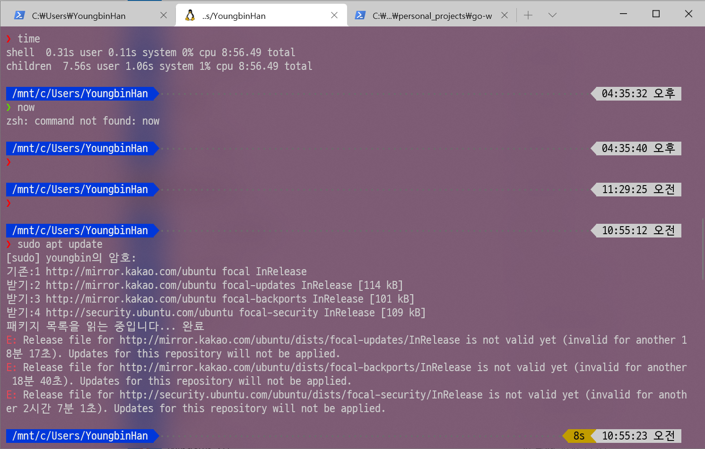
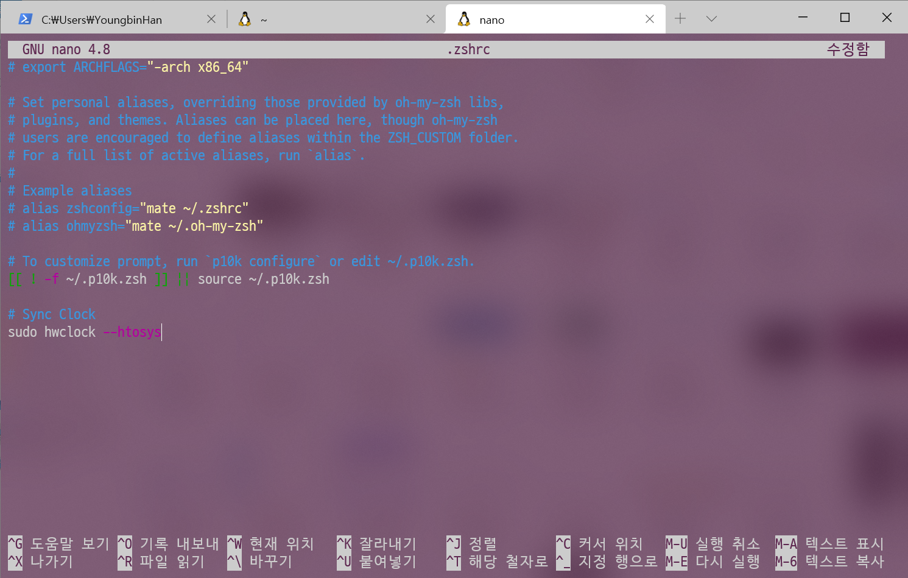
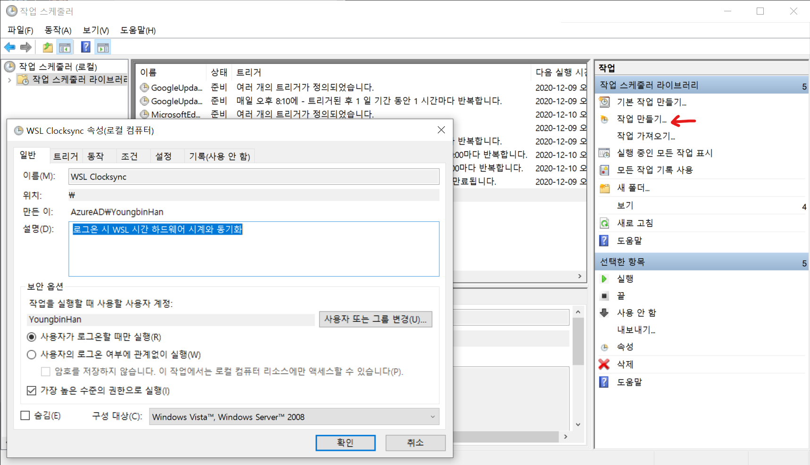
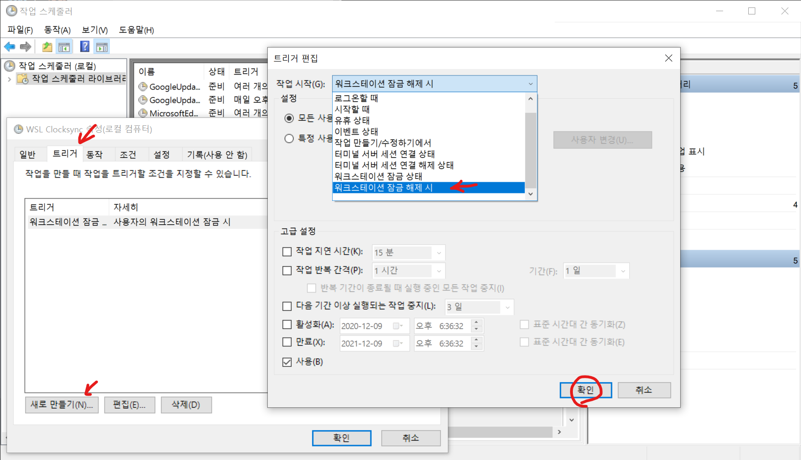
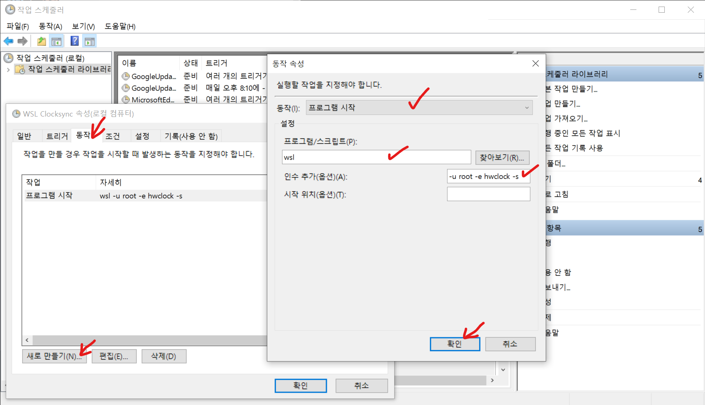
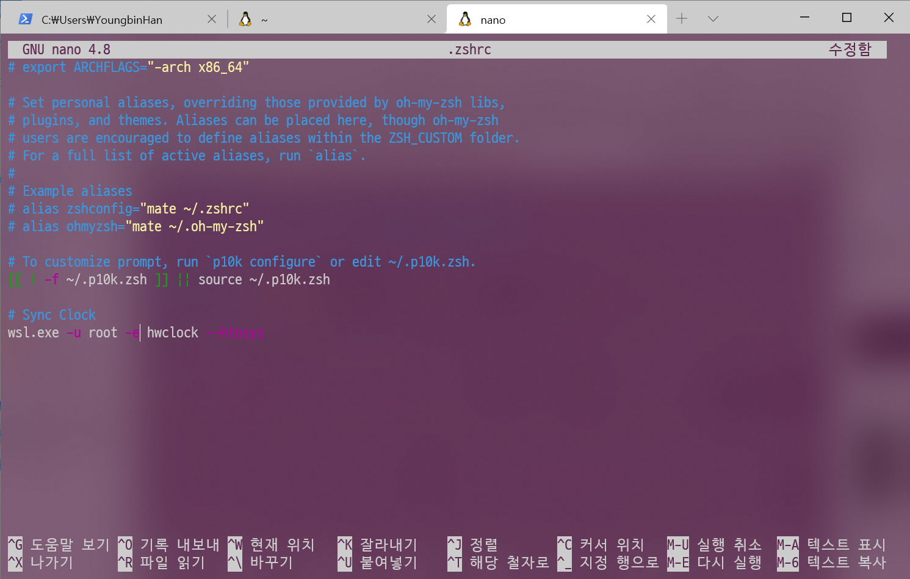

WSL2를 쓰다보면 한가지 문제가 있는데, WSL2 를 쓰다가 컴퓨터를 절전모드로 두고 다시 깨워서 쓰면 WSL2 의 시간과 Windows 의 시간이 일치하지 않는 문제가 있다. WSL2 에서의 시간이 Windows 의 시간보다 2\~30분, 1\~3시간, 하루 이틀 차이나는 등 절전모드로 둔 만큼 시간이 느린걸로 나온다. WSL1 에서는 이런 문제가 없는 걸로 봐선 내부 구조 차이로 발생하는 문제가 아닐까 생각이 든다. 

GitHub서 WSL 저장소의 이슈를 보면, 작년 부터 관련 이슈가 여럿 제기되어 왔지만, 아직 해결 되지는 않은 것 같다.

* [WSL2: Clock skewed? #4677](https://github.com/microsoft/WSL/issues/4677)
* [WSL2 - clock problems during build #4975](https://github.com/microsoft/WSL/issues/4975)
* [WSL2 Ubuntu, time stopped. #5184](https://github.com/microsoft/WSL/issues/5184)
* [WSL2 date incorrect after waking from sleep #5324](https://github.com/microsoft/WSL/issues/5324)

시간 동기화가 안 되면 아래와 같은 사소한 문제로 인한 불편함이 발생한다.

* apt 패키지 저장소와 동기화 실패
* SSL 인증서 검증 오류 발생
* 패키지 빌드하다 오류 발생
* Git Commit 생성시 시간이 꼬이는 문제
* 그 외...



임시방편으로 해결하는 법은 간단하다. 그냥 시간 동기화를 한번 해 주면 된다. 아무래도 WSL 환경 사용시에는 보통 Windows 에서 동기화 한 시간과 같기를 원할테니, 아래 명령으로 하드웨어 시간을 시스템 시간으로 설정해주면 된다.

```bash
sudo hwclock --htosys
```

그러고 조금 전에 오류가 발생하던 작업을 다시 시도하면 된다. 그런데 문제가 하나 더 있다. 만약 절전모드 진입과 절전모드에서 깨우는 일이 잦다면? 요즘 노트북 쓰면 아주 잦을 수 밖에 없다. 덮으면 절전모드, 다시 열면 절전 모드 깨우기. 그때마다 매번 명령 실행하긴 귀찮다. 자동화가 필요하다.

가장 간단한 방법. `.bashrc`, `.zshrc` 등 CLI 셸 시작시 처음에 실행할 명령이 들어간 파일을 열어 마지막 줄에 해당 명령을 추가하는 방법이다. 근데 이렇게 하면 WSL 셸 시작할 때 `root` 로 시작하는 것이 아닌 이상 매번 터미널 창 하나 켤 때 마다 루트 권한 얻기 위해 암호를 입력해 줘야 한다.

```bash
cd ~
nano .zshrc #bash 사용시 .bashrc
```



`systemd` 는 WSL 환경에서 지원이 없어 사용을 못하고. `upstart` 유닛 파일을 작성해 넣어 보거나, `crontab` 설정하는 것도 생각해 볼 법 하다. 하지만 안타깝게도 WSL 환경에서 `upstart` 로 설정 한다고 WSL 켤 때 자동으로 시작되지 않고. `crond` 데몬 또한 이러한 이유로 수동으로 켜줘야 한다.

어짜피 WSL 은 Windows 의 일부이고, 명령 프롬프트나 PowerShell 에서 `wsl` 명령으로도 시간 동기화 명령을 실행해 줄 수 있다. 그것도 아래와 같이 `root` 계정으로 지정해서 암호 입력 없이.

```bash
wsl -u root -e hwclock --htosys
```

이 명령을 Windows 의 작업 스케줄러에서, 컴퓨터 잠금 해제 할 때마다 실행하도록 설정하면 된다. 보통 절전모드에서 깨우면 일단 잠금해제부터 해야 하니, 이걸로 트리거 설정하면 노트북 쓰는 사람들은 덮은 노트북 열어 다시 쓸 때 자동으로 시간 동기화가 실행된다.

시작 메뉴 검색창에서 "작업 스케줄러"를 검색해서 실행하면 사진과 같은 화면이 나온다. `작업 만들기...`를 눌러 새로 생성해보자.



"트리거" 탭으로 들어가 어떤 조건을 만족하면 작업을 실행할지 지정하자. 앞서 언급한 것처럼 잠금 풀 때 실행해야 하니, "워크스테이 잠금 해제 시" 로 선택하여 추가한다.



그리고 "동작" 탭에서 `wsl` 명령과 명령 인수를 아래 사진처럼 넣어서 추가해 주면 된다.



그러면 이제 잠금 해제 할 때 마다. 터미널 창이 아주 잠깐 나왔다 사라지면서 설정한 명령이 실행되고, 그렇게 시간 동기화가 실행된다. 이것도 아주 좋은 방법만은 아닌게, 로그인 할 때 마다 터미널 창 하나 깜빡이면 또 거슬려서 약간 보기 안좋을 수도 있다.

생각을 좀 해 보니, WSL 환경에서도 아래와 같이 `wsl.exe`명령으로 같은 명령을 실행할 수 있다. 

```bash
wsl.exe -u root -e hwclock --htosys
```

그러니 이 명령을 그냥 `.bashrc` 나 `.zshrc` 등 각 셸의 프로필 파일에 넣어주면 된다. 그러면 이 경우에 암호 입력도 나오지 않고 프롬프트가 바로 나오게 된다. 작업 스케줄러로 설정한 것도 딱히 필요 없으니 잠금 해제 때마다 창 하나 깜빡이는것도 볼 일이 없다.



지금까지 WSL2 의 시간 동기화가 안 되는 문제를 임시방편으로 해결하는 여러 방법을 알아보았다. 

이거 말고도 다른 방법이 있긴 하겠지만, 가장 좋은 방법은 아마 WSL 팀에서 이 버그를 고쳐서 업데이트로 제공하는 것이다. 버그가 수정되면 이런 임시방편 조치를 할 필요가 없으니 말이다. [반년 전에는 관련 부서랑 예기하면서 고치고 있다던데, 빨리 수정해 줬으면 좋겠다.](https://github.com/microsoft/WSL/issues/5324#issuecomment-638348776)