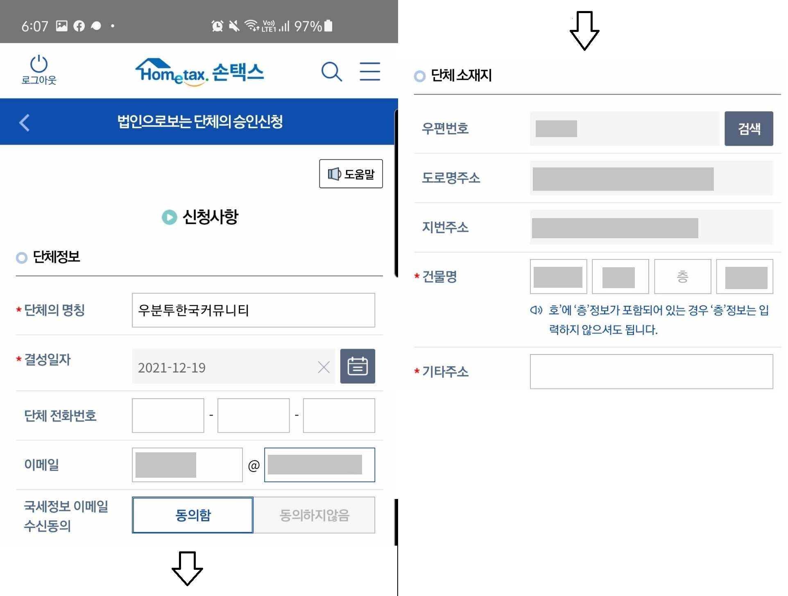
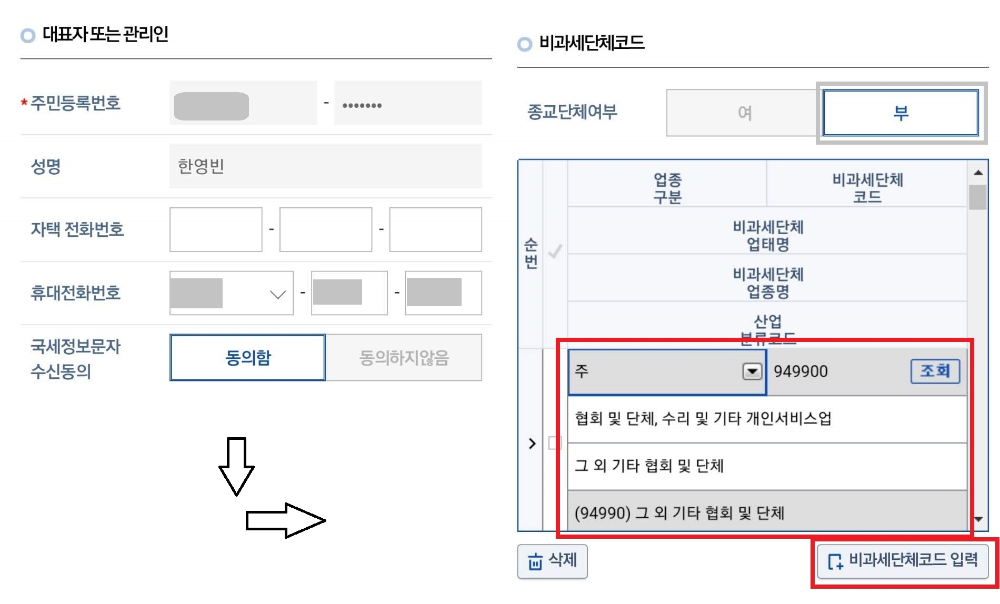

작년 말, UbuCon Asia 2021 이 끝나고 남은 잔액을 우분투한국커뮤니티에서 모두 넘겨받게 되면서 커뮤니티 자금이 갑자기 크게 늘어나게 되었다. 남은 금액을 넘겨 받을 때 까지만 해도 개인 명의의 계좌로 자금을 관리하고 있어서, 받은 금액이 운영진 한 명의 개인 소득으로 잡하는 등의 세금 문제도 생기면서, 지금처럼 개인 명의가 아닌 단체 명의로 된 계좌로 자금을 관리해야 할 필요성이 생기게 되었다.

그래서 작년 11월에 논의하여 국세청에 "법인으로 보는 단체의 승인 신청"을 넣어 고유번호증을 발급받고, 발급된 고유번호증으로 커뮤니티 명의의 통장을 개설하는 것을 추진했다. 그리고 1월 10일에 드디어 커뮤니티 명의의 법인 통장을 개설하게 되었다. 이렇게 통장 개설 까지 하고 보니, 회계 관리로 비슷한 고민을 하고 있는 오픈소스 커뮤니티가 주변에 많이 있는 것을 알게 되었다. 그래서 우분투한국커뮤니티의 경우는 어떻게 준비해서 신청했는지 과정을 글로 정리 해서 공유 해 보고자 한다.

# 다양한 비영리 단체 등록 유형
비영리 단체를 등록 할 수 있는 유형은 매우 다양하다. 이번에 우분투한국커뮤니티 처럼, 법인 등기를 통해 법인격을 받는것이 아니라 세무서 신청으로 납세번호만 받을 수도 있고. 거래 규모가 크고, 기부금 영수증 처리 등도 필요하면 비영리 법인 등기를 하는 방법도 있다. 어떤 유형이 있는지 간단히 알아보고, 여기서는 법인 등기 없이 진행하는 유형을 자세히 알아보자.

## 비영리 법인
많이 들어본 "사단법인", "재단법인" 이 있고, 비영리 목적의 협동조합인 "사회적 협동조합"도 있다. 아래 비영리 법인 유형을 표로 정리한 것을 간단히 살펴보자.

> [서울NPO지원센터 비영리단체 설립 가이드북](https://holistic-narwhal-9cc.notion.site/fc3ba49ff83844bbbf345afe2d42beb2) 에 있는 표를 참고하여 작성하였다.

| 유형 | (비영리)사단법인 | 재단법인 | 사회적협동조합 |
| -- | -- | -- | -- |
| 설립 근거 | 민법 | 민법 | 협동조합기본법 |
| 특징 | 목적을 위해 모인 사람들의 단체 | 목적을 위해 출연한 재산을 중심으로 한 단체 | 사회적 목적 실현. 공익목적사업 비중 40% 이상. |
| 설립 전 조건 | 회원 30~50명 이상 | 출연 재산 5~20억원 이상 | 조합원 5명 이상 |
| 허가/인가 | 주무관청 허가 | 주무관청 허가 | 중앙부처 인가 |

비영리 법인은, 등기된 법인이므로, 법인으로서 보호도 받고. 다른 법인과의 거래, 기부금 영수증을 통한 세액 공제 처리, 정부 보조금 신청 등을 통한 예산 확보 등 다양한 것이 가능하다.
그만큼 등기를 위해 준비해야 하는것도 많고 절차도 복잡하다. 이사회 구성원이나 정관이 바뀌면 변경 등기도 해야 하며, 매년 주무관청에 회계 및 사업실적 보고도 해야 해서, 재정이나 인원 수가 잘 구성되어 있지 않다면 설립 후에도 관리 부담이 매우 클 것이다.

## 법인 등기를 하지 않는 유형
법인 등기를 하지 않는 유형에는 주변에서 흔히 보는 동호회, 커뮤니티, 동창회 같은 모임을 포함하는 "임의단체" 가 있고. 불특정 다수의 수혜를 목적으로 사업을 하는 "비영리 민간 단체"가 있다.
임의단체는 그 안에서 또 셋으로 나누어 볼 수 있다. 등록하지 않은 임의단체(납세번호 없음), 법인이 아닌 단체(소득세율 적용), 법인으로 보는 단체(법인세율 적용) 으로 나누어 볼 수 있다.

- 임의단체: 우리가 평소에 주변에서 흔히 보는 통호회, 커뮤니티, 동창회, 스터디 모임 등이 모두 조직이나 재산 등이 임의로 구성된 임의단체이다.
  - 등록하지 않은 임의단체: 말 그대로 아직 등록 안 한 단체이다. 납세번호나 법인 등기번호가 없는 크고 작은 모임이다.
  - 법인이 아닌 단체: 소득세율이 적용되며, 영리 사업자와 비교하면 개인 사업자와 유사하다. [실제로 개인 사업자 등록과 동일한 양식으로 신청을 받는다.](https://www.gov.kr/main?a=AA020InfoCappViewApp&HighCtgCD=A09002&CappBizCD=12100000072&tp_seq=) 대표자가 바뀌면, 개인사업자 처럼 폐업 처리를 하고 다시 새로 신청해서 납세번호를 받는 것도 동일하다. 세법상 이러한 유형의 단체를 "개인" 으로 보고 세금을 과세하기 때문에, "개인으로 보는 단체" 라고도 많이 불린다.
  - 법인으로 보는 단체: 기존의 조직적으로 잘 운영중인 사단(모임)의 재산에 법인세율이 적용되는 유형이다. 이 유형으로 등록하면, 대표자가 바뀌어도 납세번호가 그대로 유지되며, 회계 또한 연속적으로 이어서 할 수 있다. 2명 이상의 회원만 있으면 등록이 가능하다.
- 비영리 민간단체: "비영리민간단체지원법"을 근거로 하는 단체이다. 임의단체나 비영리법인 모두 이 유형의 단체로 등록할 수 있고, 1년 이상의 활동 실적과 상시 100명 이상의 회원이 필요하다.

각 단체 유형별 세부적인 사항이나 설립 절차는 [서울 NPO 지원센터](http://snpo.kr)에서 정리한 "[비영리 단체 설립 가이드(Notion)](https://holistic-narwhal-9cc.notion.site/fc3ba49ff83844bbbf345afe2d42beb2)"이나 "[비영리 단체 설립 가이드맵](https://snpo-archive.kumu.io/%EB%B9%84%EC%98%81%EB%A6%AC%EB%8B%A8%EC%B2%B4-%EC%84%A4%EB%A6%BD-%EA%B0%80%EC%9D%B4%EB%93%9C%EB%A7%B5)"에 잘 정리되어 있다.

## 다른 커뮤니티는?

다음으로 넘어가기 앞서, 다른 오픈소스 커뮤니티는 어떤 유형으로 단체 등록을 했는지도 한번 알아보자.

- Python Korea: 매년 많은 사람이 참여하는 PyCon Korea 를 운영 하기도 하는 Python Korea는 [사단법인 파이썬사용자모임](http://www.python.or.kr/) 이라는 "사단법인"을 통해서 각종 비용과 세금 처리를 하고 있다.
- DevOps Korea: "데브옵스의 날" 행사를 열기도 하는 DevOps Korea는 [사회적협동조합데브옵스코리아](https://www.coop.go.kr/COOP/state/guildEstablishPopup.do?ACPT_NO=20191710000SO206495&SEARCH_TYPE=COOP_NM&SEARCH_TEXT=%25EB%258D%25B0%25EB%25B8%258C%25EC%2598%25B5%25EC%258A%25A4) 라는 "사회적 협동조합"을 설립하여 활동하고 있다.
- JSConf Korea: 2019년 까지는 [임의단체(법인으로 보는 단체)](https://2019.jsconfkorea.com/faq) 로 활동 했다. 2019년도 행사 웹사이트에 세금계산서 발급이 불가 하다고 나온 것으로 보아, 수익사업 개시 신고는 하지 않은 것으로 보인다. 2020년 부터는 [	제이에스컨프코리아 사회적협동조합](https://www.coop.go.kr/COOP/state/guildEstablishPopup.do?ACPT_NO=20201710000SO209159&SEARCH_TYPE=COOP_NM&SEARCH_TEXT=%25EC%25A0%259C%25EC%259D%25B4%25EC%2597%2590%25EC%258A%25A4) 라는 "사회적 협동조합"을 설립하여 활동하고 있다.
- OSGeo Korea: 이번에 단체 등록을 하면서 많이 참고한 사례. [OSGeo Korea 의 경우 "법인으로 보는 단체" 로 등록하고, "수익사업 개시 신고"까지 한 다음 이를 통해 발급된 사업자 명의로 활동을 하고 있다.](https://endofcap.tistory.com/1748)
- Opentutorials: 우리에게 익숙한 "생활코딩"을 운영하는 오픈튜토리얼스 또한, OSGeo Korea 사례처럼 ["법인으로 보는 단체"로 등록하고 후원금을 받아서 활동하고 있다.](https://opentutorials.org/module/1588/12342) [여러 번 연말에 재무재표를 공개 한 적도 있어서](https://opentutorials.org/module/1588/27744) 단체 등록 이후 어떻게 운영해야 하는 지에 대해 유용한 참고 사례가 될 것 같다.

# 법인으로 보는 단체의 승인 신청 준비하기
자 그럼 이제 단체 등록을 위해 어떤 서류가 필요한지 알아보자. 한가지 짚고 넘어갈 점, 세무서에 "법인으로 보는 단체의 승인 신청"을 하는 것은 법인격을 취득하거나 새로운 임의단체 설립 등록을 하는 과정이 아니다. 이 과정은 기존에 존재하는 임의 단체에 법인세율이 적용되는 납세번호를 발급하여 부여하는 과정임을 기억하자. 다만 납세번호를 부여할 때 이미 비영리 법인처럼 조직적으로 활동하는 단체임을 가정하고 부여 하는 것이다 보니 정관이나 회원 명부, 대표자 선임 증빙 등을 요구한다. 보통 IT/개발자/오픈소스 커뮤니티는 비영리 법인처럼 정관을 제정하거나, 회원 명부를 별도로 관리 한 적은 없다 보니 준비 과정에서 이러한 서류를 새로 만들게 되고, 회원 명부에는 생년월일이나 주민등록된 주소와 같은 개인정보도 들어가서 모든 회원이나 운영진을 명부에 넣기 어렵다 보니, 일부 인원만 명부에 넣어서 세무서에 제출 할 뿐이다.

우분투한국커뮤니티의 경우, 아래와 같은 서류를 제출하였다. 하나씩 알아보자.

- 정관
- 단체 발기인 총회 회의록
- 회원 명부
- 직인(사용인장계)
- 주소지 증빙(무상사용승낙서)
- [법인으로 보는 단체의 대표자 등의 선임(변경)신고서](https://www.law.go.kr/LSW//flDownload.do?flSeq=109166479&flNm=%5B%EB%B3%84%EC%A7%80+%EC%A0%9C6%ED%98%B8%EC%9D%984%EC%84%9C%EC%8B%9D%5D+%EB%B2%95%EC%9D%B8%EC%9C%BC%EB%A1%9C+%EB%B3%B4%EB%8A%94+%EB%8B%A8%EC%B2%B4%EC%9D%98+%EB%8C%80%ED%91%9C%EC%9E%90+%EB%93%B1%EC%9D%98+%EC%84%A0%EC%9E%84%28%EB%B3%80%EA%B2%BD%29%EC%8B%A0%EA%B3%A0%EC%84%9C%0A)
- 법인으로 보는 단체의 승인신청서(홈택스 작성)
 
## 정관
단체의 명칭, 목적, 사업, 사무실 소재지, 조직 구성 등 기본적인 사항을 규정한 것으로, 국가로 치면 헌법에 해당하는 규약이라고 볼 수 있다.
정관을 처음부터 다 작성하는건 쉽지 않으니, 보통은 다른 단체의 정관을 참고하거나 정관 예시에서 명칭, 목적, 사업, 소재지, 조직 구성, 대표/운영위원 구성 방법 등을 수정하고, 필요에 따라 의결 방법이나 회계 부분도 수정하여 사용한다.
임의 단체의 경우 법인이 아니니, 단체 구성원 동의만 있으면 정관을 쉽게 수정할 수 있지만. 비영리 법인의 경우 정관 변경을 하면 주무관청 허가와 정관 변경 등기를 해야 해서, 정관에는 핵심적인 부분만 담고, 더 필요한 부분은 별도의 규정이나 규약을 만들어 관리하는 경우가 많다.

우분투한국커뮤니티의 경우, 서울 NPO 지원센터에서 제공한 정관 예시와 오픈튜토리얼스의 정관, OSGeo Korea 의 정관을 참고하여 작성하였다. 서울 NPO 지원센터에서 제공한 정관 예시 파일을 다양한 문서 포맷으로 변환해서 첨부 하였으니 참고 하여 정관을 작성하면 된다.

> 참고로 정관에 단체의 약칭과 영문 명칭도 명시 해 두면, 나중에 은행에서 계좌 개설시 정관을 근거로 하여 영문 명칭을 넣을 수 있는 등 유용한 부분이 많으니 정관에 명시 해 두면 좋다.

- 서울 NPO 지원센터에서 제공한 정관 예시: [DOCX](bylaws_sample.docs) | [ODF](bylaws_sample.odt) | [PDF](bylaws_sample.pdf)

## 단체 발기인 총회 회의록
단체 설립, 정관 심의, 발기인, 대표자 선임 및 운영위원 구성의 근거가 되는 자료이다. 대략 아래와 같은 사항을 포함하고, 회의록 하단에 발기인의 이름과 서명(또는 도장 날인)을 넣으면 된다.
서명은 실물로 인쇄된 것에 펜으로 직접 서명해도 되고, 모두싸인 같은 전자계약으로 서명을 받거나, 배경이 투명한 서명 이미지를 삽입하거나, Google Docs 의 그림 삽입 기능을 활용해도 무방하다.
홈택스 제출시 PDF 파일로 제출하기 때문에 서명만 잘 확인되면 무방한 것으로 보인다. 우분투한국커뮤니티의 경우, 발기인으로 참여하신 분들이 Google Docs 그림 삽입 기능으로 서명 하시거나, 가지고 계신 서명 이미지를 삽입하는 방식으로 진행했다. 

- 회의 일시 및 장소
- 회의 참여 인원
- 회의 안건: 정관 심의, 운영위원 선출

우분투한국커뮤니티에서 사용한 발기인 총회 회의록에서 개인 정보만 제거한 양식을 첨부하였으니 이를 활용하여 작성하면 된다.

- 발기인 총회 회의록 예시: [DOCX](meeting_note.docs) | [ODF](meeting_note.odt) | [PDF](meeting_note.pdf)

## 회원 명부
발기인 회원 정보가 담긴 문서를 준비하면 된다. 보통 회원 명부에는 발기인으로 참여하는 사람의 이름, 생년월일(또는 주민등록번호/외국인 등록번호), 주민등록지 주소, 연락처(휴대전화), 회원 유형 등의 정보가 들어간다. 회원 명부 양식을 첨부 하였으니, 이를 활용하여 준비하면 된다.

- 회원 명부 양식: [DOCX](member_list.docs) | [ODF](member_list.odt) | [PDF](member_list.pdf)

## 직인
직인은 직인 실물을 제출하는 것은 아니고, 사용인장계 양식에 직인을 날인하고 발기인 대표자 이름과 서명을 넣은 것을 제출하면 된다. 우분투한국커뮤니티의 경우 은행 거래할 때 거래 인감으로 사용할 실물 직인도 필요하니, 온라인으로 직인을 하나 주문해서 인쇄한 사용인장계 양식에 날인하고, 대표자인 내 이름과 서명을 넣었다.

마찬가지로 사용인장계 양식을 첨부 하였으니, 이를 활용하여 준비하면 된다.

- 사용인장계 양식: [DOCX](stamp.docs) | [ODF](stamp.odt) | [PDF](stamp.pdf)

## 주소지 증빙
준비가 가장 힘든 부분 중 하니인 주소지 증빙 서류이다. 여러 방법으로 주소지 증빙을 준비할 수 있다.

- 건물이나 주택을 소유하고 있다면, 해당 부동산에 대한 등기부 등본
- 사무실을 임대 하였다면, 임대차 계약서
- 임대 사무실의 일부를 임대 하였다면, 건물주와 임대 사무실 임차인의 동의가 모두 포함된 전대차 계약서

많은 IT/개발자/오픈소스 커뮤니티는 어쩌면 당연하겠지만, 사무실을 두고 활동하지 않는다. 그래서 주소지 확보가 따로 필요한데, 흔히 다음과 같은 방법을 고려 해 볼 수 있다.

- 커뮤니티를 후원해 온 기관이나 기업에 사무실 후원 요청 (실제 사무 공간을 제공 받거나, 아니면 주소만 제공받는 형태)
- 실제 사무실 임대
- 비상주 사무실 임대

대면으로 모여서 논의를 하거나 처리할 업무가 자주 있다면, 사무실을 임대하는 것이 좋을 것이고. 주소지만 있으면 된다면, 비상주 사무실도 좋은 선택이다. 커뮤니티를 긴 시간 후원해 온 기관이나 기업이 있다면, 이들에게 사무 공간이나 주소지 무상 임대를 요청하는 방법도 있다.

정 안된다면, 집 주소로도 가능하다. 이 경우 세대주가 부동산을 단체에 무상 사용을 승낙하는 내용의 "부동산 무상 사용 승낙"계약을 하면 된다. 세를 들어 사는 집(월세/전세)이라면 집 주인의 인적사항과 동의 서명도 필요하다

주변 지인중에 세 들어 사는 집이라고 집주인 동의까지 필요하진 않다는 의견을 주신 분도 있었는데, 원칙적으로는 전대차 계약이 되므로 집주인 동의도 필요한 것이 맞다. 이와 관련해서 어떻게 준비해야 할지 불확실 하다면, 관할세무서의 재산법인세과 법인팀에 문의하여 사전에 정확한 답변을 받도록 하자.

우분투한국커뮤니티의 경우, 처음에는 클라우드메이트의 임대 사무실을 주소지로 지원을 받으려 하였으나, 건물주 협조 구하는 것이 어려워 건물주의 동의 서명 문제로 무산 되었고. 대신 대표인 나의 집 주소로 등록하기 위해 무상 사용 승낙서를 작성했다. 다만 집이 세 들어 사는 집 이다 보니, 집 주인의 동의 서명을 받고, 세대주가 부모님 이기 때문에 부모님 동의 서명도 받아서 진행 하였다. 

무상사용승낙서를 작성 하는 경우, 우분투한국커뮤니티에서 사용했던 양식을 첨부 하였으니 참고하여 계약서를 작성하면 된다.

- 무상사용승낙서(전대차 계약) 양식 예시: [DOCX](office_rent.docs) | [ODF](office_rent.odt) | [PDF](office_rent.pdf)

## 법인으로 보는 단체의 대표자 등의 선임(변경)신고서
세법에 의해 지정된 양식을 작성하면 된다. 해당 양식은 [여기를 클릭하여 내려받을 수 있다.](https://www.law.go.kr/LSW//flDownload.do?flSeq=109166479&flNm=%5B%EB%B3%84%EC%A7%80+%EC%A0%9C6%ED%98%B8%EC%9D%984%EC%84%9C%EC%8B%9D%5D+%EB%B2%95%EC%9D%B8%EC%9C%BC%EB%A1%9C+%EB%B3%B4%EB%8A%94+%EB%8B%A8%EC%B2%B4%EC%9D%98+%EB%8C%80%ED%91%9C%EC%9E%90+%EB%93%B1%EC%9D%98+%EC%84%A0%EC%9E%84%28%EB%B3%80%EA%B2%BD%29%EC%8B%A0%EA%B3%A0%EC%84%9C%0A)

## 법인으로 보는 단체의 승인신청서
[이 또한 세법에 의해 지정된 양식](https://www.law.go.kr/LSW/flDownload.do?flSeq=38325291&flNm=%5B%EB%B3%84%EC%A7%80+%EC%A0%9C6%ED%98%B8%EC%84%9C%EC%8B%9D%5D+%EB%B2%95%EC%9D%B8%EC%9C%BC%EB%A1%9C+%EB%B3%B4%EB%8A%94+%EB%8B%A8%EC%B2%B4%EC%9D%98+%EC%8A%B9%EC%9D%B8%EC%8B%A0%EC%B2%AD%EC%84%9C%0A)이 따로 있지만, 세무서에 직접 방문하여 신청하는 경우가 아니라면 홈택스에서 입력한 정보로 자동 생성 되기 때문에 따로 작성하지 않아도 된다.

## 그 외 미리 확인할 사항

- 단체의 재산 현황을 법인으로 보는 단체 신청시 입력해야 하므로 미리 파악해 두면 유용하다.
- 취업규칙의 겸업/겸직 금지 조항 저촉 여부 확인: IT/개발자/오픈소스 커뮤니티의 경우 보통 구성원간 수익을 배분하지 않는 비영리 단체이고. 이들 단체를 법인으로 보는 단체의 승인 신청을 하는 것은, 새로운 단체의 설립 등록 신청을 하는 것이 아니라, 기존 단체에 법인세율이 적용되는 납세 번호 부여를 신청하는 것이다. 때문에, 법인으로 보는 단체의 승인 신청을 하는 것은 보통 대부분의 기업 취업규칙의 겸업/겸직 금지에 저촉되지 않는다. 특히 이미 커뮤니티 운영진으로 잘 활동 해 온 사람이라면 더 그렇다. 그럼에도 불구하고, 회사마다 취업 규칙에 차이가 있기 때문에, 발기인 참여자 중 혹시 걱정이 된다면 재직중인 회사의 인사팀(HR팀)을 통해 취업규칙의 겸업/겸직 금지 조항에 저촉되는지 먼저 확인해 보는 것도 나쁘진 않다.

# 홈택스로 승인 신청하기
증빙 서류 준비가 다 되었다면, 이제 홈택스(또는 모바일 손택스 앱)으로 신청을 넣어 보자. 먼저 당연하게도, 홈택스에 로그인 한다. 
그리고 홈택스 검색창에서 "법인으로 보는 단체"를 검색하면, "법인으로 보는 단체의 승인신청" 메뉴가 나온다. 이를 클릭하여 신청 화면으로 들어간다.

## 신청 양식 작성

그러면 위 사진과 같은 화면이 나온다. 하나씩 차근차근 입력 해 보자.

- 단체의 명칭: 정관에 명시한 단체 명칭으로 입력
- 결성 일자: 발기인 총회 회의록에 나온 의결 일자로 입력
- 단체 전화번호/이메일: 둘중 하나 이상 입력
- 단체 소재지: 앞에서 단체 등록을 위해 확보한 주소지 증빙의 주소로 입력. (사무실 주소 등) 

스크롤 하여 내리면 위와 같은 양식이 계속해서 나온다.
- 대표자 또는 관리인: 발기인 총회 회의록에서 대표자로 선임한 사람의 개인정보를 입력한다. 홈택스의 경우, 홈택스로 로그인 한 사람 정보가 자동으로 입력된다.
- 비과세단체코드: 종교단체여부는 `부`로 지정하고, 비과세단체코드는 `(94990) 그 외 기타 협회 및 단체` 로 지정하여 추가하면 된다.

이어서 단체 사업 내용과 재산 현황을 입력한다.
- 고유사업: 커뮤니티가 하는 주요 활동을 한 문장으로 짧게 요약해서 넣는다. 우분투한국커뮤니티의 경우 "우분투, 리눅스 및 오픈소스 저변확대"로 넣었다.
- 수익사업: 운영비 충당을 위한 수익사업을 계획하고 있다면, 수익사업 내용도 입력한다.
- 면적: 단체 주소지의 면적을 입력한다. 앞서 준비한 임대차 계약서나 무상사용승낙서에 명시한 임대 면적을 넣으면 된다.
- 사업 설명: 단체에서 하는 활동이나 사업에 대한 자세한 설명을 입력하면 된다.
- 공익법인여부, 출연자산여부: 해당사항이 없으니 `부`로 선택
- 재산사항: 단체가 관리중인 현금 등 재산 현황을 입력한다. 없다면 `0`으로 넣어도 무방하다.

여기까지 작성 완료 후, 저장을 눌러서 다음 단계로 넘어가면 이제 증빙서류 제출 단계이다.
## 증빙서류 첨부

아래 사항을 참고하여, 앞서 준비했던 증빙서류를 첨부하면 된다.

- 정관 또는 조직 운영에 관한 사항: 정관, 회원 명부, 사용인장계
- 대표자 또는 관리인 임을 확인할 수 있는 서류: 단체 발기인 총회 회의록
- 법인으로 보는 단체의 대표자 등의 선임신고서(민원업무편람): 법인으로 보는 단체의 대표자 등의 선임(변경)신고서 양식을 받아 작성한 것을 제출
- 임대차계약서(장소를 임차한 경우): 임대차계약서, 전대차계약서 또는 무상사용승낙서를 제출.
- [상가건물 임대차보호법]의 적용을 받는 상가건물의 일부를 임차한 경우에는 해당부분의 도면: 해당 사항 있는 경우 제출

## 제출한 증빙서류 확인

꼭 "제출서류 확인하기"를 눌러서, 업로드한 증빙서류가 정상적으로 표시 되는지 꼼꼼히 확인 후 제출 하도록 하자. 이상이 있는 서류가 제출되면 세무서에서 서류를 보완하여 다시 보내 달라고 할 수 있고, 이로 인해 신청 승인이 지연될 수 있다.

모두 확인 했다면, "신청서 제출하기"를 눌러 신청서를 제출한다.

## 서류 보완 요청이 온다면?

세무서에서 서류를 보완하여 다시 제출해 달라고 메시지나 전화로 연락이 오기도 한다. 당황하지 말고, 서류 어떤 부분을 보완해야 하는지 문의해서 확인 한 후, 보완하여 제출 하도록 하자. 제출한 서류를 검토하고 승인하는 것은 세무서 직원이다. 그러니 어떤 서류를 제출해야 승인 되는지는 세무서의 담당 부서 직원이 가장 잘 안다. 괜히 본인 추측대로 수정해서 제출하기 보단, 꼭 문의 해보고 제출 하도록 하자. 

법인으로 보는 단체의 승인 신청은 관할 세무서의 **재산법인세과 법인팀** 에서 담당한다. 보완 요청이 문자나 전화로 왔다면 이 부서에서 연락 온 것이니 그 번호로 연락해서 문의하면 된다. 불확실 하다면 홈택스에서 신청한 경우, 민원 접수증을 조회하면 담당자 전화번호가 나오니 그 번호로 연락하여 문의하면 된다. 

다른 부서(예: 민원봉사실)에 문의하면 정확하지 않은 답변이 나와서 담당자와 계속 핑퐁을 할 수도 있다. 꼭 민원 담당자에게 문의 하도록 하자.

# 고유번호증 수령하고 법인계좌 개설하기
제출한 서류가 이상이 없다면, 보통 일주일 안으로 고유번호증이 나오고 늦어도 민원접수증에 명시된 처리 기한 까지는 민원 처리가 완료되어 고유번호증이 나온다. 발급된 고유번호증은 가까운 세무서에 직접 방문하여 수령 하거나, 홈택스에서 출력도 가능하다. 고유번호증과 함께 총 3장의 서류가 발급된다. "고유번호증", "법인으로 보는 단체의 국세에 관한 의무이행자 통지서", "법인으로 보는 단체의 승인여부통지서"

이제 단체 명의의 법인 계좌를 개설하러 가 보자. 아래와 같은 서류를 준비하여 은행 영업점에 방문하여 개설하면 된다. 영업점 마다 아래 나열된 증빙서류 외에 추가 서류를 더 요구하는 경우도 있고, 서류가 하나라도 부족하면 개설이 거절 되거나 금융거래 한도계좌(일 최대 30만원 이체 가능)로 개설될 수 있으니, 방문하고자 하는 영업점에 미리 전화로 문의 해 본 후 방문하는 것을 추천한다. 필자의 경우, 집 근처 영업점에 먼저 전화로 문의 해 보고, 홈택스에 제출했던 서류 모두 다 그대로 들고 가서 그대로 제출했고(무상사용승낙서와 사용인장계 까지...) 여기에 추가로 주민등록증을 대표자 신분증으로 단체 직인(실물 도장)을 거래인감으로 제출했다.

- 고유번호증 원본
- 거래인감 - 사용인장계에 날인했던 직인 실물 도장을 들고 가면 된다
- 정관 - 홈택스에 제출했던 것 그대로 출력하여 지참하면 된다
- 회원 명부 - 마찬가지로 홈택스에 제출했던 것 그대로 출력하여 지참
- 회의록 - 홈택스에 제출했던 발기인 총회 회의록을 지참
- 대표자 신분증 - 대표자가 방문하여 신청하는 경우 대표자의 신분증 지참

법인 계좌는 개설 절차가 복잡해서 시간이 오래 걸린다. 필자의 경우 창구에만 앉아서 두 시간 정도 걸려서 개설을 완료했다. 점심 때 가는 것이 아니라면, 연차나 반차를 쓰고 방문하는 것을 추천한다. 

법인 통장을 개설할 때, 아래와 같은 사항도 함께 개설하도록 하자.

- 인터넷 뱅킹: 매번 창구 가서 거래 할 수 없으니 당연히 필요하다. 인터넷 뱅킹 인증에 쓸 OTP가 함께 발급된다. OTP 발생기 구입은 현금으로만 가능하니 미리 준비 하도록 하자. (일반형 5000원, 카드형 10000원)
- 법인카드: 체크카드, 신용카드, 현금카드 등 발급이 가능하다. 참고로 법인 체크카드나 신용카드는 개인용과 달리 현금카드 기능이 없다. 카드로 현금 인출 할 일이 있다면, 현금 카드를 별도로 발급하여야 한다. 

이렇게 하면 단체 명의로 된 법인 계좌를 아래 사진처럼 개설하여 사용할 수 있다. 우분투한국커뮤니티의 경우 법인 계좌로 개설은 되었는데, 필요한 서류를 다 제출 했음에도 창구 직원분이 일단은 금융거래한도계좌만 가능하다고 하셔서 어쩔 수 없이 하루 최대 30만원 까지만 이체 가능한 것으로 일단 개설 하였다. 앞으로 정기적인 결제 내역이나 납부 내역이 있으면 3개월 후 심사해서 풀어 줄 수도 있다고 하니 이제 한도 제한을 풀기 위한 작업을 해야 할 것 같다.

# 인터넷 뱅킹
창구에서 개좌 계설과 함께 인터넷 뱅킹도 신청 했다면, 기업용 인터넷 뱅킹에 로그인 하여 은행 업무를 볼 수 있다. 요즘 개인 뱅킹은 공동 인증서 말고도 다른 인증수단이 많아서 조금은 편리한 편인데, 기업 뱅킹은 아직도 공동 인증서(구 공인 인증서)로만 인증 및 거래가 가능하다. 거기다가 이 쓰기 불편한 공동 인증서를 사용하기 위해 매년 4,400원의 이용료를 지출해야 한다.

우분투한국커뮤니티는 국민은행에 계좌를 개설했는데, 국민은행의 경우 법인 계좌의 현금으로만 공동 인증서 이용료 결제가 가능해서 5000정도 입금 후, 창구에서 구입한 OTP로 인증하여 일단 한정용 공동인증서를 발급하였다.

모바일 뱅킹은 보통 기업용 뱅킹 앱이 별도로 있어서 이를 설치하여 이용하게 된다. 마찬가지로 공동인증서로만 로그인이 가능하다. 국민은행의 경우 [이 페이지에서 공동인증서를 휴대전화로 복사할 수 있다.](https://obank.kbstar.com/quics?page=C101065)

# 정리
지금까지 우분투한국커뮤니티의 사례를 통해, 세무서에 법인으로 보는 단체 등록을 하고 여기서 발급된 고유번호증으로 단체 명의의 법인 계좌를 개설하는 방법에 대해 알아 보았다. 넘어야 할 산은 이제 시작이다. 앞으로 이체 한도도 풀어야 하고, 수익사업을 위해 수익사업 신고를 하면, 수익사업으로 들어온 수익에 대해 법인세도 납부해야 한다. 차차 운영 해 보면서 또 중요한 것은 지금 이 글 처럼 따로 정리 해 봐야 할 것 같다. 단체 명의 계좌 개설을 생각하고 있는 분들 모두에게 이 글이 많은 도움이 되었으면 좋겠다.