> [클라우드메이트 기술 블로그에도 기고 된 글](https://tech.cloudmt.co.kr/2022/12/13/ubuntu-summit-2022/) 입니다.

지난 11월 7일부터 9일 까지 체코 프라하에서 Ubuntu Summit 2022 (우분투 서밋 2022) 행사가 있었는데요, 한국에서는 저를 비롯한 우분투 한국 커뮤니티 운영진으로 활동 중인 4명의 인원이 Canonical 측으로부터 초청을 받아 참가할 수 있었습니다. 이번에 우분투 서밋 참가를 통해 다양한 분야에서 최근 우분투가 어떤 역할을 하는지도 알 수 있었고, 전세계 우분투 커뮤니티의 다양한 사람들을 만날 수 있어 즐거운 시간이였습니다. 행사 후에는 회사 지원을 받아 워케이션 일정으로 몇일 더 머물 수 있었는데요, 이 글을 통해서 이번에 열렸던 우분투 서밋에 대해 소개 해 보고, 제가 참가했던 세션 중 흥미로웠던 세션 일부를 소개 해 보고자 합니다.

## Ubuntu Summit
우분투 서밋에 대해 처음 들어 보시는 분들이 많으실 겁니다. 그럴 수 밖에 없는데요, 이번에 처음 열린 행사이기 때문입니다. 원래는 약 10년 전 까지는 Ubuntu Developer Summit (UDS) 행사가 주기적으로 열렸습니다. 6개월마다 새로운 우분투 릴리스가 나오기 한두달 전 쯤에 전 세계 우분투 커뮤니티 기여자들이 한 곳에 모여 릴리스를 앞두고 함께 협업하는 자리 였는데요. 이번에 열린 우분투 서밋은 기존 UDS와 달리 우분투 배포판 개발에만 집중 하기 보단, 비 개발 분야인 디자인, 문서화, 지역 커뮤니티 운영 등 다른 분야까지 크게 확장하여 우분투 커뮤니티 자체에 초점을 둔 행사라고 볼 수 있습니다.

## UbuCon 과 다른 점?
Ubuntu Summit 이외에 우분투 커뮤니티를 위한 글로벌 행사가 하나 더 있는데요, 각 대륙이나 국가별로 열리는 UbuCon (Ubuntu Conference) 행사입니다. 북미 지역 (UbuCon @ SCALE), 남미 지역(UbuCon Latin America), 유럽 지역(UbuCon Europe) 그리고 [**작년에 온라인으로 처음 시작하여 올해 한국에서 오프라인으로 처음 열렸던 아시아 지역 행사(UbuCon Asia)**](https://2022.ubucon.asia/ko)도 있습니다! Ubuntu Summit 과 UbuCon 모두 우분투 커뮤니티를 위한 축제의 장이라는 점에서는 비슷한데요. 차이점이 있다면 행사를 준비하는 주최가 다르다고 볼 수 있습니다.

Ubuntu Summit 은 주로 Ubuntu 를 개발한 회사인 Canonical 에서 행사를 준비합니다. 행사 예산도 Canonical 예산으로 준비가 되어서 따로 후원사가 없는것이 보통인데요. 반면 UbuCon 은 모든것을 커뮤니티에서 준비합니다. 전반적인 계획부터 자금 조달을 위한 후원사 모집, 발표자 모집과 일정 만들기와 마케팅 모두 커뮤니티에서 준비하는 행사입니다. 물론 Canonical 도 참여 하지만, Ubuntu Summit 에서와 UbuCon 에서는 후원사로 참여하는 편입니다. 

대상으로 하는 참가자 구성에도 조금 차이가 있습니다. 주로 Ubuntu Summit 에서 전세계 사람들을 대상으로 한다면, UbuCon 의 경우 대륙이나 국가별로 열리다 보니 해당 지역의 커뮤니티를 대상으로 하는 경우가 많이 있습니다. 컨퍼런스에서 다루는 내용 또한 UbuCon 의 경우 해당 지역에서 관심 있는 내용에 좀더 초점이 맞춰지는 편 입니다.

## 행사장 도착 & 환영 행사
올해 우분투 서밋은 힐튼 프라하(Hilton Prague) 호텔에서 열렸습니다. 행사 기간 동안 숙박도 힐튼 프라하 호텔로 지원 받아서, 아침에 일어나면 씻고 바로 내려가서 식사 후 행사 참여가 가능해서(?) 꽤나 편했던 것 같습니다. 하지만 도하 경유를 포함한 20시간 장거리 비행 후 시차 적응에는 실패하여... 오후 7~8시만 되도 피곤해지고 새벽 6시에 잠을 깨다 보니 조금 피곤하기도 했습니다. 

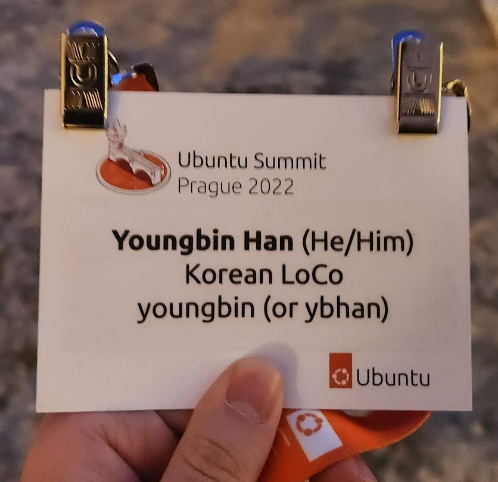

호텔에 도착 했을 때는 행사 시작 바로 전날 이였는데요, 낮에는 행사장을 미리 둘러보면서 행사장 체크인과 명찰 수령을 하였고, 저녁에는 행사 시작을 앞두고 호텔에 있는 클라우드9 라운지에서 환영 행사가 있었습니다. 와인, 맥주와 안주를 곁들여 먹고 돌아 다니면서 다른 행사 참가자 분들과 인사하고 미리 조금 친해질 수 있는 자리 였습니다. 같이 발표를 준비하던 우분투 포르투갈 커뮤니티 운영진 분들, 일본, 네팔, 인도 말레이시아 등에서 오신 해외 UbuCon Asia 운영진 분들, UbuCon Asia 후원이나 Ubuntu Summit 참가 관련해서 메일로 여러 이야기 나눴던 Canonical Community Team 분들과도 만나서 인사할 수 있었습니다.

## 1일차
Community Team 을 이끌고 있는 Philipp Kewisch님과 Canonical CEO인 Mark Shuttleworth의 오프닝으로 1일차 일정이 시작 되었습니다. 1일차 주요 일정에 대해 소개하고 참가자들이 어디에서 왔는지 국가 목록을 보여 주면서 다양한 곳에서 온 분들을 다시한번 환영하는 자리를 가졌습니다.

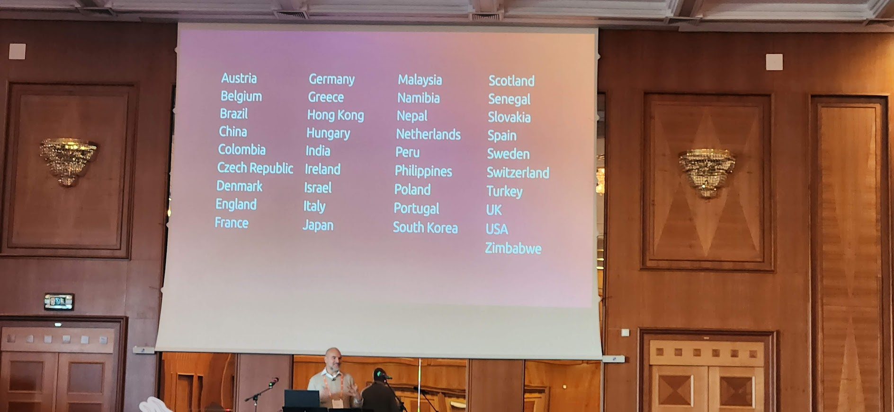

### The Windows Subsystem for Linux (WSL) - Latest updates and future improvements
이후 오전에는 Ballroom 에서 세션이 이어 졌는데요, 개인적으로 WSL을 자주 쓰다 보니 [Craig Loewen 님의 세션 "The Windows Subsystem for Linux (WSL) - Latest updates and future improvements"](https://events.canonical.com/event/2/contributions/24/)을 재미있게 봤습니다. EA, 블리자드에서 WSL을 활용하여 리눅스에서 돌아갈 게임 서버 개발 및 디버깅등에 활용한 활용 사례, 새로 나온 서비스인 DevBox 에서의 WSL 시연, WSL 에서의 상호운용성 기능과 GPU 가속 기능, 등에 대한 소개가 있었고. WSL2와 WSLg 의 내부 구조에 대한 설명이 있었습니다.

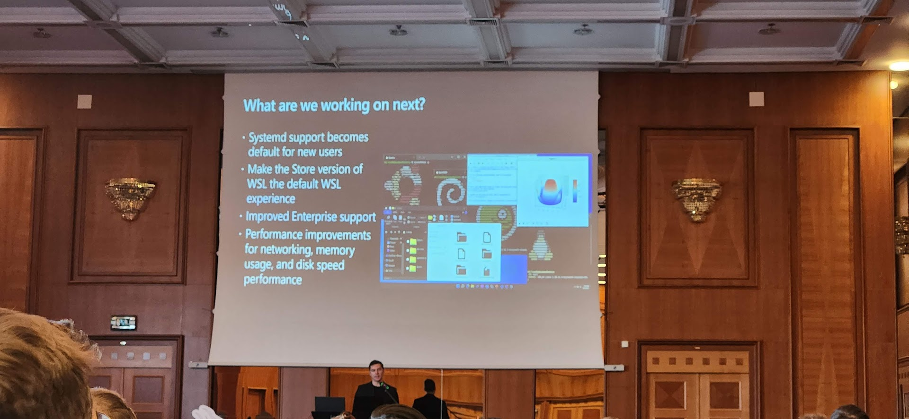

앞으로 나올 새 기능에 대한 소개도 있었는데요, WSL 에서의 Systemd 기본 활성화, MS Store 의 WSL 를 통한 WSL 업데이트 제공, 엔터프라이즈 지원 개선, 네트워킹/메모리 사용량/디스크 속도 등 부분 성능 향상 등 흥미로운 부분이 많았습니다. WSL 환경이 Systemd 의 부재로 몇가지 못 쓰는 기능이 있어 좀 아쉬웠는데, 올해 중반 쯤 정식 지원을 하더니 기본 활성화 적용도 된다 하니 많이 기대가 되는군요. 

### Build containers that ROCK!
우분투 컨테이너 이미지를 기반으로 널리 쓰이는 오픈소스 소프트웨어를 잘 다듬어 컨테이너 이미지로 만드는 커뮤니티이자 프로젝트인 "Ubuntu ROCKs" 에 대한 세션이였습니다. 우분투 베이스 이미지를 기반으로, 일관적이면서도 안전하고 성능이 좋으면서도 조그마한 사이즈의 컨테이너 이미지를 만들이 위해 프로젝트에서 무엇을 하는지 소개하고, 이러한 컨테이너 이미지를 만들기 위한 관리 도구인 [Rockcraft](https://canonical-rockcraft.readthedocs-hosted.com/en/latest/) 에 대해 소개하는 시간도 가졌습니다. Snapcraft 나 Juju Charm 설정 파일 작성에 사용하는 YAML 포맷을 Rockcraft 에도 도입해서 컨테이너 빌드를 구성하는 것 등을 알 수 있었습니다.

### LXD: Containers for Human Beings

보통 리눅스 컨테이너에 대해 이야기 하면, Docker 와 Podman 같은 애플리케이션을 패키징 해서 배포하기 위한 OCI 포맷의 애플리케이션 컨테이너를 많이 이야기 하는데요. 이 세션에서는 VM 대신 가벼운 격리 환경을 만들어 쓸 때 많이 사용하는 시스템 컨테이너인 LXD에 대해 알아보는 시간을 가졌습니다. 이와 함께 간단한 LXD 시연도 볼 수 있는 시간이였습니다.

## 2일차
2일차 일정은 ["Ubuntu on Arm"](https://events.canonical.com/event/2/contributions/8/) 이라는 흥미로운 제목의 세션으로 일정이 시작 되었습니다. 

### Ubuntu on Arm

캐노니컬의 Ubuntu on Arm 팀에서 우분투에서 Arm 프로세서 지원을 위해 어떤 활동을 해 왔는지 알 수 있는 세션이였습니다. 우분투 12.04 때 부터 Arm 지원을 위해 커뮤니티와 해온 갖은 노력, .Net, JDK, Airflow 등 다양한 워크로드를 우분투 Arm 으로 운영할 때의 다양한 이점, 우분투가 프리로드된 ThinkPad X13s (Snapdragon 8cx Gen3 가 탑제된) 노트북을 위한 협업, 그외 퍼블릭 클라우드, Juju, MAAS, Automotive 등 분야에서의 우분투 Arm 지원을 위해 다양한 작업을 하고 있음을 알 수 있는 세션이였습니다. 재미난 것이 원래 우분투 모바일 팀에서 지금의 우분투 Arm 팀으로 피봇해서 활동을 해 오고 있다고 하는데, 우분투 모바일 팀은 원래 인텔의 제안으로 시작 했다고 하는군요...?

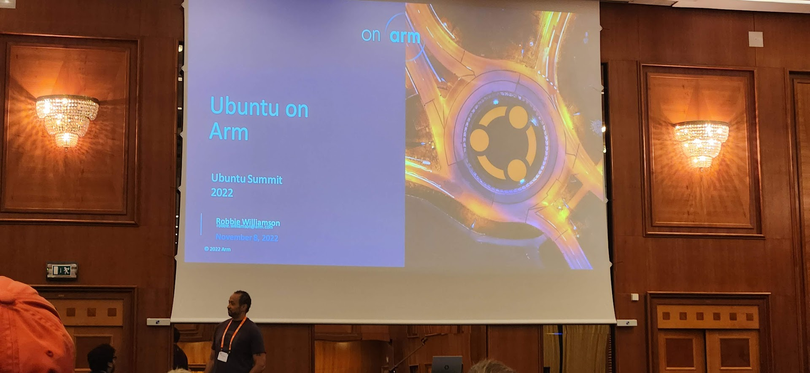
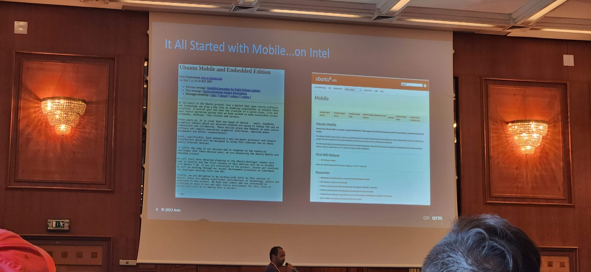
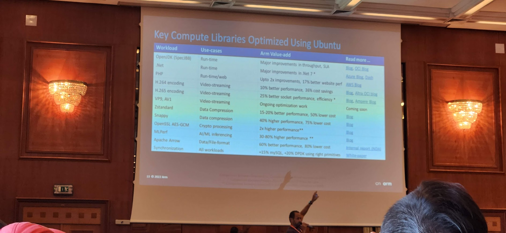
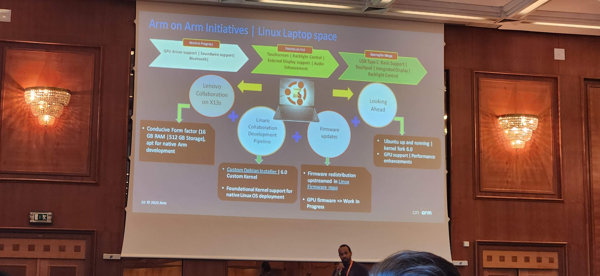

### Ubucon Europe and Asia
이 날은 [저와 우분투 포르투갈 로컬 커뮤니티의 운영진인 Tiago Carrando 님이 함께 준비한 세션](https://events.canonical.com/event/2/contributions/109/)이 있는 날 이기도 했습니다. 세션을 통해서 Ubucon Europe 행사와 Ubucon Asia 행사에 대해 소개하는 시간을 가졌습니다. Ubuntu Summit 과는 어떻게 다른 행사인지, 과거에 열린 Ubucon 행사는 어땠는지, Ubucon 을 개최하려면 어떤 준비과정을 거쳐야 하고, 준비 하면서 꼭 명심해야 할 것은 무엇인지에 대해서도 공유하는 시간을 가졌습니다. 

청중이 많이 없어서 아쉽긴 했지만, 발표 자체는 즐겁게 준비해서 잘 마쳤고. (전날 까지도 준비가 다 안 되어서 밤에 Tiago 님과 맥주 마시면서 준비하고 당일 오전에도 마저 준비를 마무리 하긴 했습니다만...) 외국 분과 협업해서 발표도 준비 해 보고, Ubucon 에 대한 경험을 공유 해 볼 수 있는 좋은 경험 이였습니다.

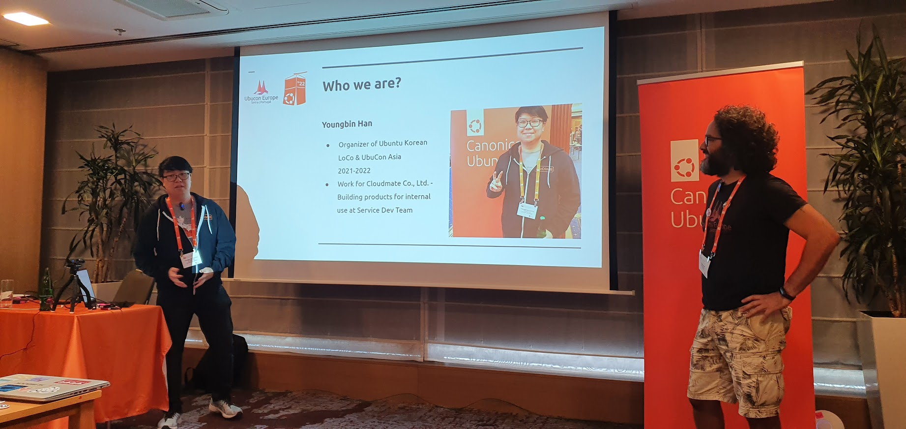
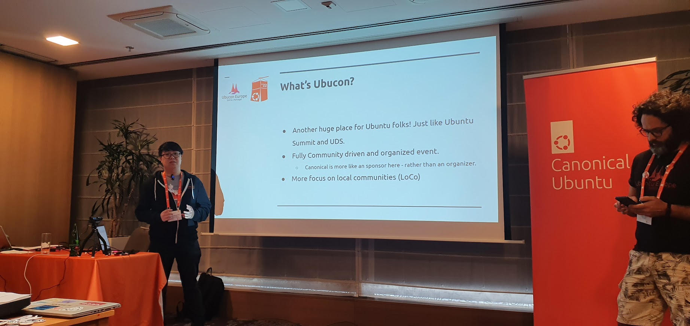
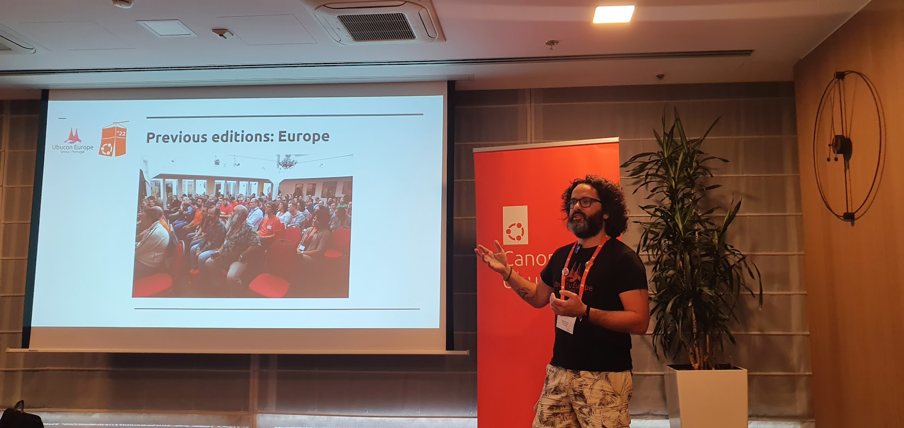

### Finding happiness and success through documentation - workshop
제 발표를 마친 후에는, 어떤 세션을 참가 해 볼까 하다가 [문서화 워크샵](https://events.canonical.com/event/2/contributions/70/) 에 참여 했었는데요. 문서화 도구에 관한 워크샵 인가 싶어서 참여 했더니, [Diátaxis framework](https://diataxis.fr/) 라는 문서화 방법론에 관한 워크샵 이였습니다. 세션 중간에 참여해서 내용 전체를 잘 이해하진 못했지만, 그룹별로 책상에 보드와 카드를 올려두고, 각 카드에 나와있는 텍스트가 튜토리얼(Tutorial), How-to 가이드(How-to guides), 설명(Explanation), 참조자료(Reference) 중 어디에 해당하는지 분류 해 보면서 각 유형의 문서가 어떤 특성을 가지는지 이해해 보는 시간을 가졌습니다.

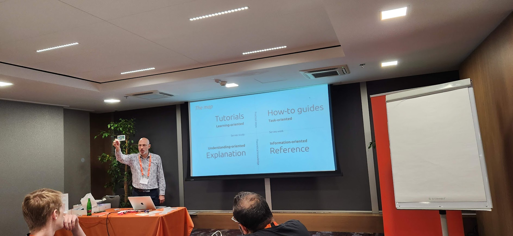
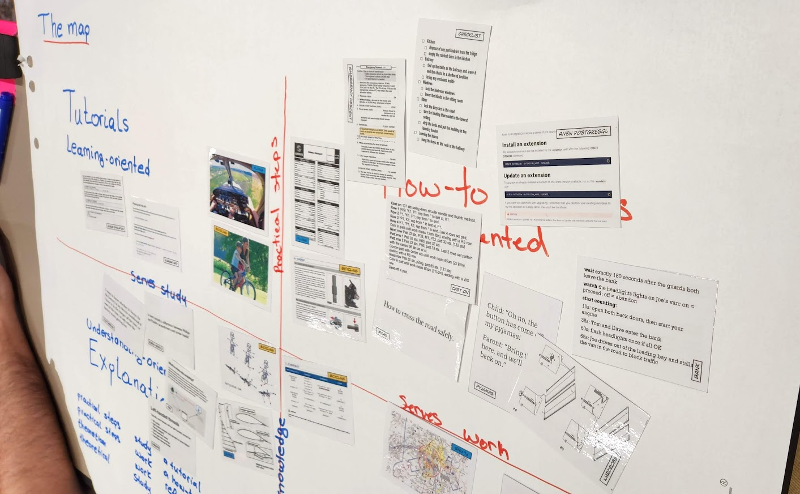

## 3일차

3일차에는 주로 워크샵 세션에 많이 참가해서 참가했던 워크샵에 대해 이야기 해 보고자 합니다.

### Build your own environmental monitoring station with a raspberry Pi on Ubuntu Core

[Raspberry Pi 와 Ubuntu Core 를 이용해서 온습도 센서에서 값을 읽어다가 보여주는 실습을 해 보는 시간을 가졌습니다.](https://events.canonical.com/event/2/contributions/77/) 발표자 분이 실습용 라즈베리파이와, Ubuntu Core 가 미리 설치 된 SD 카드, 센서까지 미리 다 준비 해서 나눠 주셨으나... 저는 Ubuntu Core 초기 설정에 실패하는 바람에 초기화 하고 다시 설정 한다고 시간을 다 써서 제대로 실습 해 보지는 못한 것 같습니다. 옆에분은 잘 실습 진행하고 계서서 대신 옆에분이 Ubuntu Core 에 날씨 모니터링 프로그램 샘플 Snap 패키지 셋팅하는것을 구경하거나 앞에서 발표자분이 시연하는것을 구경하는 것으로 대신 했습니다.

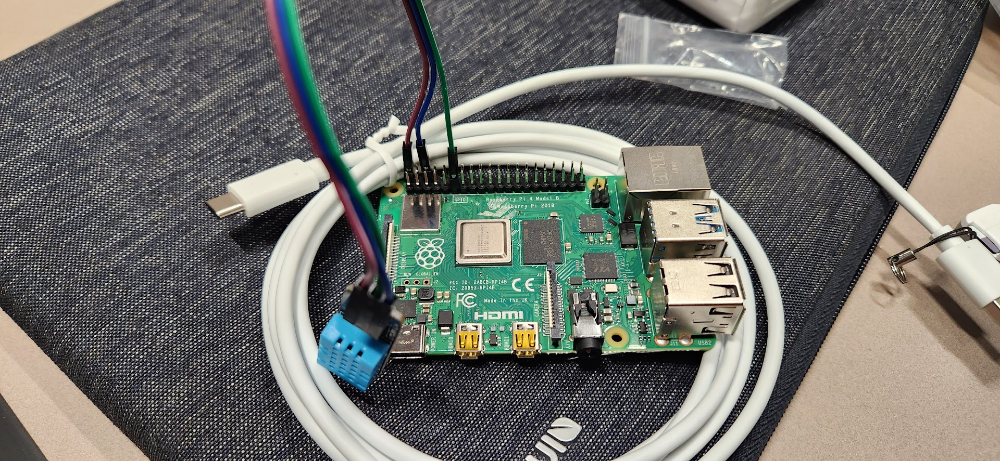
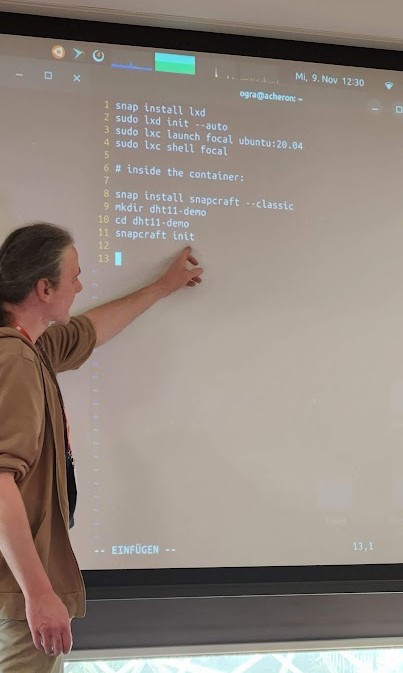
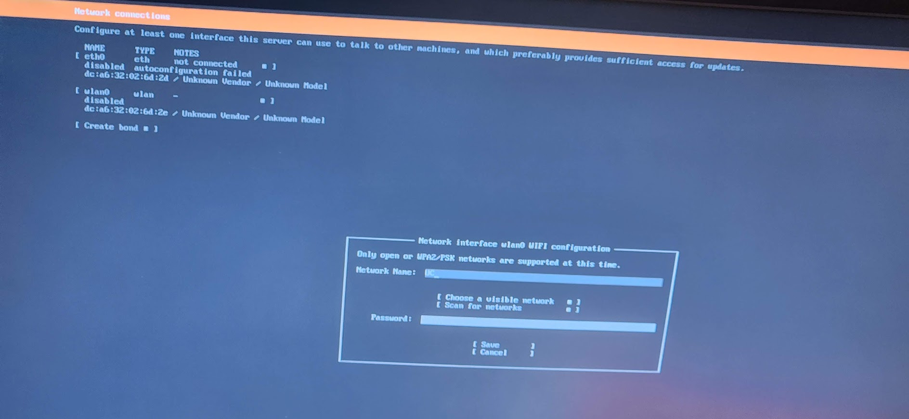

### Ubuntu on RISC-V - state of things

요즘 Arm 과 함께 또 많은 사람들이 관심을 가지는 프로세서가 ISA가 모두 오픈소스로 공개되어 있는 RISC-V가 아닐까 싶은데요. [현재 우분투의 RISC-V 지원은 어떤지에 대해 이야기 하는 짧은 세션](https://events.canonical.com/event/2/contributions/111/)에도 참여 했습니다. 세션에서 현재 우분투가 지원되는 RISC-V 싱글보드 (SiFive Hifive Unmatched, StarFive VisionFive 2, Allwinner Nezha 등)에 대해 알아보고, 지금 각 우분투 릴리스 별로 지원하는 RISC-V 하드웨어, 지원되는 패키지 현황 등에 대해 알아보는 시간을 가졌습니다. Python, JSK, Node.js, Docker, LXD 등 자주 쓰는 개발 도구는 이미 지원이 잘 된다고 하는군요.

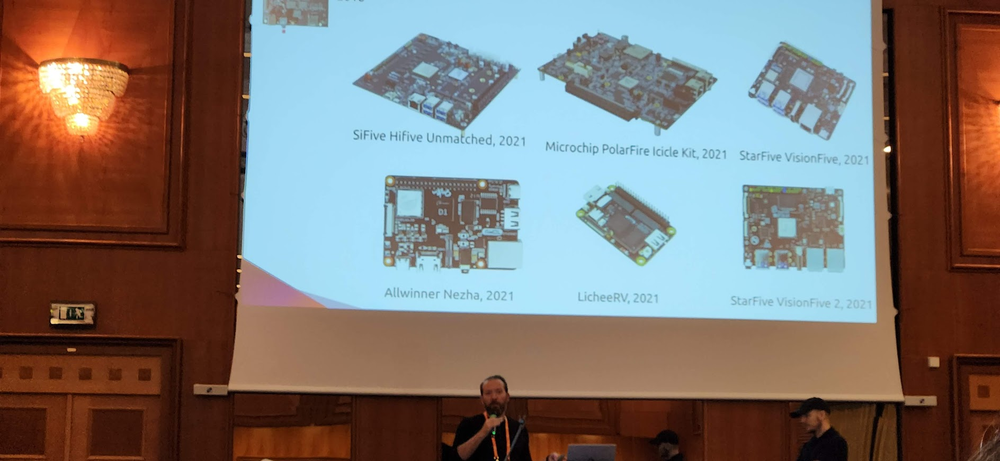

### Building graphical IoT solutions with Mir and Ubuntu Core

마지막으로 [Ubuntu Frame 을 활용해서 Flutter 기반 키오스크 앱을 구축해서 실행 해 보는 워크샵](https://events.canonical.com/event/2/contributions/39/)에도 참여 하였습니다. 그러나 이 워크샵에서는 샘플 코드 빌드에 시간이 한참 걸려서, 실제로 제 노트북에서 실행되는 것을 보진 못했습니다. 그래서 이 워크샵에서도 마찬가지로 앞에서 발표자 분이 시연 하는것을 구경하는 것으로 만족 했습니다.

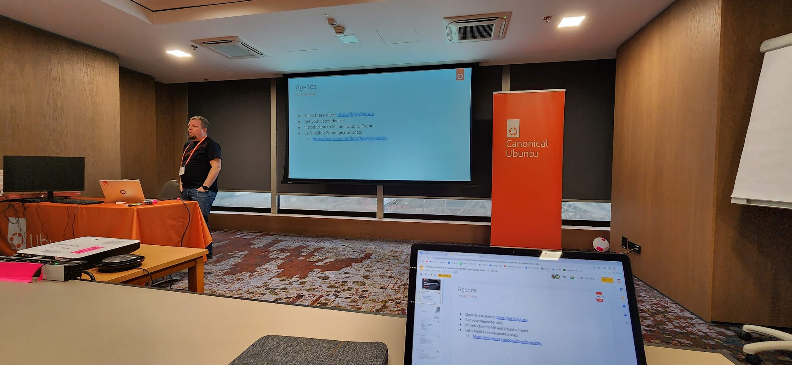

## 클로징 파티

행사에서 가장 즐겁게 참여 했던 프로그램이 아마 클로징 파티가 아닐까 싶습니다. 프라하 블타바 강의 크루즈에서 파티가 열려서 프라하 야경도 보면서 술과 음식도 즐길 수 있었고. 오픈소스만으로 각종 음악 작업을 다 하는 [Lorenzo's music](https://www.lorenzosmusic.com/) 에서 공연을 해 주어서 더 즐거운 클로징 파티가 아니였나 싶습니다 :) 내부에는 포토 프린터와 소품도 있어서 한국에서 같이 온 운영진 분들이나 또 다른 참가자 분들과 사진도 찍으면서 즐거운 추억도 남길 수 있었습니다.

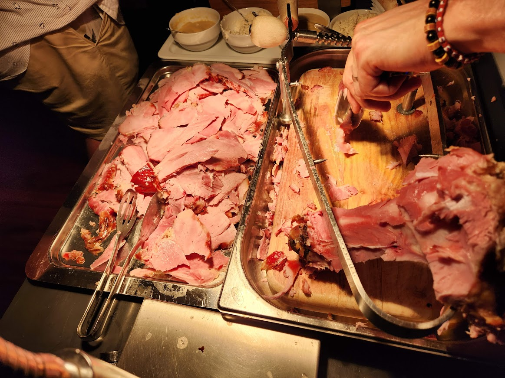
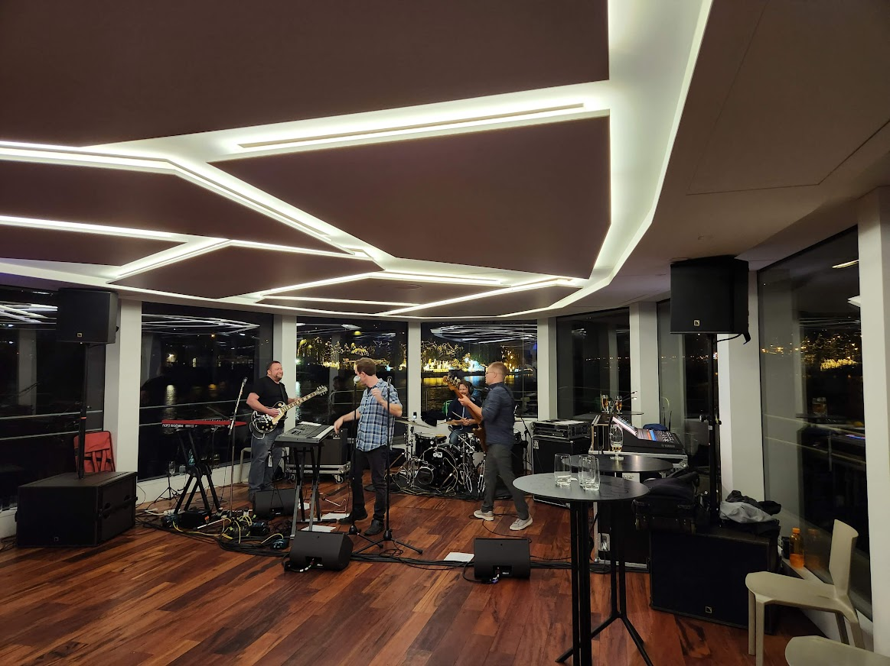
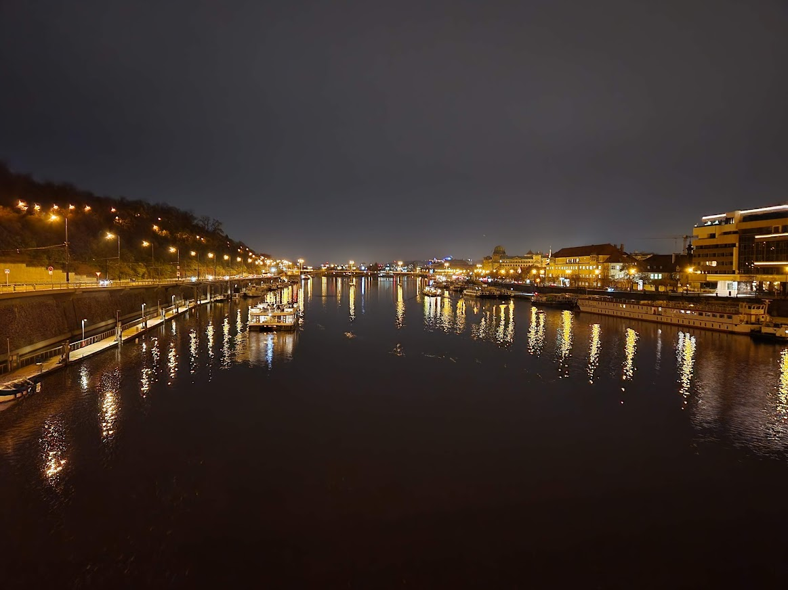

# 글을 마치며

행사 이후에는 몇일간 프라하에 더 머물면서 관광도 하고 회사 일도 조금씩 보는 워케이션 일정을 가졌는데요. 이 기간 동안 호텔 숙박은 회사 측에서 부담 해 줘서 프라하에 더 머물며 이곳저곳 둘러볼 수 있어 좋았습니다. 우분투 서밋은 코로나19 이후 오랜만에 참여했던 해외 오프라인 행사 였는데요, 개인적으로 참여 해 봤던 컨퍼런스 중에 가장 즐겁게 참여 했었던 것 같습니다. 내년에도 열려서 여건이 된다면, 한번 더 참여 해 보고 싶은 행사라고 할 수 있겠네요. 

우분투 서밋이 끝난 지도 어느덧 한 달이 지나서, 녹화 영상이 조금씩 올라오고 있습니다. 우분투 서밋에서 어떤 세션이 있었고, 녹화 영상으로 자세히 알고 싶다면 [행사 홈페이지](https://events.canonical.com/event/2)와 [YouTube 재생목록](https://www.youtube.com/playlist?list=PL-qBHd6_LXWYutOfi0r_jzyqHGmq1vIhf)을 한번 보시면 좋을 것 같습니다. :)
