올해 UbuCon Asia 2022 행사를 준비 하면서, 다른 것도 어려웠지만. 해외 연사분들 여행 지원, 그 중에서도 비자 지원이 정말 어려웠고. 또 이번에 처음 겪어보면서도 자주 겪어볼 것은 또 아니여서(?) 글로 한번 정리를 해 보게 되었다. 일단 결론을 먼저 말해 보자면, 각 해외 지역별 주제 대사관이나 영사관 마다 요구하는 서류나 요건이 다 차이가 있고, 서류 작업 할 것이 정말 많아서 준비가 너무 힘들다. 1-2명 이라면 모를까 5-6명 이상이라면 전담 인력을 두거나 여행사 도움을 받지 않으면 아마 준비가 쉽지 않을 것이다. 비자가 적절한 시기에 발급되면 모를까, 너무 늦게 발급 되어서 해외 연사분 비행기 출발 하루 전날에 나오고 하면 정말 피 말리기 때문에, 이런 어려움 까지 감당하고 싶지 않다면 여행사 도움 받는 것이 좋을 수도 있다.

## 원래 계획
원래는 처음부터 여행사로부터 비자 초청장 도움을 받고자 했다. 그런데 여행사로부터 비자 발급 관련 도움을 받으려면, 비자뿐만이 아니라 항공권과 호텔까지 모두 여행사에 맡겨야 비자까지 도움을 받을 수 있었다. 그런데 이렇게 하면 항공권의 경우 한국으로 들어오는 인바운드 항공권을 여행사가 예약 해 주는 것인데, 한국 여행사에서 현지 여행사에 요청하여 발권을 하게 되어서 중간 수수료 때문에 비용이 많이 나간다고 한다. UbuCon Asia 준비 팀의 경우는 최대한 지출을 줄이고자 해서, 호텔은 직접 예약하고 항공권은 해외 연사가 먼저 예약 후 환급 해 주는 형태로 생각을 하고 있었기 때문에 결국 직접 비자 지원을 제공 하기로 했다.

## 비자 유형
그렇다면 어떤 유형의 비자 발급을 지원 해 주어야 할까? 일단 컨퍼런스에 몇일 참석하고 대부분 길어야 1~2주 정도만 머물다가 귀국 하실 것으로 예상이 되기 때문에, 90일 미만 체류를 허용하는 단기 체류 비자를 지원 해 주면 된다. 단기 체류 비자도 다양한 종류가 있다. 단기일반(C-3-1), 단체관광등(C-3-2), 일반상용(C-3-4), 협정단기상용(C-3-5), 단기상용(C-3-6), 동포방문(C-3-8), 일반관광(C-3-9) 등 다양한 비자가 있는데. 해외 연사 분이 이미 한국 여행을 위해 한국 비자를 발급 해 본 경험이 있어서 도움 없이 잘 준비할 수 있다면, 일반관광(C-3-9) 으로 준비해도 보통 큰 문제는 없다. 보통 컨퍼런스 참석 하는 김에 관광도 많이 하곤 하니 딱히 입국 목적을 벗어나지는 않는다. 

하지만 C-3-9 로 지원 하려면 한국에 있는 가족이나 지인의 초청이 필요하거나, C-3-9 비자 발급이 오래 걸리는 경우도 있다. 때문에 되도록 비자 초청장을 제공해 주는것이 좋다고 할 수 있다. 이 경우 단기일반(C-3-1) 비자가 입국 목적에 부합하므로 이 유형의 비자로 지원을 진행하면 된다. [비자 포털 웹사이트에서 C-3-1 비자를 확인 해 보면 아래와 같이 신청 대상 설명이 나와 있는데, "컨퍼런스 참석" 이라는 목적에 딱 부합하는 비자라고 볼 수 있다.](https://www.visa.go.kr/openPage.do?MENU_ID=1010201)

> 친지 방문, 친선경기, 공익사업투자, 각종 행사나 회의 참가 또는 참관, 문화예술, 일반연수, 강습, 종교의식 참석, 학술자료 수집, 그 밖에 이와 유사한 목적으로 단기간동안 체류하려는 자

## 피초청인 서류 준비하기
먼저 피초청인 측에서 어떤 서류를 준비 해야 하는지 확인해서 전달 해 줄 필요가 있다. 보통 피초청인이 살고 있는 지역에 있는 한국 대사관 홈페이지에 나와있다. 준비해야 하는 서류가 나라별로 차이가 있고, 서류에 공증을 요구하는 경우도 있어서 각 나라별로 확인을 해 주어야 한다. 보통 피초청인의 신분을 확인할 수 있는 서류(재직증명서, 재학증명서 등), 한국에 방문 및 귀국에 필요한 경비를 충당할 수 있는 재정능력을 입증할 수 있는 서류(은행 거래 내역, 세금 납부 내역 등), 사증신청서(비자신청서), 여권 등을 제출 받는다. 여기에 더 필요하면 자기소개와 방문 계획을 기술한 커버레터나 다른 추가 서류를 요구 하기도 한다.

UbuCon Asia 2022를 준비 하면서 인도, 인도네시아, 네팔 발표자 분들께 지원을 해 드렸는데. 각 국가별로 그리고 지역별로 한번씩 살펴보자.

### 사증신청서(비자신청서)

사증발급신청서, 사진 1매, 만료까지 6개월 이상 남은 여권 제출은 신청자의 국적에 상관없이 동일하다.

사증발급신청서는 양식이 여러가지가 있는데, 특별한 경우가 아니라면 [개인용 양식](https://www.law.go.kr/%EB%B2%95%EB%A0%B9%EB%B3%84%ED%91%9C%EC%84%9C%EC%8B%9D/(%EC%B6%9C%EC%9E%85%EA%B5%AD%EA%B4%80%EB%A6%AC%EB%B2%95%EC%8B%9C%ED%96%89%EA%B7%9C%EC%B9%99,%EC%84%9C%EC%8B%9D17))을 작성하게 된다. [온라인 전자서식](https://www.visa.go.kr/openPage.do?MENU_ID=10204)으로 작성해서 제출하는 방법, PDF 파일 양식 받아다가 마크업으로 텍스트 넣어서 출력해서 제출하는 방법, 기입 안된 신청서 양식을 출력해서 자필로 작성해서 제출하는 방법 등이 있다. 일부 재외공관에서는 자필로 작성한 신청서만 받는 경우도 있어서, 각 재외공관 홈페이지를 확인 해 보는것이 좋다. 

그리고 사증신청서 작성에 필요한 몇가지 정보를 피초청인 측에 전달 해 주어야 한다. 신청서 양식 첫 페이지의 `2. 신청 사증 정보/ DETAILS OF VISA APPLICATION`, 3페이지의 `8. 방문정보 / DETAILS OF VISIT`, 4페이지의 `9. 초청 정보 / DETAILS OF INVITATION`, `10. 방문경비 / FUNDING DETAILS` 에 기입할 정보를 전달해야 한다.

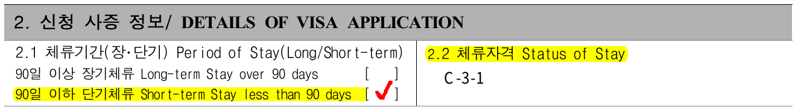

`2. 신청 사증 정보/ DETAILS OF VISA APPLICATION` 의 경우 위 사진처럼 `90일 이하 단기체류` 에 체크하도록 하고. `체류자격` 에는 신청할 비자 유형인 `C-3-1` 을 기입하도록 안내하면 된다.

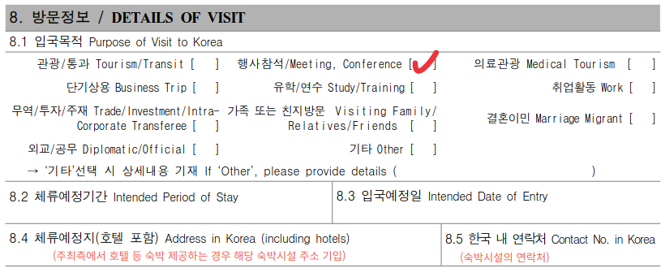

`8. 방문정보 / DETAILS OF VISIT`의 경우, `입국목적`은 `행사참석`으로 기입하도록 안내하면 되고, 주최측에서 호텔을 제공 한다면, 호텔의 주소를 `체류예정지(호텔포함)`에 호텔 전화번호를 `한국 내 연락처`에 기입하도록 안내하면 된다. 다만 한국 내 연락처는 한국 입국 할 때 선불 SIM 들고 오는 분들도 있으니 선불 SIM 전화번호 입력도 문제는 없을 것 같다. 

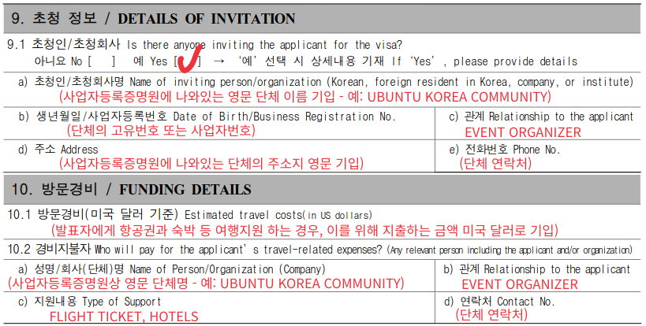

`9. 초청 정보 / DETAILS OF INVITATION` 에는 단체 정보를 기입하도록 안내하면 된다. 홈택스에서 영문 정보가 함께 표기된 사업자등록증명원을 발급할 수 있는데, 이를 전달해 드리고 참고하여 작성하도록 안내 드리면 된다. `관계` 란의 경우 초청인(초청단체)가 피초청인과 어떤 관계인지 기입하는 것 인데. UbuCon Asia 의 경우, 행사 주최자로서 초청하는 것이니 `EVENT ORGANIZER` 정도로 기입하도록 안내했다.

`10. 방문경비 / FUNDING DETAILS` 의 경우, 주최측에서 발표자 분께 여행 경비를 지원해 드린다면 해당 정보를 기입하도록 안내 드리면 된다. `방문 경비`에는 발표자 분께 지원해 드릴 총 경비 금액을 미국 달러로 기입하도록 안내하면 된다. 예를 들어 호텔과 항공권을 지원할 예정이고 합쳐서 총 1000 USD 라면, 1000 USD를 기입하도록 하면 된다. 

`지원 내용`은 말 그대로 어떤 것을 지원 해 드리는지 전달하여 기입하도록 안내하면 된다. UbuCon Asia 2022의 경우 항공권과 호텔 정도를 지원 해 드렸으니, `FLIGHT TICKET, HOTELS` (또는 `AIRPLANE TICKET, ACCOMMODATIONS`)정도로 안내 드렸다.

### 인도 

인도는 지역이 넓다 보니 지역별로 쪼개서 일부 지역은 대사관이 관할하고, 일부 지역은 영사관에서 관할 한다. 특이한 것이 같은 나라에 있는 재외 공관인데, 지역에 따라서 요구하는 서류에 또 차이가 있다.

#### 주인도 대한민국 대사관 관할지역

발표자 두 분이 뉴델리 지역에 거주 하시는 분이였는데, 뉴델리 지역은 주인도 대한민국 대사관에서 관할하는 지역이다. 그래서 대사관에서 비자 접수 업무를 위탁한 뉴델리 비자 접수 센터나 콜카타 비자 접수 센터를 통해 비자 신청을 접수 하셨다. 아래와 같은 서류를 기본적으로 요구한다. 물론 여권과 비자신청서도 제출 해야 한다. [자세한 사항은 여기서 확인 가능](https://overseas.mofa.go.kr/in-ko/brd/m_2803/view.do?seq=1301843&page=1)

1. 사업자등록증 사본(개인일 경우, 재직증명서 사본)
2. 납세증명(Income Tax Return) 최근 1년 분
    - 납세증명서류 제출이 불가한 경우 사유서를 자세히 작성하여 제출
3. 은행입출금내역서(Bank Statement) 6개월 분
4. 사업가 (소상공인 포함) : Business Profile 및 관련 서류
    - 직장인 : 재직증명 + 월급명세서 

#### 주첸나이 대한민국 총영사관 관할지역
발표자 분 중 벵갈루루에 거주하시는 분도 계셨는데, 여기는 주첸나이 대한민국 총영사관에서 관할하는 곳이라 첸나이 총영사관에서 비자 신청 접수를 해야 한다. 이상한 것이 같은 인도에 있는 대한민국 재외 공관인데, 요구하는 서류가 다르다. 신분이나 재정능력 증명을 위해 제출하는 서류는 비슷한데, 입국서유서와 항공권 예약 내역을 추가로 요구하는 점이 차이가 있다. [자세한 사항은 여기서 확인 가능](https://overseas.mofa.go.kr/in-chennai-ko/brd/m_2924/view.do?seq=1287111&page=1)

- 피초청인의 입국사유서 원본(Covering letter) - 피초청인이 방문 목적, 체류 계획, 여행 경비 등에 대한 내용을 기술한 문서
- 피초청인의 재직증명서 원본/재학증명서 등 기타 신분 증명서류
- 재정능력 증빙서류 (은행 직인 포함 최근 6개월 은행거래내역서, 소득세 납부 2년)
- 항공권 예약 내역

그리고 조금 이해가 안 가는 부분이 있다면, 사증발급신청서를 자필로 기재한 것을 요구 한다는 점... 그리고 대부분의 서류에 대해 원본을 요구한다. 양식을 종이로 출력해서 자필로 작성하거나, 서명과 직인을 실제로 날인한 것을 그대로 제출 해 달라는 의미이다. 주인도 대사관에서는 사본도 문제없이 잘 받았는데, 이 또한 다른 점이면서 잘 이해가 안 가는 점 이였다.

### 인도네시아 - 주인도네시아 대한민국 대사관
인도네시아의 경우도 발표자 분이 준비할 서류는 비슷했는데, 가족관계증명서를 요구하는 점이 조금 다르다. 이 대사관의 경우 [비자 안내 사이트가 따로 있는데, 여기에 정보가 잘 정리되어 있다.](https://sites.google.com/view/koreanembassy/%EC%B0%B8%EA%B3%A0%EC%82%AC%ED%95%AD/%EA%B3%B5%ED%86%B5%EC%84%9C%EB%A5%98-%EC%95%88%EB%82%B4)

- 가족관계증명서(Kartu Keluarga)
- 신분 증빙 서류
  - 직장인: 재직증명서, 세금증명서 전년도 1개년 치
  - 자영업자: 사업자 등록증, 세금증명서 전년도 1개년 치
  - 학생: 재학증명서
  - 무직: 최종학력의 졸업증명서
    - 40세 이상인 사람 및 가정주부는 최종학교의 졸업증명서 대신 KTP(Kartu Tanda Penduduk) 사본으로 대체할 수 있습니다. 

### 네팔 - 주네팔 대한민국 대사관
발표자 분들 중 네팔에서 오시는 분도 있었는데, 네팔쪽 서류가 가장 준비하기 쉽지 않아 보인다. 항공권과 호텔을 먼저 예약해서 예약확인서를 함께 제출해야 한다. 그리고 비자요청서(이름만 다르지 첸나이 총영상관에서 요구하는 입국사유서랑 같은 서류로 보인다), 재직중인 회사의 은행거래내역서도 요구한다. [자세한 사항은 여기서 확인 가능.](https://overseas.mofa.go.kr/np-ko/brd/m_1730/view.do?seq=1214566&page=2)

- 항공권 예약서 (flight schedule booking)
- 호텔 예약서 (hotel voucher)
- 비자요청서 (visa cover letter ; 한국방문 목적, 비용 등을 상세 기술)
- 직업관련서류 원본/사본 (재직증명서 (job certificate), 사업자등록증 (firm registration), 납세자등록증 (PAN registration) (직장이 있을 경우)
- 개인은행거래내역서 6개월치 (personal bank statement 6 months)
- 회사은행거래내역서 6개월치 (firm bank statement 6 months)

### 참고사항
제출 서류를 보면 알 수 있겠지만. 피초청인 측에서 준비하는 서류는 피초청인이 한국을 방문해서 서류에 기술 한 목적 대로만 체류 하다가 본인 계획대로 잘 귀국할 것이고 이를 위한 여행 경비를 준비할 충분한 재정 능력이 있는지(안정적인 수입이 있는지) 확인하기 위한 서류이다. 

그래서 일단 안정적인 수입이 있는 직업을 가진 직장인이 아니라면, 일단 요구되는 서류를 준비하기가 어렵다. 실제로 네팔 발표자 중 한 분이 프리렌서여서, 재직증명서와 회사의 재직증명서 구비가 어려워 포기 하시고 온라인 발표로 전환을 하셨었다.

미성년자의 경우 부모님과 함께 비자를 신청하고 같이 한국을 방문하게 되는데, 이 때는 부모님의 재정능력을 보기 때문에, 부모님 이름으로 된 서류를 준비하게 된다. 초청했던 분들 중, 청소년 분이 있었는데 이 분은 입국 사유서나 재직/재학 증명서는 본인 것과 함께 동반할 어머니쪽 서류 각각 모두 제출하고, 재정능력 증빙을 위한 서류(은행 거래 내역)는 어머니 명의로 된 것만 제출하여 진행하였다.

## 초청 단체 측 서류 준비하기
발표자(피초청인)이 서류 준비를 다 했다면, 이제 초청단체인 UbuCon Asia 준비위원회 측에서도 서류를 준비해야 한다. 준비해야 할 서류 자체는 비슷한데, 역시 각 재외공관별로 요구하는 세부적인 부분이 많이 달라서 하나씩 확인을 해야 한다. 행사 참가 목적 사증 신청시, 초청단체 측에는 보통 아래와 같은 서류가 요구된다.

- 비자초청장
- 사업자등록증 또는 사업자등록증명원 (수익사업을 하지 않는 비영리법인의 경우 고유번호증)
- 행사 정보와 일정이 포함된 브로슈어나 팜플렛
- 신원보증서

이번에 비자 지원을 하면서 알게 된 재미난 것이(?) 꼭 법인격이 있는 단체가 아니여도, 세무서에 등록한 고유번호증 단체(세법상 법인으로 보는 단체)라면, 고유번호증이나 사업자등록증(법인사업자 명의)으로 비자 초청을 진행할 수 있다. 대신 할 일이 엄청 많다. 

### 비자초청장
비자 초청장은 재외공관 비자 담당자에게 보내는 것을 가정하고 작성하는 서류로, 초청 단체에서 피초청인을 정해진 목적(예를 들어 행사 초청)으로 초청하고자 하니 협조를 요청하는 내용의 서류이다. 보통 정해진 양식은 따로 없는데, 공문 양식이면 충분하다. 내용은 보통 아래와 같은 내용을 포함 하는데, 각 재외공관별로 요구하는 세부적인 내용이 또 다른 경우가 있어 꼼꼼히 확인이 필요하다. 참고로 서류를 최종적으로 보는 사람이 피초청인이 아니라 재외공관 담당자 이기 때문에, 영어가 아닌 한국어로 작성하면 된다.

- 초청하고자 하는 사람의 인적사항: 이름, 성별, 국적, 여권번호 및 만료일, 생년월일, 소속(소속된 학교나 회사 이름)
- 초청 단체의 정보: 단체 이름, 단체 사업자번호(또는 고유번호), 대표자 이름, 단체 주소, 연락처(이메일과 전화번호 등)
- 체류 목적(또는 초청 목적)
- 초청 일정(또는 행사 일정 기술)

UbuCon 준비하면서 작성한 비자 초청장은 아래와 같은 공문서 양식으로 작성하고, 마지막에 직인을 넣었다. 이전에 오픈스택 한국 커뮤니티 조성수님이 PyCon APAC 2016 준비에 참여 하셨다 보니, 해당 행사에서 사용한 비자 초청장 양식 샘플을 공유 해 주신 덕에 참고해서 작성할 수 있었다.

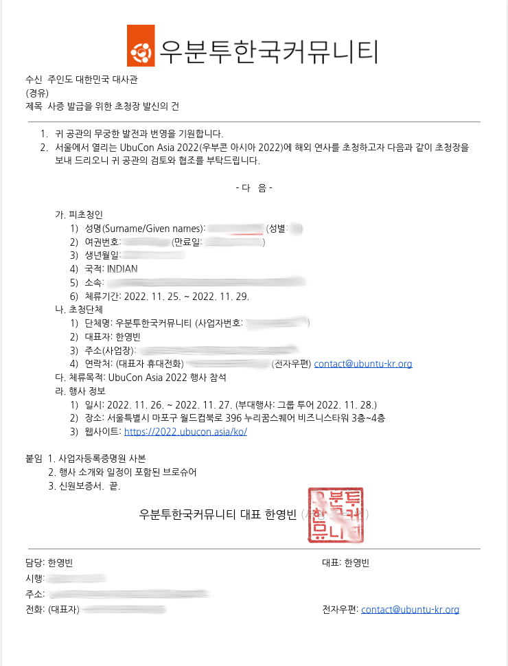

### 사업자등록증 또는 사업자등록증명원 (수익사업을 하지 않는 비영리법인의 경우 고유번호증)
셋중 하나를 준비해서 전달 해 드리면 되는데, 우분투한국커뮤니티는 수익사업을 영위하는 세법상 비영리 법인 이여서 홈택스에서 "사업자등록증명원"을 영문 표기가 포함된 것으로 발급하여 전달 해 드렸다. 이렇게 하면 발표자(피초청인)분이 사증발급신청서 작성시 참고하실 수 있어 유용하다. 

### 행사 정보와 일정이 포함된 브로슈어나 팜플렛
말 그대로 행사 정보가 담긴 브로슈어를 전달 해 드리면 된다. 행사 소개와 주제, 세부 일정이 담긴 PDF 문서 전달이면 충분하다. 올해 UbuCon Asia 의 경우 아래와 같은 형태로 작성해서 PDF 파일로 발표자 분께 전달하여 제출 하도록 안내 해 드렸다.

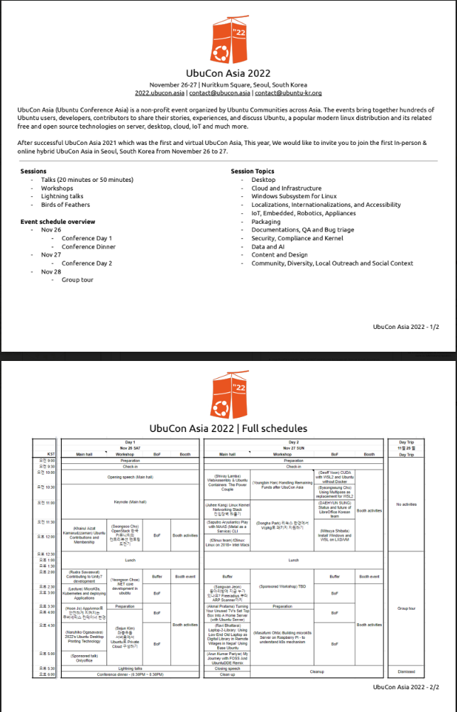

### 신원보증서
신원보증서는 피초청인이 한국에 체류하는 동안 초청인(초청단체)가 신원을 보증한다는 내용의 문서이다. 보통 "보증" 하면 떠오르는 "채무 보증"과는 다른 것이지만, 아무래도 부담이 되는것은 마찬가지. 혹시나 초청한 사람이 한국에 머물다가 법률 위반으로 강제 출국 하거나, 다쳐서 부득이하게 한국에 더 머물게 되거나 하면 여기서 발생하는 비용을 초청단체가 부담할 것을 보증하는 내용이기 때문이다.

재외공관마다 요구하는 경우도 있고, 요구하지 않는 경우도 있는데. 이번에는 대부분 신원 보증서를 요구 하는 경우가 많아서 제공을 해 드려야 하나, 혹시 비용 지불 책임을 이행해야 할 일이 생기면 어떻게 해야 하나 고민을 많이 했다.

그래서 다른 운영진 분들과 이 문제에 대해 어떻게 해야 하나 논의를 하다가, 사전 검증 절차를 진행 하기로 했다. 비자 지원을 해 드리는 분들 대부분이 발표자여서, 실제로 행사장에 와서 발표할 의지가 있는지 확인하기 위해 발표 슬라이드 초안을 받아서 검토하는 절차를 걸치고. 이상이 없는 경우에 신원 보증서를 작성해서 제공 해 드리는 형태로 진행했다.

[신원보증서 서식은 사증발급신청서처럼 법률로 지정되어 있어서,](https://www.law.go.kr/%EB%B2%95%EB%A0%B9%EB%B3%84%ED%91%9C%EC%84%9C%EC%8B%9D/(%EC%B6%9C%EC%9E%85%EA%B5%AD%EA%B4%80%EB%A6%AC%EB%B2%95%EC%8B%9C%ED%96%89%EA%B7%9C%EC%B9%99,%EC%84%9C%EC%8B%9D129)) 해당 서식을 받아서 작성하여 전달하면 된다. 피보증 외국인에는 발표자(피초청인) 인적사항을, 신원보증인 부분은 단체 명의로 작성 하는 거여서, 단체 대표자의 인적사항을 넣고, 마지막에 대표자 서명, 직인 또는 법인인감을 날인하면 된다. 재외공관마다 또 직인만 된다고 하거나, 법인인감만 된다고 하는 경우도 있어서 이 또한 사전에 잘 확인해야 한다.

신원보증서가 꼭 요구되지 않는 경우여도 같이 준비하여 제출하면 비자 발급을 앞당기는데 많은 도움이 된다. 해외여행 자체가 처음이거나 한국 방문이 처음인 사람에게 아마 도움이 될 것이다.

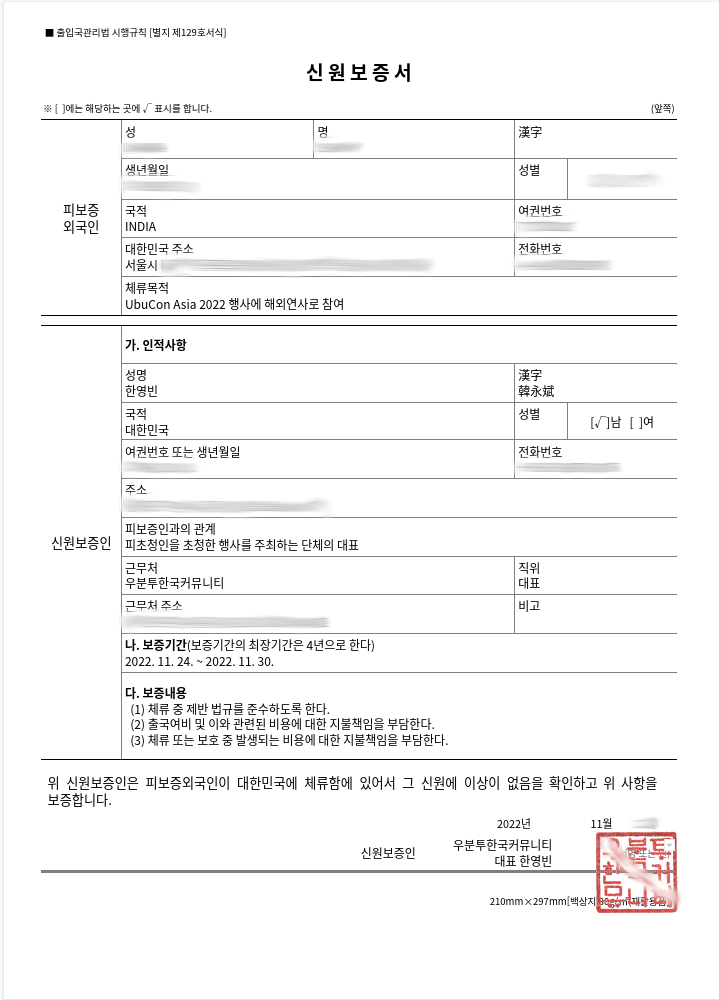

### 특이 사례

#### 주인도네시아 대한민국 대사관 - 대사관 지정 서식 입국목적 확인서

특이하게 초청단체 측에서 [대사관에서 지정한 서식으로 된 입국목적 확인서](https://overseas.mofa.go.kr/id-ko/brd/m_2861/view.do?seq=1211881&page=1) 로 작성하여 제출해야 한다. 어떻게 보면 편리한 것이 양식 요구사항 일일이 확인할 필요 없이 대사관 지정 양식 따라서 열심히 작성하면 되어서 오히려 조금 편하달까. 

입국목적 확인서가 신원보증서 역할까지 같이 하다 보니, 초청장이랑 신원보증서 따로 준비 할 필요 없이 입국목적 확인서 하나로 준비가 되는 형태였다. 다만 양식에 작성할 것이 꽤나 많았고, 양식이 또 하필 `*.hwp` 포맷이여서 필자는 한컴오피스 라이선스가 없다보니 작성하면서 많이 번거롭고 불편했다.

아참, 그리고 입국목적 확인서 작성 한 사람 신분증도 보내야 한다. 

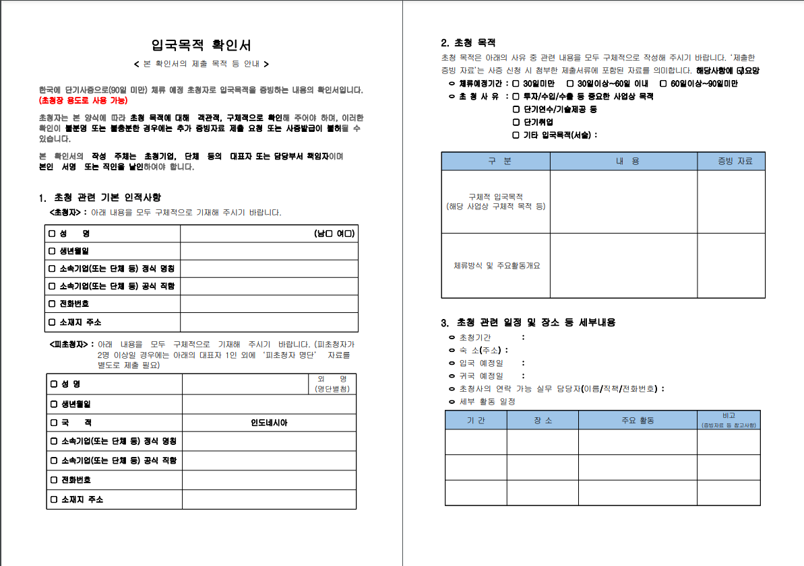
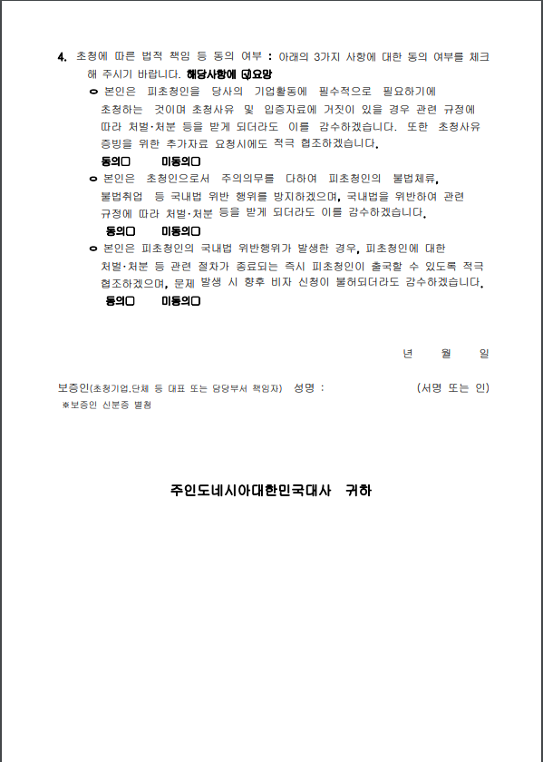

#### 주첸나이 대한민국 총영사관 - 초청장, 신원보증서 "원본" 요구
주첸나이 총영사관은 피초청인에게도, 초청 단체 측에도 각종 서류의 "원본"을 요구한다. 초청장과 신원보증서 출력 해다가 직인 인주 찍어다가 날인한 종이를 그대로 피초청인 측에 전달하여 총영사관에 제출하라는 의미이다. 

이렇게 되면 우편이나 인편으로 전달해야 하는데, 서류 준비할 당시 행사 3~4주 앞이다 보니 우편으로는 재시간에 서류 전달이 어려워 보였고. 운이 좋게도 초청할 발표자 분도 나도 11월 초 열린 Ubuntu Summit 2022 참석 예정이였어서, 참석해서 만나서 인편으로 전달 해 드렸다.

그리고 사업자등록증이나 사업자등록증명원(또는 고유번호증) "원본"에 "원본대조필"을 날인해서 제출을 요구한다. 이 부분은 무슨 소리인지 이해가 어려워서(일단 원본에 왜 원본대조필을 찍는지를 이해하지 못했다.) 총영사관에 국제전화 걸어서 문의를 넣었다. 그리고 이 사례의 경우 사업자등록증명원을 출력해다가 자필로 "원본대조필" 을 쓰고 그 위에 직인을 날인해서 제출했다. 

당시 Ubuntu Summit 참석 차 방문한 프라하 어느 호텔 IT룸에서 즉석에서 서류를 출력해다 준비 하다 보니, 원본대조필 도장이 없었다. (하지만 직인과 인주는 혹시나 해서 들고 가긴 했다) 그래서 문의 해 보니, 자필로 "원본대조필" 기입하고 직인 날인해도 된다고 해서 그렇게 준비하여 제출하였다.

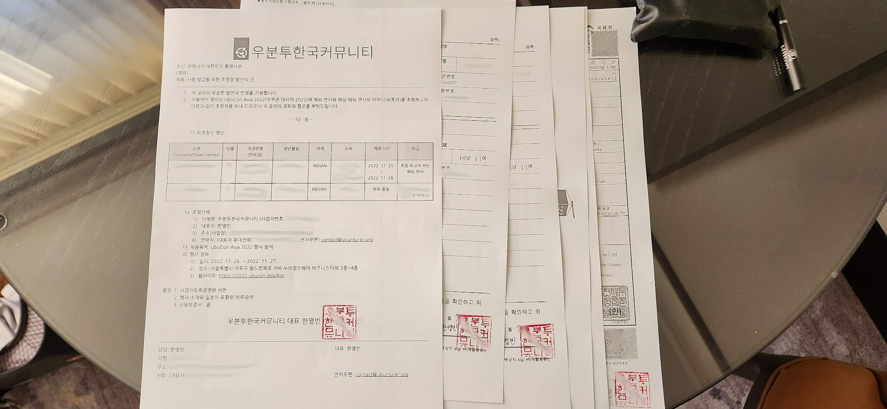

#### 주네팔 대한민국 대사관 - 초청장과 신원보증서 공증 요구
초청단체 입장에서도 서류 준비하기 제일 힘들었던 쪽이 아마 네팔 발표자 초청이였지 싶다. 네팔이 행정 인프라가 열약하거나 서류 위조가 잦아서 그런지는 모르겠지만, 여기는 대사관에서 초청장과 신원보증서에 법인인감을 날인하고, 법인인감증명서를 첨부하거나. 법인인감이 없다면 대표자 서명 공증을 요구한다.

또한 주네팔 대한민국 대사관의 경우, 초청장에 체류 비용(누가 비용을 부담하고 얼마나 부담하는지), 체류 일정, 그리고 항공권 예약 관련 사항도 포함할 것을 요구해서 요구사항에 따라 작성하였다.

우분투한국커뮤니티는 법인격이 있는 단체는 아니기 때문에, 공증사무소에 방문해서 서명 공증을 했다. 공증을 받으면 공증인이 보는 눈 앞에서 서류에 서명을 하게 되고, 이를 공증인이 확인했다는 내용이 담긴 서류와 표지가 초청장과 신원보증서 앞뒤로 부착되어서 아래 사진처럼 서류가 준비가 된다. 

"인증서" 라고 적인 텍스트와 함께 금박과 리본이 달린 근사한(?) 표지와 인증 내용이 담긴 문서가 원래 문서 앞뒤로 부착이 된다. 비용은 꽤 비싸다, 서류 한 묶음에 총 4만원 정도 지출한 것 같다. 그리고 이제 이것을 그대로 물리적으로 전달을 하면 된다. 마찬가지로 우편이나 인편으로 전달을 해야 하는데, 이 네팔 발표자 분도 운 좋게 Ubuntu Summit 에서 만날 수 있었어서, 인편으로 서류를 전달 해 드렸다.

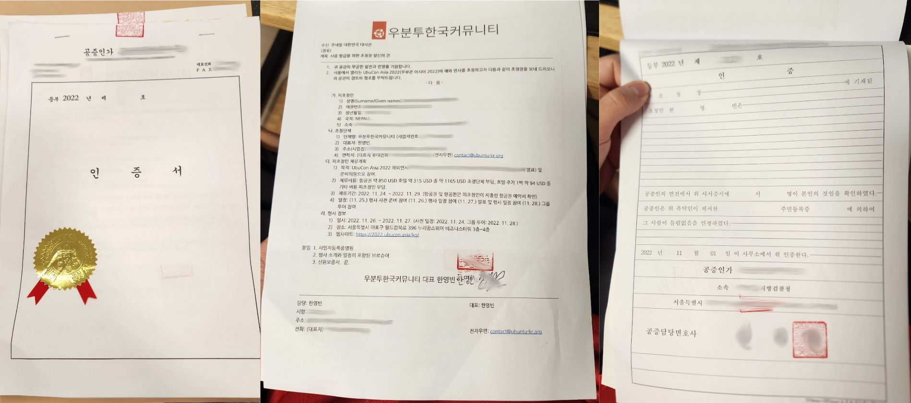

#### 미성년자 초청
발표자 중에 미성년자 분이 있었는데, 이 분은 한국에 오실 때 어머니와 함께 동행 할 예정이였다. 그래서 아래 사진처럼, 초청장 하나에 두 사람을 모두 초청하는 내용으로 작성 하였다. 신원보증서는 발표자분 것과 발표자 어머니 것, 총 두장 작성하여 다른 서류와 함께 전달 해 드렸다.

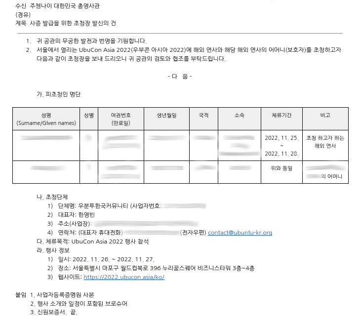

#### 초청장 피초청인 이름 오탈자

발표자 분들 비자 초청장 준비 하면서, 행사 일정표도 체크하고, 호텔 방 배정도 관리하는등 하는 일이 많아서 굉장히 바쁘다 보니 실수로 초청장 작성 중에 발표자 한분 성함에 오탈자를 내서 전달을 드렸었다. 발표자 분이 수정 해 달라고 요청 해 주시면 좋았겠지만, 발표자분도 본업으로 바쁘셨는지 그대로 제출하는 불상사가 발생했다. 

그리고 행사 일주일 전 쯤에 대사관 측에서 대사관 측에서 초청장에 피초청인 이름 오탈자가 있다고 발표자분 통해서 뒤늦게 연락이 왔다. 다행이도 해당 재외공관은 사본도 받으며, 신원보증서를 필수적으로 요구하는 곳이 아니였어서 즉시 오탈자를 수정한 것을 전달 해 드렸고ㅡ 비자가 늦어도 비행기 탑승 전날에는 나와서 받아보실 수 있도록 하기 위해서, 원래 제공하지 않아도 되었던 신원보증서를 추가로 작성해서 제공 해 드렸다. 

또 때마침 행사 후원사였던 울관광재단측에서 해외 참석자 대상 인바운드 여행자 보험을 무료로 제공 해 주어서. 해당 발표자 분 보험 가입 처리를 한 다음 보험 가입 증서도 발표자분을 통해 추가 제출하여, 초청하고자 하는 사람이 한국에서 계획대로 체류하고 늦지않게 귀국할 것 임을 추가 서류를 통해 재외공관측에 강조하였다.

그렇게 한 결과 비자는 운이 좋게도 가까스로 비행기 출발 하루 전 날에 발급 되어 발표자 분이 재시간에 비행기를 타고 한국에 오실 수 있었다.

## 재외공관 닦달하기
발표자 분들 중 Ubuntu Summit 에서 인편으로 초청장을 전달해 드린 분 들은, 귀국 이후에 나머지 서류까지 모두 준비해서 비자 신청 접수를 해야 했고, 현지 휴무일 등 까지 겹쳐서, 예정보다 비자 신청을 늦게 하셨다. 어떤 발표자는 또 대사관 홈페이지에서 사전 예약을 해야 비자 접수가 가능해서 예약을 확보 하는데 빠른 날짜는 이미 예약이 꽉 차서 조금 늦은 날로 예약을 해야만 했다.

그래서 가능한 비자 발급을 앞당기기 위해서 크게 두가지 방법을 시도 했는데, 하나는 초청인이 아무 문제 없이 체류 하다가 잘 귀국할 것임을 다시 한번 확인 해 주는 추가 서류를 제출했다. 해당 재외공관은 신원보증서를 이미 필수 서류로 요구해서, 신원보증서를 또 재출 하는건 의미가 없었고. 때마침 위에서 언급한 인바운드 여행자 보험 가입 처리 할 때여서, 보험 가입 처리 한 다음. 보험 가입 증서를 전달하여 추가 제출 해 보시도록 안내 드렸다. 실제로 잘 제출 하셨는지는 잘 모르곘다.

두번째는 재외공관을 전화로 닦달 해 보는 것이다. 내가 닦달을 한 것은 아니고, 발표자 분들이 한국에 오시기 전 부터 한국인 패치가 되어(?) 재외공관에 주기적으로 전화를 걸어서, 한국에서 하는 행사에서 발표자로 참석하려면 재시간에 비자 받아서 비행기 타야 하는데, 비자 빨리 발급 해 달라고 하는 형태로 열심히 닦달을 해 주셨다. 그렇게 열심히 닦달을 해 주신 결과, 이분들도 비행기 타기 하루 전이나 행사 하루이틀 전 쯤에 가까스로 비자를 발급 받아서 한국으로 오실 수 있었다. 개인적으로 이때 발표자 분들 도와 드리면서 정말 피 말렸었다.

## 비자 초청장 제공 거절 사례
행사 준비 하면서, 발표자는 아니고 일반 참가자로 참가를 원하는 분이 이메일로 비자 초청장 제공을 요청한 적이 있다. 나이지리아에 어느 테크 스타트업 한다는 사장님 이였는데, 회사 소프트웨어 엔지니어들이 행사 참가에 관심이 있다고 비자 초청장을 요청 해 주셨다. 결론적으로는 우회적으로 거절했다. 

우선 받은 메일을 보니 회사 도메인으로 된 비즈니스 메일 (예: mark@example.com) 이 아니고 개인 Gmail 주소로 비자 초청장을 달라고 메일을 주셨다. 일단 거기서부터 의심을 했다. 대학생이면 학교 도메인으로 된 메일이 나오고, 조그마한 회사도 웬만하면 회사 도메인으로 된 비즈니스 메일이 나오는데, 회사 사장님이라면서 개인 Gmail 주소라... 본인 말로는 월드워이드 빌리언 달러 테크 스타트업을 하고 있다고 하고, 세계 이곳저곳 출장도 자주 다닌다고 하시는데, 그정도 돈이 있으면서 구글 워크스페이스 등으로 어렵지 않게 구비 가능한 비즈니스 메일이 없다라... 정확히는 비즈니스 메일 있으면 비즈니스 메일 주소로 메일 다시 보내 달라고 했는데, 메일 서버에 기술적인 문제가 있어서 제대로 작동하지 않는다고 개인 Gmail 주소로 예기 하자고 하셔서 더더욱 의심을 했다. 

그리고 일반 참가자면, 행사 와서 어떤 일정 참가 할 것이고 티켓 등록도 확인이 되어야 하며, 초청이 필요한 사람 프로필이나 이력서 등으로 신원도 확인이 되어야 비자 초청장과 신원보증서 지원을 검토 해 볼 수 있다. 그런데, 계획은 알려 주지도 않고 주최 측에서 서류 제공 안 해 줄지도 모르는데 왜 자기네가 먼저 티켓을 구입해야 하냐고 하면서 비자 초청 지원해 달라고 계속 요구를 했다. 그래서 나이지리아인 비자 초청 관련 사례 검색 해 보거나 주변 분들께 여쭤보니, [나이지리아인의 경우 학회나 컨퍼런스 참석을 가장하여 비자 초청장을 받아 비자 받고 한국에 입국한 후, 불법체류 및 행방불명이 되는 경우가 매우 흔하다고 하고, 실제로 주나이지리아 대한민국 대사관에서도 이를 유의하라고 공지하고 있었다.](https://overseas.mofa.go.kr/ng-ko/brd/m_9880/view.do?seq=1039012) 이러한 사실을 요청한 나이지리아 스타트업 사장님이라 하는 사람에게 직접 언급하면서 거절하진 않았고, 주최 측에서 서류 준비할 인력이 없고 너무 바빠서 못 해준다고 우회적으로 거절했다. 

> 1. 나이지리아인 초청시 유의사항
> - [나이지리아는 불법체류다발 고시국가로,](https://www.law.go.kr/행정규칙/출입국관리법시행규칙별표5사증발급신청등첨부서류에관한고시/(2003-619,20031212)) 대한민국 내 나이지리아인의 불법체류 비율이 높습니다.
> - 무역거래를 사칭하여 사기를 치거나, 각종 국제회의나 컨퍼런스 참가를 가장하여 입국 후 불법체류를 하는 경우가 다수 있음.
> - 나이지리아 부패방지위원회 (ICPC) 대변인 Folu Olamiti는 2013년 10월 6일 성명서를 통해 사기 바자대행업체 주의보를 발령 (각종 서류 위조) 한 바 있음.
> - 이에 따라 당관은 대한민국의 국익과 국민의 보호를 위해 사증발급심사를 규정에 따라 면밀히 시행하고자 노력하고 있습니다. 나이지리아인을 초청하실 때에는 피초청인 관련 정보를 면밀히 파악 (초청대상자의 신분확인, 입국목적의 진위성, 무역거래의 경우 계약서와 선수금 수령 등)하여 충분한 사전 검증작업 후 초청하시기 바랍니다.
>
> [주나이지리아 대한민국 대사관 - 사증신청시 유의사항](https://overseas.mofa.go.kr/ng-ko/brd/m_9880/view.do?seq=1039012)

만약에 이 나이지리아 사람들 신원이나 입국목적 진위성을 준비위원회에서 잘 확인했다고 해도, 서류 준비할 인력이나 시간이 턱없이 부족해서 아무튼 이래나 저래나 비자초청 제공 못했을 것 같다. 나이지라아가 서류 위조가 얼마나 심한건지, 네팔 발표자 서류 준비보다 더 난이도가 어렵다. 법인인감 있어도 무조건 초청장과 신원보증서 공증 해야 하고, 참가자 명단에 초청단체의 은행거래내역과 세금납부 서류(...) 도 준비해서 제출해야 한다. 개인적으로는 지원 안 해 드리기 잘 한것 같다. 지원 해 드렸다가는 일에 치여서 남아나는 채력이 없거나 최악으로는 초청해 드린 사람이 한국 입국 후 불법체류 내지는 행방불명이 되어서 법적인 문제가 생겼을 것이다. 

> ◇ 각종 행사, 세미나, 회의참석, 지인방문 등 단기방문
> - 초청인의 초청장(공증 받은 원본 필요)
> - 초청인의 신원보증서(공증 받은 원본 필요)
> - 초청인 사업자등록증 사본
> - 행사(세미나, 회의 등) 소개 서류 및 초청(참가)자 명단
> - 신청인(피초청인)의 재직증명서, 회사(또는 단체) 등록증 원본 및 사본, 회사의 은행거래내역서 원본, 세금납부증명서 원본 및 사본 등
> - 방문목적 설명 서류
>
> [주나이지리아 대한민국 대사관 - [사증] 사증발급안내](https://overseas.mofa.go.kr/ng-ko/brd/m_9880/view.do?seq=1312076)

## 비자 신청 상태 및 결과 확인과 사증발급확인서

이렇게 비자를 신청하면, 비자포털의 [진행현황 조회 및 출력](https://www.visa.go.kr/openPage.do?MENU_ID=10301) 페이지에서 처리 현황을 조회하거나, 비자가 승인 되었다면 바로 사증발급확인서 PDF 파일을 내려받을 수도 있다.

비자가 발급이 되면, 과거에는 대한민국 재외공관에서 여권에 스티커를 부착 해 주었는데. 최근에는 스티커로 발급하지 않고 비자 포털을 통해 "사증발급확인서"라는 A4용지 규격의 서류를 발급 해 준다. 발표자가 이 서류를 출력하여 여권과 함께 휴대 하면서 입국시 입국심사대에 여권과 함께 보여주면 된다.

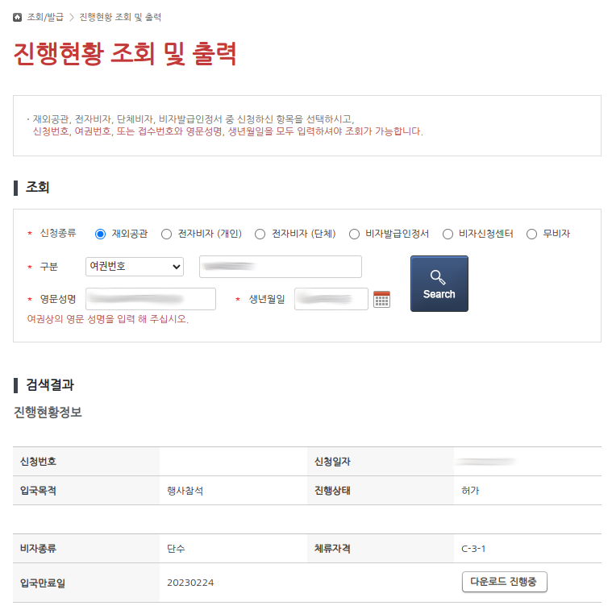

발급된 사증발급확인서는 아래처럼 생겼다. (개인정보는 모두 가렸다.) 단체 명의 비자 초청을 통해 비자가 발급 되다 보니, 비고(Remarks)란에 초청단체 이름인 `UBUNTU KOREA COMMUNITY` 가 적혀 있는 것을 볼 수 있다. 체류기간은 보통 30일에서 90일 사이로 많이 나오는 것 같고, 10일(?!!!)만 체류를 허가하는 비자를 받은 분도 있었다. 국적이나 관할 재외공관에 따라서 차이가 꽤 있는 것으로 보인다.

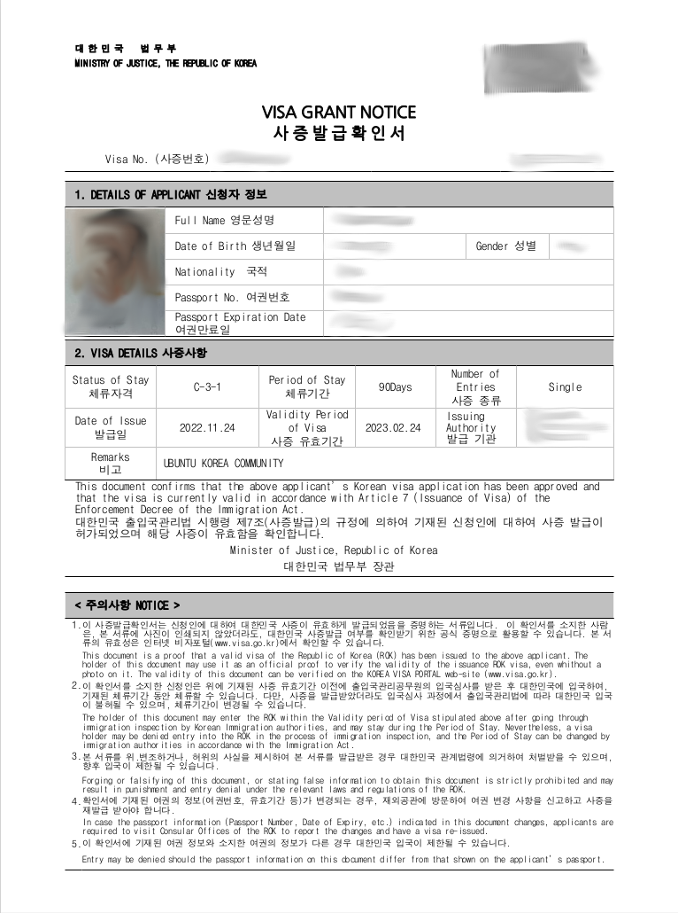

## 발표자가 한국에 체류하는 동안 별 일 없는지 확인하기
아무래도 비자 지원 해 드린 모든 발표자 분들께 신원보증서도 제공 해 드렸다 보니, 발표자 분들이 한국에서 아무 탈 없이 잘 지내다 가시는지 그래도 조금은 확인을 할 필요가 있었다. (왜냐면 혹시나 무슨 일 생기면 초청 단체가 책임 져야 할 수도 있기 때문에...) 발표자 피곤하게 할 정도로 모니터링을 하진 않았고, 행사 기간에는 행사장에 출몰 하시는지(?)로 확인 하고, 행사 이후에도 몇일 더 여행 하다 가시는 분들은 메신저로 한두번씩 아무 일 없는지 안부만 물어보는 형태로 확인 했다.

이 외에 한국 입국 및 귀국 잘 하셨는지도 확인을 조금 했는데, Hi Korea 홈페이지에서 [체류만료일 조회](https://www.hikorea.go.kr/info/CheckExprYmdByPassNoR.pt) 페이지를 통해, 조회가 안 되다가 조회가 되면 한국에 잘 입국하신 것으로 보고, 귀국 비행기 타러 가시는 날에는 반대로 조회가 되다가 조회가 되지 않으면서 체류중인 외국인이 아니라는 메시지가 나오면 비행기 잘 타신 것으로 보는 형태로 확인을 했다.

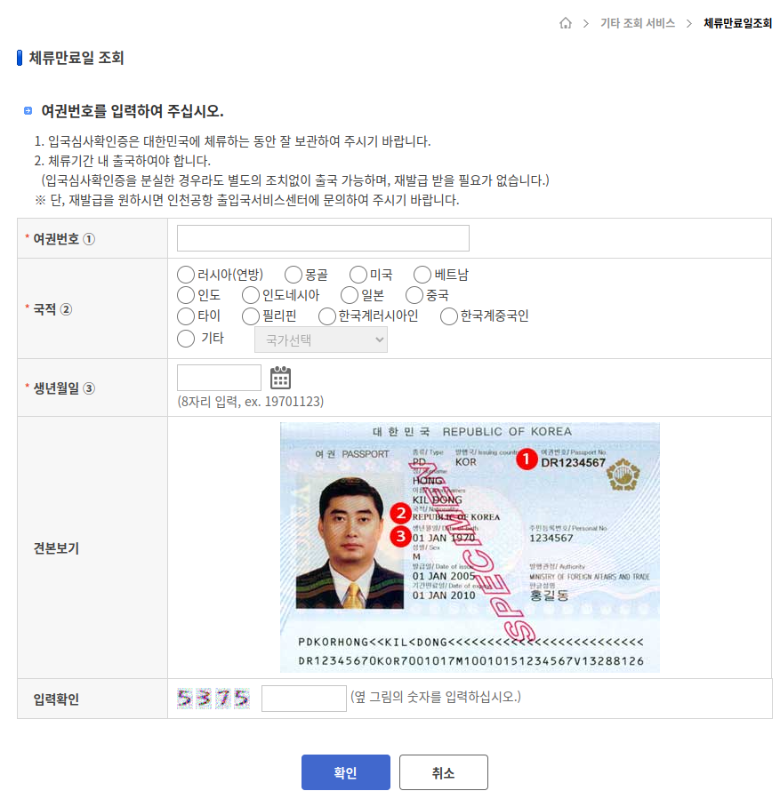

> Hi Korea - 체류만료일 조회 페이지

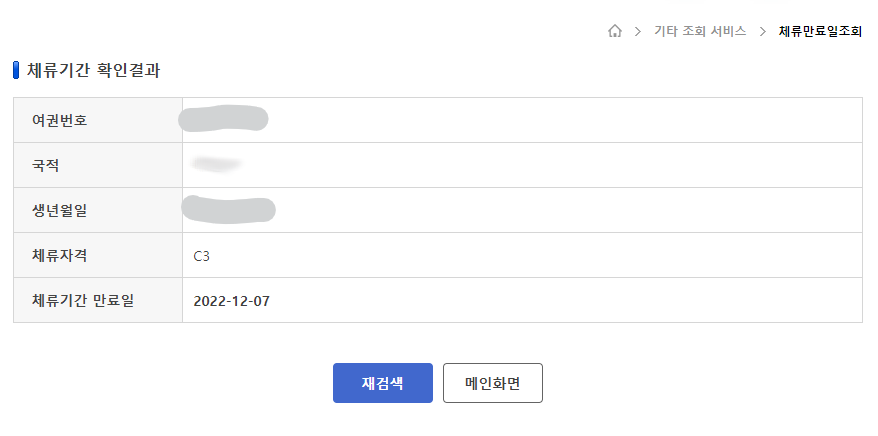

> 한국에 입국 하셔서 체류 중 이신 경우

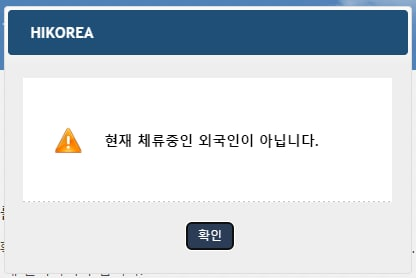

> 아직 한국에 입국 하지 않으셨거나, 귀국 비행기 탑승을 위해 한국에서 출국 심사를 마친 경우

## 번외: K-ETA
한국에 방문할 때 비자가 필요 없는 외국인 발표자 분 들은, 비행기 탑승 전에 K-ETA를 발급 해야 탑승권을 발권 받아서 비행기에 탑승할 수 있다. K-ETA가 없으면 아예 탑승권 발권이 불가능 하니, 사전에 미리 안내를 잘 해 드려야 한다. 물론 행사 홈페이지에 이를 잘 안내하는 페이지가 있긴 하지만, 이 페이지도 미리 여러번 강조해서 잘 알려주지 않으면 무용지물 인 것 같다.

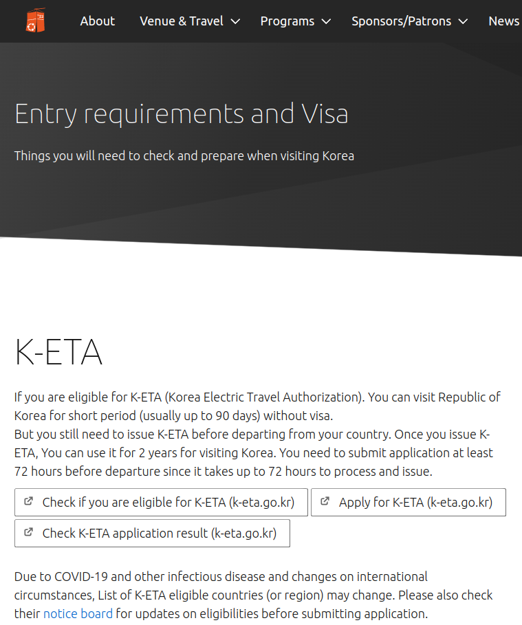

올해 UbuCon Asia 발표자 중에 미국에서 오신 키노트 발표자 분의 경우는, 내가 너무 바빠서 K-ETA 안내를 따로 해 드리지 못했는데 발표자분 항공권 예약을 해 준 여행사도 K-ETA 안내를 해 주지 않아서, 공항 체크인 카운터에 도착하고 직원이 알려주고 나서야 K-ETA에 대해 알게 되었다고 한다. 그래서 한국시간 기준으로 새벽에 메일로 도와 달라고(...) 연락이 왔는데, 나는 일단 재시간에 K-ETA가 발급 안 될 것이라고 보고 주변 대사관이나 재외공관 연락처를 알려 주었다. 보통 72시간 내 발급 되거나, 더 걸리는 경우도 있지만. 다행이도 1시간 만에 K-ETA에 발급 되어서 발표자 분이 출국 게이트로 후다닥 뛰어가서 짐 검사 받고 비행기에 잘 타셨다고 한다. 이때도 참 피 말리는 줄 알았다. 키노트 발표자가 펑크 나면 행사 어떻게 해야 하나 라는 고민으로...

그리고 K-ETA 신청할 때 정확한 개인정보를 입력하시도록 또 안내를 해 드려야 한다. 왜냐하면 K-ETA 신청시 잘못된 정보(이름이나 생년월일 등 오탈자)를 입력해서 신청하면, 반려가 되는 것이 아니라 그냥 승인이 되어 버린다(...) 제출한 데이터를 검사하는 시스템이 부실하거나, 사람이 검사 한다면 뭔가 대충 보고 승인 하는 느낌이다. 그리고 또 이렇게 오탈자 난 상태로 승인이 나 버리면, 이걸로 한국에 입국도 아마 어렵고. 승인 후에는 이름이나 생년월일 등 개인 식별을 위한 개인정보는 수정이 되지 않아서, 수수료를 또 지불하고 새로 다시 신청해야 한다(...) 

내가 이걸 어떻게 아냐면, 다른 발표자 한 분이 또 이런 것을 겪으셨어서(...) 밤에 화장실에 앉아 있을 때 텔레그램 전화로 도움 요청이 들어왔었다. 마찬가지로 가까운 대사관이나 영사관 연락처를 알려 드렸었는데, 해당 재외 공관에서는 자기네 업무 아니라는 식으로 답변을 해서(...) 뭐 결국은 발표자 분이 수수료 또 지불 하시고 다시 신청 하시고 승인 받으셔서 한국에 잘 오셨다.

K-ETA 가 미국이나 캐나다의 ESTA 모방해서 만든 것 같은데, 뭔가 걷만 대충 모방하고 내부 운영 시스템은 매우 부실한 것 같은 느낌이다.

아무튼 한국에 무지바로 오시는 분들은 K-ETA 꼭 미리 신청하도록 안내 드리고, 신청 시 개인정보 정확히 입력하고 제출 전 다시 한번 확인 하시도록 꼭 안내를 드리도록 하자(...)

## 번외2: 항공권 예약
일부 발표자 분들은 당장 항공권 예약할 자금이 부족하다고 하셔서 대행사를 통해서 항공권을 예약 해 드렸다. 아무래도 대행사가 여행사는 아니다 보니, 발표자 분께 항공권 알아보라고 해서 예약 링크를 공유 받은 다음 해당 링크에 대행사 담당자 분이 접속해서 예약 하는 형태로 진행 하였다.

생각보다 쉽지는 않았다, 아무래도 발표자와 준비위원회간 시차도 있고, 대행사도 다른 행사 담당 하면서 하다 보니 예약 링크를 받아서 공유 드린다고 바로 예약 가능한 것이 아니다. 아무래도 예약 완료 까지 시간이 조금 걸릴 수 밖에 없다. 그런데 항공권은 또 빨리 팔리다 보니, 여행사가 예약하려고 보면 이미 공유받은 예약 링크가 만료된 경우도 있었고. 일부 예약 사이트는 대행사의 법인카드 결제를 거부 하는 경우도 있었어서 진행이 쉽지가 않았다.

발표자 분들 항공권도 예약 도와드리면서 느낀 거지만, 항공권도 주최측에서 예약 해 줄 꺼면 여행사 측에 위탁을 하거나 아니면 발표자가 직접 예약 하도록 하고 행사 이후 환급 해 드리는 것이 나을 것 같다는 생각이 들었다.

## 글을 마치며
글을 마치면서 하고 싶은 말은, 서론에서 언급한 것과 거의 같다. 혹시나 한국에서 글로벌 행사를 하면서 해외 연사를 초청 하는데, 호텔과 항공권 그리고 비자도 지원 한다면, 팀 내부에 인력이 있다면 전담 인력을 여러명 두는 것이 좋고, 그렇지 않다면 여행사의 도움을 꼭 받도록 하자. 혼자 다 하기에는 일 하다가 피 말리고 지쳐서 때려치고 싶을 정도로 일 양이 정말 많다. 특히 여행사를 통해서 하면 물론 비싸겠지만, 이번에 호텔과 항공권 부터 비자 지원까지 직접 다 해보니, 여행사 쓰는 비용은 그만큼 큰 비용 지출할 가치가 있는 것 같다는 생각이 든다.

그리고 개인적으로 느낀거 한가지 더 적어보지면, 비자 지원 일 하면서 한국 여권 파워를 제대로 실감하고 이걸 가진게 정말 큰 특권 이란걸 느꼈다랄까. 내가 비자 지원 해 드린 해외 연사 분 들은 해외 여행이나 출장 때 마다 이렇게 비자를 발급 받으셔야 하니 말이다. (물론 방문하고자 하는 나라에 따라 편차가 조금 있겠지만...)