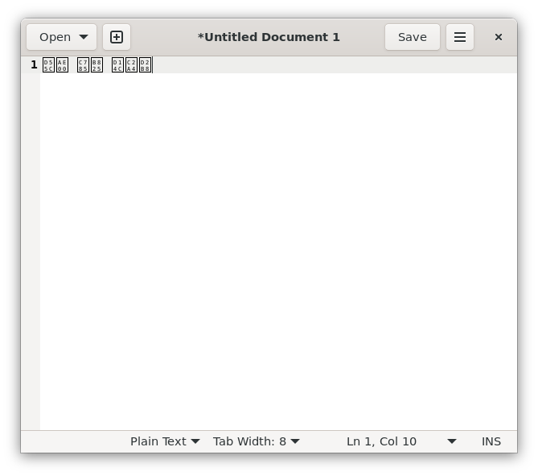

작년 말, 개인 노트북을 새로 구입하고 Ubuntu 를 설치했다. 보통 뱅킹은 요즘 휴대전화로 많이 하는데, 개인 뱅킹 외에 우분투한국커뮤니티 법인 계좌도 관리 해야 하다 보니, 노트북에서도 뱅킹을 하는 일이 자주 있다. 법인 계좌도 모바일로 관리 가능하지만, 회계 장부 관리 하다 보면 노트북으로 보는것이 편할때가 자주 있다. 예를 들면 거래 내역 스프레드시트 파일 받는 경우 등등. 그래서 새 노트북에도 뱅킹에 필요한 프로그램을 설치해 보기로 했다. 다만 그냥 설치하면 지저분한 프로그램 잔뜩 설치 되므로, LXD 컨테이너를 만들어서 그 안에 모두 설치해 보기로 했다.

## 애플리케이션 컨테이너와 시스템 컨테이너 
이 글을 보는 사람이라면, 리눅스 컨테이너에 대해서는 이제 많이 들어 봤을 것이다. 요즘 웹앱 개발하면 보통 Dockerfile 작성 한 다음, OCI 컨테이너로 말아올려서 배포하는 경우가 많다. 이러한 컨테이너를 흔히 애플리케이션 컨테이너라고 한다. 애플리케이션과 그 애플리케이션 실행에 필요한 의존성을 함께 말아올린 형태의 컨테이너이다. 그래서 보통 실행에 필요한 최소한의 구성요소만 포함되고, 컨테이너 내부에서 쓸 수 있는 기능에 제약이 조금 있다. 여기서 활용해볼 LXD는 시스템 컨테이너이다. 애플리케이션 컨테이너가 말 그래도 그냥 앱 하나 실행 하는 용도라면, 시스템 컨테이너는 VM 처럼 범용적인 용도로 쓰는 컨테이너이다. 애플리케이션 컨테이너와 달리 완전한 OS 환경이 컨테이너로 제공되어 대부분의 기능을 제약 없이 이용 가능하다. 안에 특정 프로그램 빌드를 위한 환경을 설치해서 프로그램 빌드에 활용할 수도 있고, 테스트 환경이나 개발 환경을 만들어다가 사용할 수도 있다. 필자처럼 지저분한 프로그램을 가둬두고 쓰는 용도로도 유용하다.


위 사진은 https://linuxcontainers.org/lxd/ 에서 발췌한 애플리케이션 컨테이너와 시스템 컨테이너의 비교 그림이다. [여기](https://linuxcontainers.org/lxd/#application-containers-vs-system-containers)에서 애플리케이션 컨테이너와 시스템 컨테이너의 차이에 대한 자세한 설명을 확인 할 수 있다.

## LXD 설치 및 컨테이너 만들기

LXD 설치는 여러 방법으로 할 수 있는데, 여기서는 Ubuntu 환경에서 Snap 으로 설치하는 방법으로 설명 해 보겠다. 먼저 Ubuntu 를 사용 한다면, Snap 은 기본으로 설치 되어 있으니 아래 명령을 실행해서 바로 LXD 를 설치하면 된다. 다른 리눅스 배포판에서의 설치 방법은 [여기](https://linuxcontainers.org/lxd/getting-started-cli/#other-installation-options)에서 확인 가능하다.

```bash
# 최신 버전 설치
sudo snap install lxd

# 5.0 LTS 버전 설치
sudo snap install lxd --channel=5.0/stable
```

그리고 LXD 구성 초기화가 필요하다. `lxd init` 명령을 이용하는데, 보통 `--auto` 옵션을 붙여 기본값으로 자동 설정 한다. 쓰는 기능이 적어서 최소한의 필수적인 기능만 사용하도록 설정하려면 `--minimal` 옵션 사용도 가능하다. 세부적인 부분을 직접 지정하고 싶다면, 옵션 없이 실행하면 각 설정 항목을 어떻게 할 것인지 항목마다 프롬프트가 나오는데, 이를 통해 설정하게 된다. 여기서는 `--auto` 옵션으로 초기 화 해 보겠다.

```bash
sudo lxd init --auto
```

이후, `lxc launch` 명령으로 LXD 컨테이너를 만들 수 있다. (참고: `lxd` 가 아니고 `lxc` 명령임에 유의하자.) 여기서는 예시로, Ubuntu 22.04 컨테이너를 `jammy` 라는 이름으로 만들어 보겠다.

```bash
lxc launch ubuntu:22.04 jammy
```  

컨테이너 만들어진 후 에는, 셸에 붙어 이것저것 실행 해 볼 수 있다. `lxd shell` 또는 `lxd exec` 를 활용하면 된다. 컨테이너는 만들면 자동으로 시작 되지만, 혹시 그렇지 않다면 `lxc start` 로 켜 주면 된다. 기본적으로 `root` 계정으로 접속되고, `ubuntu` 계정으로도 접속 가능하다.

```bash
# 컨테이너 켜기
lxc start jammy

# jammy 컨테이너에 접속 (기본값: root 로 접속)
lxc shell jammy

# jammy 컨테이너에 ubuntu 계정으로 접속
lxc exec jammy -- su --login ubuntu
```

접속하지 않고, 내부에서 명령만 실행하도록 하려면 `lxc exec`를 사용한다.

```bash
# jammy 컨테이너에서 apt update 명령 실행
lxc exec jammy -- apt update
```

## GUI 앱 실행하기
LXD 컨테이너를 만들었으니, GUI 앱을 하나 설치해서 실행 해 보자. 여기서는 `gedit` 이라는 텍스트 편집기를 설치 해 보겠다. 설치 하려 명령을 입력하면, 실행에 필요한 의존성까지 함께 설치 되는것을 볼 수 있다.

```bash
sudo apt install gedit
```


그러나 실행은 되지 않는다. GUI 앱을 표시할 디스플레이 서버에 접속할 수 없기 때문이다. 

```bash
ubuntu@jammy:~$ gedit

(gedit:5309): Gtk-WARNING **: 12:25:20.909: cannot open display: 
```

그래서 환경을 만들어 주어야 하는데, 컨테이너 내부에 Wayland, XOrg 같은 디스플레이 서버 관련된 것을 설치 더 설치 할 필요는 없고, 호스트에 있는 Wayland 와 XOrg 소켓에 연결하도록 설정하면 된다. 여기서는 우분투 데스크톱 Wayland 환경에 만들어진 LXD 컨테이너에 설정 한다고 가정하고, Wayland와 XWayland 소켓 연결을 설정 해 보자.


먼저, 호스트에서 컨테이너 내부 사용자 uid 값을 매핑 하고, 컨테이너에 디스크 타입의 디바이스를 추가해서, 호스트의 Wayland 및 XWayland 소켓을 컨테이너에서 사용할 수 있도록 설정한다.

```bash
lxc config set jammy raw.idmap="both 1000 1000"
lxc config device add jammy wayland-socket disk source=/run/user/1000/wayland-0 path=/mnt/wayland-socket
lxc config device add jammy xwayland-socket disk source=/tmp/.X11-unix/X0 path=/mnt/xwayland-socket
```

이후, 컨테이너 내부에서 Wayland, XWayland 소켓 연결에 쓰이는 디렉터리를 생성하고. 호스트와 연결할 때 쓸 소켓에 링크한다.

```bash
uid=$(id -u)
run_dir=/run/user/$uid
mkdir -p $run_dir && chmod 700 $run_dir && chown $uid:$uid $run_dir
ln -sf /mnt/wayland-socket $run_dir/wayland-0
ln -sf /mnt/xwayland-socket /tmp/.X11-unix/X0
```

마지막으로, 생성한 소켓 경로를 GUI 앱 실행 시 사용하도록 아래처럼 환경 변수를 설정 해 주자. 
```bash
export WAYLAND_DISPLAY=wayland-0
export XDG_RUNTIME_DIR=/run/user/1000
export DISPLAY=:0
export XSOCKET=/tmp/.X11-unix/X1
```

그리고 다시 `gedit` 를 실행 하면, 이번에는 정상적으로 Gedit 텍스트 편집기가 나오는 것을 볼 수 있다.


## IME 설정하기
하지만 컨테이너 내부에 IME와 한글 글꼴이 설치 안 되어 있어서, 한글 입력이 잘 안되거나, 입력 되어도 깨지는 것을 볼 수 있다.
호스트가 GNOME Wayland 및 iBus 가 설치된 환경인 상태에서 Wayland 지원이 있는 Gedit 을 열면, 호스트의 GNOME, IBus 통합 때문인지 한글 입력이 되는것을 볼 수 있다. 하지만 한글이 깨지는 것을 볼 수 있다.



기존적으로 XOrg 모드로 실행되는 Chrome 브라우저의 경우, 아예 한글 입력으로 전환이 안 된다. XOrg 앱은 시스템에 설치된 각 위젯 툴킷(GTK, QT 등)별 IME 클라이언트 라이브러리를 통해 IME와 연동되는데, 컨테이너 내부에 설치 안 되어 있으니 어쩌면 당연하다 할 수 있겠다.

한글 입력을 위한 IME 설치 및 설정은 기존에 리눅스 데스크톱에서 하는 방법 그대로 컨테이너 내부에서 해 주면 된다. 여기서는 IBus 와 `ibus-hangul` 및 Noto Sans KR 글꼴을 설치하여 설정 해 보겠다. 먼저 아래 명령으로 필요한 패키지를 설치하자.

```bash
sudo apt install ibus ibus-hangul fonts-noto-cjk language-selector-gnome
```

이후, iBus 를 `im-config` 명령으로 기본 입력기로 설정하고, `dbus-run-session` 명령으로 iBus 데몬을 시작한다. 
다음으로, `ibus-setup` 명령으로 실행하면, IME 입력 언어/엔진을 설정할 수 있다.
```bash
im-config -n ibus
dbus-run-session ibus-daemon -drx
ibus-setup
```
`ibus-setup` 을 실행하면, 아래와 같은 화면이 나오는데. Input Method 탭 - Add - "Hangul" 검색 - "Korean" 누르면 하위에 있는 "Hangul" 을 추가하여, `ibus-hangul` 을 사용하도록 설정하면 된다.
