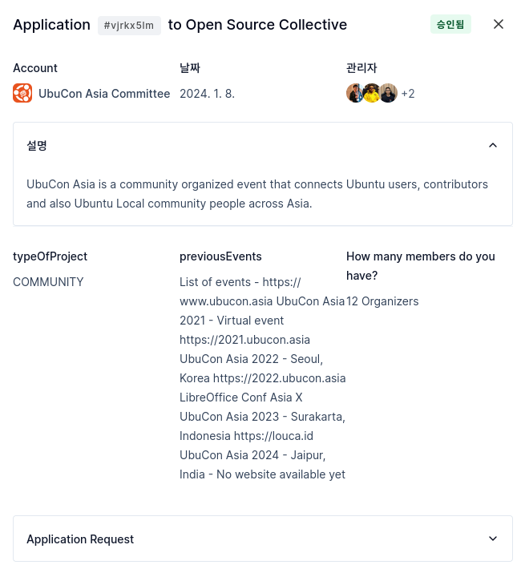
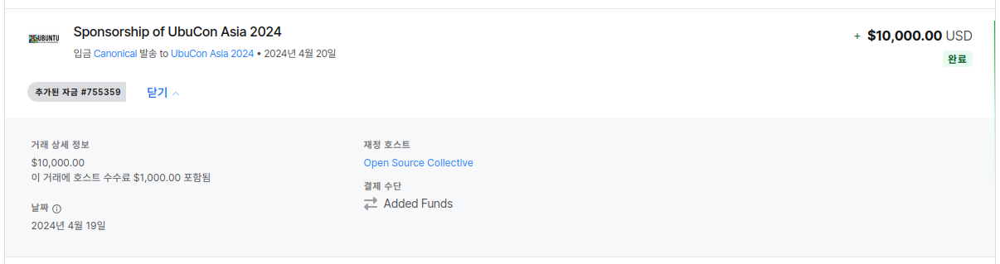

2021년 부터 다른 나라 다른 도시를 돌면서 열리는 아시아 지역 우분투 커뮤니티 행사인 UbuCon Asia. 올해도 역시 열렸고, 나 또한 올해도 행사 준비위원으로 글로벌 팀의 일원으로 참여 했다. 개인 적으로 이번 행사는 이전 회차에 비하면 좋은점도 있고 아쉬운 점도 있고 하지만, 개선된 점도 많이 있었던 회차였다. 개인적으로는 이전에 비해 로컬팀과의 의사소통과 협업이 상당히 많이 개선 되었고, 글로벌 팀에서 활동하는 분들도 이전에 비해 더 적극적으로 참여 해 주셔서 좋았다. 또 한가지 좋았던 점이 개선된 행사 자금 관리 방법이다.

이전 회차까지는 행사 자금 관리와 관련된 행정처리를 모두 로컬팀에 위탁 하였다. 로컬팀에서 이벤트 대행사를 끌고 오든, 지역 비영리 단체 도움을 받든 직접 운영하는 비영리 단체 등을 이용해서, 행사 후원사와 후원 계약 채결을 하고 돈을 받아 자금 조달도 하였고, 현지 업체와 거래 하면서 결제도 로컬팀을 통해 처리 하였다. 이 뿐만 아니라 여행경비 지원이 필요한 발표자나 준비위원 경비 지원도 로컬팀이 직접 처리 하였었다. 그러다 보니 물론 좋은점도 있었지만 (글로벌 팀 입장에서 자금 관리 관련하여 크게 할 일이 없음) 단점이 더 많았었다. 나열 해 보면 아래와 같이 정리가 가능할 것 같다.

- 자금 운영 불투명: 글로벌 팀 입장에서 대략 후원사를 모집해 얼마정도 조달 했는지는 추정이 가능 했지만, 실제로 어디에 지출 했는지는 알기가 어려웠다. 로컬팀이 자금 관리를 하는 경우 로컬팀은 보통 현지에서 행사 전날이나 당일 까지도 업체에 결제하고 정리하고 하느라 정신이 없고, 행사가 끝난 후에는 로컬팀 인원이 지쳐서 지출 내역을 전달 받기가 어려웠다. 때문에 다음 년도 로컬팀에서 "작년에는 어디에 얼마 지출 했어요?" 하고 물어보면, 답변이 불가능 했다. 왜냐면 이전 년도 로컬팀이 지쳐서 지출 내역 공유를 못 해주었기 때문에...
- 자금 집행 의견 충돌시 실제 자금을 관리하는 측의 의지대로 자금 집행: 말 그대로 자금 집행 관련하여 의견 충돌이 생기면, 실제로 자금을 들고 관리하는 로컬팀 측 의견대로 집행이 되는 것이다. 지난 회차에는 여행 경비 지원과 행사장 로지스틱 관련 지출 중 어느쪽에 더 지출을 해야 하는지 의견 충돌이 있었는데, 로컬팀 측은 로지스틱에 지출을 더 해서 실제로 참석할 다수의 인원에 더 좋은 경험을 제공하자는 입장이였다. 그래서 여행 경비 지출은 그만큼 축소가 되었고, 해외에서 오는 일부 연사 분들이 지원받는 여행 경비가 부족한 문제로 여행 일정을 취소하고 발표를 철회한 일이 있었다. 
- 행사 후 남은 자금 일부 이월 불가: 행사 후 남은 자금을 다음 팀을 위해 이월이 가능하다면, 다음 팀은 후원사로부터 자금 조달 이전에 이월받은 자금으로 먼저 집행이 가능해서 행사 준비를 비교적 용이하게 할 수 있게 된다. 그런데 UbuCon Asia 의 경우 매년 로컬팀이 완전히 다르고 (다른 국가, 다른 지역 사람으로 구성), 아직까지는 한 회차가 끝나고 연말이나 연초는 되어야 다음 개최지가 확정이 되다 보니 이전 로컬팀에서 다음 로컬팀으로 남은 자금 일부라도 이월이 쉽지 않았다. 이전 회차 로컬팀이 지쳐서 이월 해 주기 어려운 상황인 경우도 있고, 나라나 지역별 법이나 규제 때문에 실질적으로 송금이 어려운 경우가 있기도 하고, 다음 로컬팀이 자금 받을 준비가 안 된 경우(단체 명의 계좌로 못 받는 경우)가 있는 경우도 있을 수 있다.

그래서 이런 문제를 어떻게 개선해야 할지 고민이 많았는데, 이번 회차때 Open Collective 에서 활동하는 Open Source Collective (미국 소재 501(c)(6) 비영리 단체)로부터 Fiscal sponsorship 을 받아 UbuCon Asia 행사 자금 관리를 위탁하여 행사 준비를 비교적 수월하게 할 수 있었다. 그래서 이 글을 통해 어떻게 Open Collective 를 통해 그 중에서도 Open Source Collective 를 통해 Fiscal sponsorship 을 받을 수 있고, 이를 통해 컨퍼런스 자금 관리를 할 수 있는지 정리 해 보고자 한다. 

## Fiscal (Financial) sponsorship 이란?
흔히 Fiscal host 라고도 불리는 Fiscal sponsorship (혹은 Financial sponsorship)은 일단 직역하면 "재정 후원"이 되는데, 이 때문에 흔히 자금을 지원 해 주거나 투자를 해 주는 것 등으로 많은 사람들이 오해 하기도 한다. Fiscal sponsorship 이란, 간단히 설명하면 어떤 개인이 모인 조직이 굳이 비영리 법인 등기를 하거나, 세무서에 단체 등록을 한다거나 회사를 설립하지 않아도 기존 비영리 단체 등의 자원을 활용해서 조직의 자금을 조달 및 관리하고 이에 따른 행정처리 지원도 받는 것을 말한다.

보통 커뮤니티에서 컨퍼런스를 개최 하거나, 대형 프로젝트를 하면 자금이 많이 필요하여, 개인 후원이나 기업 후원으로 자금 조달을 하는 경우가 많다. 기업 후원을 받으려면 해당 기업과 사업자(보통 법인) 간의 후원 계약을 하고 세금계산서 등 서류도 발행 해 주어야 후원 비용을 받을 수 있는데, 그러려면 적어도 커뮤니티 명의로 세무서에 단체 등록을 하거나 더 나아가서 비영리법인 등기를 해야하는 경우도 있다. 하지만 현실적으로 커뮤니티 차원에서 이를 단체 등록이나 등기를 하기 어려운 것은 물론, 한다 해도 유지가 어렵다. 그래서 대신 이미 존재하는 다른 비영리 단체 (혹은 비영리 법인) 도움을 받아 해당 단체 명의로 계약을 하고, 세금계산서 발행도 하고, 이렇게 전달받은 후원비용도 해당 단체의 계좌로 관리를 하고, 필요시 해당 단체에 요청하여 업체에 결제를 하는 형태로 활용하는 것이다. 물론 이에 따른 세무나 회계 등 다른 행정 처리도 해당 단체가 처리하게 된다. 

어떻게 보면 이벤트 대행사가 하는 것과 비슷해서, "그거 이벤트 대행사 아니에요?" 라고 질문하는 경우도 있다. 이벤트 대행사가 하는 일과 비슷하긴 하다, 하지만 이벤트 대행사가 하는 것은 Fiscal sponsorship 을 행사 대행 관련 범위에서만 제공하는 것이고, 또한 이벤트 관련 Fiscal sponsorship 은 이벤트 대행사가 제공하는 많은 서비스 중 하나일 수도 있다. 또한 Fiscal sponsorship 은 꼭 이벤트 관련 자금 관리에만 국한 되었다기 보단, 비영리 영역에서 작은 비영리 조직이 자금 조달을 해야 하는데 현실적으로 직접 조달 및 관리와 관련 행청처리 여력이 없을 때 도움을 받는 방법으로 폭넓게 쓰인다고 보면 된다. 예를 들만 조그마한 오픈소스 프로젝트 팀이 기부금을 조금씩 받아서 서버 호스팅 비용을 충당할 수 있을텐데 이때 굳이 공동 명의로 자금 조달해 관리 하자고 법인을 만들면 일이 너무 많으니, Fiscal sponsorship 을 받아서 다른 비영리 단체를 통해 기부를 받고, 기부금이 어느정도 모이면 해당 단체에 요청하여 서버 호스팅 비용을 결제 하는 것이다 (아니면 개인이 먼저 결제하고 Fiscal sponsorship 받는 단체로 부터 환급 받거나).  

## Open Collective와 Open Source Collective
이러한 Fiscal Sponsorship 지원을 알아보고 받는것이 처음 하면 쉬운 것은 아니다. 이후에 도움을 주는 단체를 통해 후원받은 자금을 받아 관리하거나, 필요에 따라 지출 하는 것도 단체에 따라 보통 원할히 되겠지만, 단체에 인력이 부족하거나 다른 일로 바쁘면 그렇지 않은 경우도 있을 것이다. 거래 내역이나 남은 자금도 단체에 관리를 해 주기 때문에 요청하면 받을 수 있겠지만, 필요할 때 마다 따로 요청을 해야 해서 번거롭기도 하고 단체가 또 바쁘면 지연되기도 할 것이다. 

이러한 불편함을 웹 기반 플랫폼으로 풀어낸 플랫폼이 있는데, 바로 [Open Collective](https://opencollective.com) 이다. Open Collective 에 들어가 보면, 이미 Fiscal sponsorship을 제공하는 여러 단체가 등록되어 있는데, 프로젝트 팀이나 커뮤니티가 이들 단체 중 적합한 단체를 선택하여 간단한 절차를 통해 Open Collective 에 Collective로 등록을 하면, 직접 비영리 법인을 만들고 통장 만들고 할 필요 없이, 바로 Open Collective 를 통해서 개인 혹은 기업으로부터 기부 혹은 후원을 받을 수 있다. 이를 통해 조달한 자금은 Collective 로 등록 시 선택한 단체 명의로 관리가 되는데, 자금을 사용해야 할 때는 Open Collective 를 통해서 쉽게 요청을 할 수가 있다. 또한 이렇게 발생한 수입이나 지출은 모두 자동으로 Open Collective에 기록이 되어 조회가 가능하기 때문에, 매번 별도로 요청할 필요 없이 언제든 웹으로 거래 내역이나 남은 자금 확인도 가능하고, 또 누구나 이러한 거래내역과 남은 자금 등을 웹으로 확인이 가능해서, 큰 힘을 들이지 않고 투명하면서도 효율적으로 자금을 관리하고 집행할 수가 있다.

이번에 Open Collective를 통해 UbuCon Asia 행사 자금 관리를 위해 이용한 단체는 Open Source Collective이다. 미국에 있는 비영리 법인이고(501(c)(6)), webpack, OBS, core-js, LibreCAD 등 수많은 오픈소스 프로젝트 혹은 커뮤니티가 기부를 받을 수 있도록 돕고 있다. 물론 Open Collective에 등록된 Fiscal host로, 대부분의 오픈소스 프로젝트가 Open Collective를 통해 Open Source Collective의 지원을 받는다. 이 단체의 경우, 오픈소스 프로젝트도 지원 하지만, 지역 모임 기반 오픈소스 커뮤니티나 컨퍼런스 팀도 지원 대상 범위에 포함이 되어 있는데, 덕분에 UbuCon Asia 팀도 지원 요청을 넣어서 Open Source Collective 도움을 받아 행사 후원을 받거나 각종 비용 처리 등을 쉽게 할 수 있었다.  

## Open Source Collective에 지원하기
Open Source Collective에 지원하는 것은 생각보다 어렵지는 않았다. 예전에 잠깐 보았을 때는, GitHub Star 100개 있어야만 지원 가능한 것인가 생각했는데, 오픈소스 프로젝트가 아닌 오픈소스 밋업이나 컨퍼런스 등 행사를 개최하는 팀도 지원이 가능하고, 이런 경우는 아래와 같은 요건을 충족한다면 지원 양식을 잘 작성하여 제출하면 지원할 수 있다.

- 독점 기술이나 기타 다른 주제가 아닌, 오픈소스와 강하게 연관이 있어야 함
- 회원(혹은 참가자) 50명 이상 
- 이전에 2회 이상 행사 개최 이력
- 구성원들이 추진했던 활동 이력을 보여줄 수 있어야 함

작성한 지원서는 아래와 같은 질문이 있었다.

- 간단한 소개
- 조직 유형
- 과거 행사 이력
- 구성원 수
- 자세한 설명(조직의 활동에 대한 설명, 어떤 부분에서 지원이 필요한지 등)

지원을 하면 Open Soruce Collective 측 담당자가 검토를 한 후, 몇일정도 후에 회신을 주었고. 필요에 따라 이메일로 간단한 질의응답도 진행이 되었다. 행사 보험 가입 지원이 혹시 필요한지 질문을 받았는데, UbuCon Asia의 경우 로컬 팀에서 필요에 따라 알아보고 가입을 하는 편이라 굳이 필요하지 않다고 답변을 하였다.

## 컨퍼런스 후원사 계약 처리하기
이전에 UbuCon Asia 2022를 한국에서 개최할 때는, 국내 이벤트 대행사를 통해 후원사 계약을 처리 하였는데, 그 방법과 거의 동일한 방법이였다. 후원사 측과 금액 및 혜택을 확정하고, 이메일로 후원사 계약 처리를 요청하면서 이에 필요한 내용(행사 일시 등 개요, 후원사 정보, 후원 금액, 후원 혜택 등)을 전달하면 OSC 측에서 OSC와 후원사간 계약을 체결하고(만약 계약이 불필요하면 그냥 건너뛰고) 인보이스를 발행하면, 후원사가 인보이스에 따라 입금을 하는 방식이다.

이벤트 대행사를 통해서 할 때와 다른 점이 있다면, 이벤트 대행사를 통해서 하면 주기적으로 이메일로 거래 내역이나 남은 금액 등을 요청해서 확인해야 하지만, Open Source Collective 를 통해서 하면, 각 거래가 모두 Open Collective 에 기록되어 필요할 때 바로 열람이 가능하기에 컨퍼런스 운영 자금 관리가 확실히 편리해 지는 점이 있다. 

다만 이렇게 Open Collective 에 기록된 거래 내역은 모든 세부 정보 까지는 아니지만 기본적인 정보 (일시, 금액, 거래처, 적요)는 누구나 열람이 가능하게 된다.

