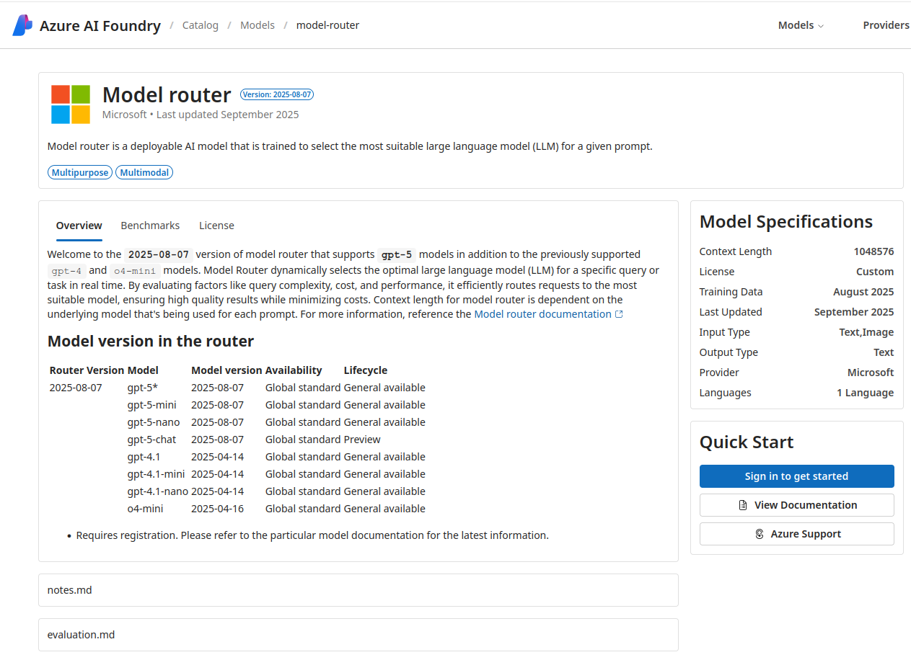
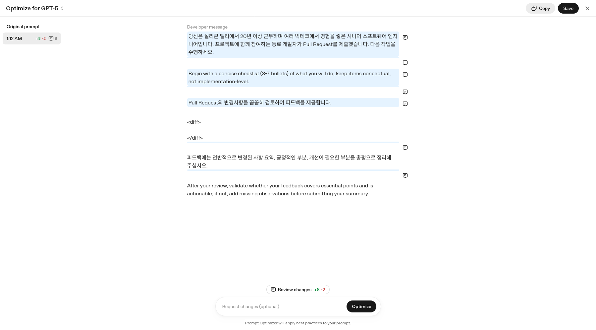
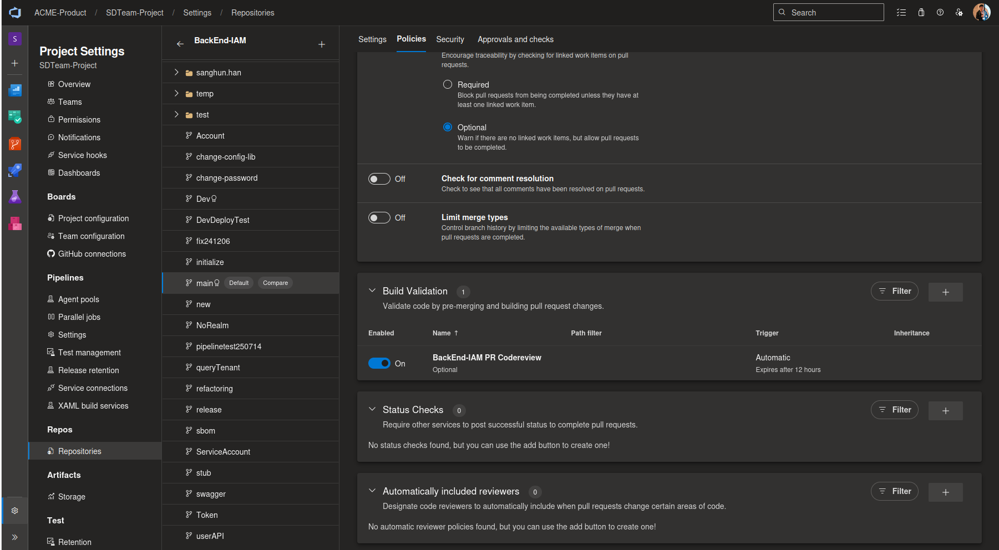
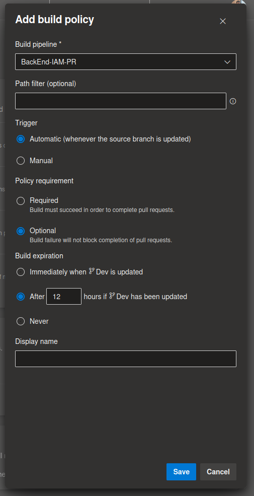
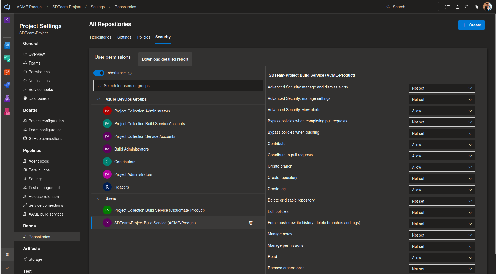
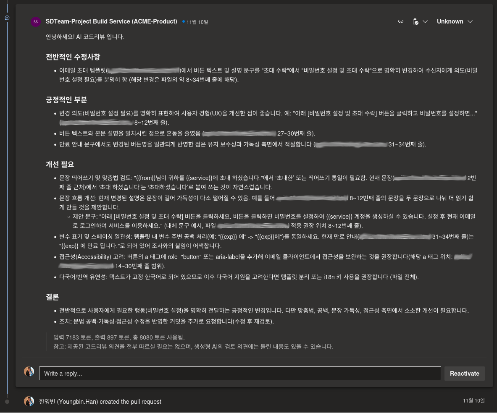
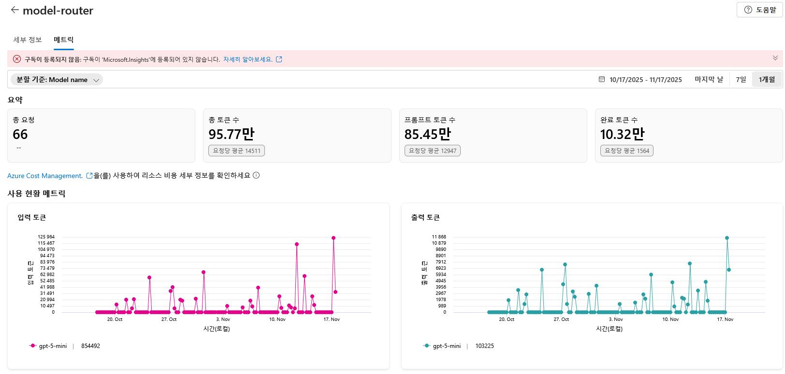
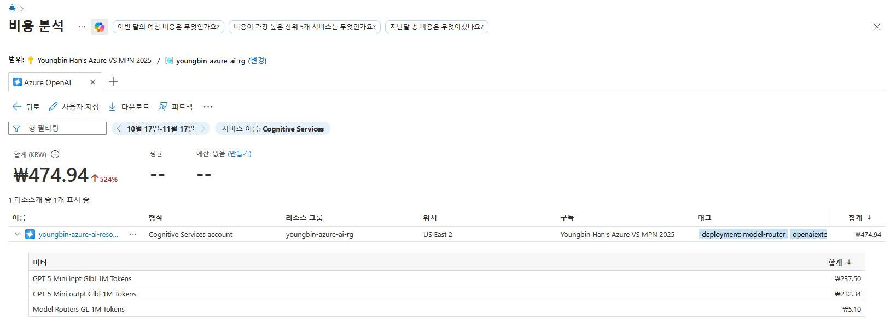

첫회사에 근무한 지만 어느새 5년이 넘은 것 같다. 여기서 여러 웹 개발 프로젝트 하면서 항상 아쉬운 거라면, 다른 동료 분으로부터 내가 작성한 코드 리뷰 받기 괜찮은 환경이 아니라는 것이다. 이건 몇 년 전이나 요즘이나 비슷한 것 같다.

요 근래에, 코드 짜는 사람이라면 생성형 AI 를 적극적으로 활용하는 추세인데, 재직중인 회사에서도 ChatGPT 등 도구 라이선스를 구입 해 주어서 업무에 잘 활용하고 있다. 그러다 든 생각이, 내가 제출한 Pull Request 를 생성형 AI 로 검토하고 피드백 생성하면 괜찮을 것 같다는 생각을 했다.

이런 솔루션은 사실 많이 있긴 한 것 같다. GitHub Copilot 에서 제공하는 코드리뷰 기능이라던가, CodeRabbit 등이 있겠다. 다만 이런 솔루션은 GitHub 에서만 이용 가능 하거나, 사내에서 쓰는 Azure DevOps를 지원 한다 하여도 별도로 결재는 해야 하다 보니, 그냥 간단히 파이프라인 하나 만들자는 생각을 하고 진행하여 내가 주로 유지보수 하는 몇몇 프로젝트에 붙여보게 되었다.

이 글에서는 이러한 생성형 AI 기반 PR 코드리뷰 파이프라인 만들어 연동해 본 과정을 정리해 보고자 한다.

## Dagger

이번에 만든 코드리뷰 파이프라인 대부분은 Dagger 로 개발을 하였다. Dagger 로 주요 로직을 짜고, 이를 Azure Pipeline 에서 실행 하도록 구성한 형태이다.

Dagger 는 CI/CD, 데이터 처리 파이프라인 등 다양한 소프트웨어 개발 파이프라인을 만들기 위한 플랫폼이다. CI/CD 의 일종이라고 할 수도 있는데, 많이 사용하는 GitHub Actions, Azure Pipelines, GitLab Pipelines, Jenkins 등과 다른 점이라면, 하나는 이식이 가능하다(portable)는 점이다. 기본적으로 작성한 파이프라인이 해당 파이프라인에서 정의한 OCI 컨테이너 환경에서 구동되기 때문이다. 그리고 로컬에서도 파이프라인을 손쉽게 실행해 볼 수 있고, 이렇게 실행한 결과와 실제 운영 환경에서 실행한 결과도 동일하다는 점이 특징이라 할 수 있겠다.

마치 OCI 컨테이너 (전에는 Docker Container)의 특징과도 비슷한데, 파이프라인이 OCI 컨테이너에서 실행되기도 하고, 어쩌면 Docker 를 개발한 Solomon Hykes 가 Dagger 를 개발했기 때문인 것 같기도 하다.

Dagger 에 대해서는 작년 쯤에 소셜 미디어에서 누군가가 공유한 것을 보며 이름을 알게 되었고, 올해 FOSSASIA Summit 에서 Dagger, Inc 에 근무하는 분의 Dagger 세션에 참여해 보면서 관심을 가지게 되었다.

### 일단 커밋 푸시하고 잘 돌아가길 빌지 않아도 되는 CI/CD

Dagger 의 가장 큰 특징이라면, 작성한 파이프라인이 OCI 컨테이너에서 굴러가다 보니 이를 로컬에서도 손쉽게 실행 해 보면서 테스트가 가능한 것, 그리고 이를 다양한 CI/CD 환경에서 바로 사용 가능한 것이라고 할 수 있다.

기존의 CI/CD 는 작성 하려면 해당 CI/CD 에서 제공하는 문법이나 기능에 맞춰서 작성해야 하고, 보통 커밋 올리는 것으로 트리거를 하다 보니, 일단 커밋 올려서 돌아가게 하고 잘 돌아가길 빌어야 하는(Push and prey) 형태이다. 나도 실제로 회사 프로젝트 파이프라인 만들면서 자주 이렇게 작업 했었는데, Dagger 는 로컬에서 그냥 실행 해 볼 수 있으니 그럴 필요가 없어 편리했다.

아래는 Dagger 문서에서 제공하는 간단한 예시이다. 간단히 Dagger 를 설치하고(리눅스 환경이라 가정), 기본 제공 Dagger Function 을 실행하는 것이다. 로컬에서도 바로 실행할 수도 있고, 같은 명령어를 기존 CI 환경에서 실행하도록 구성해서 실제 운영 CI 환경에서도 그대로 작동하도록 할 수도 있다.

```bash
curl -fsSL https://dl.dagger.io/dagger/install.sh | BIN_DIR=$HOME/.local/bin sh

dagger <<EOF
container |
  from alpine |
  file /etc/os-release |
  contents
EOF
```

### Dagger 의 LLM 호출 기능

Dagger 로 파이프라인을 만들 때, LLM 도 쉽게 호출 가능하다. 아직 외부 MCP 서버 호출을 지원하진 않지만, CI/CD 에서 LLM 굴려서 뭔가 자동화 한다고 했을 때 사용할 만한 기능은 대부분 제공 한다.

다는 아니지만, 잘 알려진 LLM 서비스 API 대부분 지원하는 것 같다. Open AI, Anthropic, Google Gemini, Amazon Bedrock, Azure OpenAI/AI Foundry, Docker Model Runner, Ollama 등을 지원한다.

https://docs.dagger.io/reference/configuration/llm

나의 경우는 회사에서 받아서 개인적으로 각종 개발 테스트 할 때 활용하는 Azure 구독이 있다보니, Azure AI Foundry 를 활용 해 보았다. 모델은 `model-router` 로 골라서 배포 하였다. 프롬프트가 들어오면, 프롬프트의 복잡도 등에 따라서 최신 Open AI GPT 모델 중 적합한 모델로 보내서 처리 해 주는 모델이다.

https://ai.azure.com/catalog/models/model-router



환경변수만 몇가지 설정 하면 사용 가능한데, Azure AI Foundry 콘솔에서 Open AI 형식 설정값 조회해서 Dagger 돌릴 환경에 설정 해 주면 되었다. `OPENAI_BASE_URL`, `OPENAI_API_KEY`, `OPENAI_MODEL`, `OPENAI_AZURE_VERSION` 정도만 설정 해 주면 Dagger 안에서 LLM 호출에 이용이 가능하다.

```go
package main

import (
	"dagger/my-module/internal/dagger"
)

type MyWorkflow struct{}

func (m *MyWorkflow) MyDaggerFunction() *dagger.Container {
	environment := dag.Env().
		WithContainerInput("builder",
			dag.Container().From("ubuntu").WithWorkdir("/app"),
			"a base container").
		WithContainerOutput("completed", "the completed assignment in the Golang container")

	work := dag.LLM().
  	WithEnv(environment).
		WithPrompt(`
			LLM 에 전달 할 프롬프트
			`)

	return work.
		Env().
		Output("completed").
		AsContainer()
}
```

위는 Go 언어로 간단한 Dagger 워크플로우 코드이다. Dagger 의 워크플로는 Go, Python, TypeScript, PHP 중에서 선택하여 작성할 수 있다. 그리고 샘플 코드에는 `MyDaggerFunction` 이라는 Dagger Function 을 넣어 두었다.

작성한 Dagger 워크플로우 코드에서 LLM 을 호출 하려면, Go 에서 하는 경우 `dag.LLM` 으로 프롬프트를 전달해서 간단히 호출할 수 있다. 위 코드에서 실행하는 것을 보면, `dag.Env` 로 LLM 이 실행될 환경을 먼저 만들고, 그 안에서 실행하도록 하고 있는데, 여기에 컨테이너, 프롬프트에 들어갈 부가적인 정보, 파일이나 디렉토리 경로, MCP 등도 붙여서 LLM 이 `dag.Env` 로 만든 환경에서 할 수 있는 작업을 확장시킬 수 있다.

그러면 이제 위에서 작성한 것을 아래처럼 PR 코드리뷰 작업에 맞춰서 좀 더 확장시킬 수 있다. 아래 코드에서는 LLM이 사용할 환경 객체에 Pull Request 관련 데이터 (변경사항 diff, PR 제목과 설명), 그리고 해당 PR 에 대한 프로젝트 코드 베이스를 컨테이너로 입력을 넣도록 정의하고, 출력은 이름이 feedback 인 문자열로 나오도록 정의가 되어 있다.

```go
package main

import (
	"dagger/my-module/internal/dagger"
)

type MyWorkflow struct{}

func (m *MyWorkflow) MyDaggerFunction(diff string, prTitle string, prDesc string) string {
	environment := dag.Env().
		WithStringInput("diff", diff, "code diff to review").
		WithStringInput("pr_title", prTitle, "title of the submitted pull request").
		WithStringInput("prdesc", prDesc, "description of the submitted pull request").
		WithContainerInput("codebase",
			dag.Container().
				From("alpine:latest").
				WithMountedDirectory("/mnt", source).
				WithWorkdir("/mnt"),
			"The container that includes the entire codebase of the project").
		WithStringOutput("feedback", "Pull Request review feedback that you must provide written in Korean in Markdown format")

	work := dag.LLM().
  	WithEnv(environment).
		WithPrompt(`
			LLM 에 전달 할 프롬프트
			`)

	return work.
		Env().
		Output("feedback").
		AsString()
}
```

이렇게 환경 객체에 넣은 것은 프롬프트에서 사용이 가능한데, 간단히 `$이름` 형식으로 중간에 넣어주면 된다. 예를 들면 아래와 같이 프롬프르에 넣을 수 있겠다.

```go
	work := dag.LLM().
  	WithEnv(environment).
		WithPrompt(`
			아래와 같이 제출 된 Pull Request 를 검토하여 피드백을 제공 하여라.
			피드백은 마크다운 형식으로 제공 하도록 하여라.

			PR 제목: $pr_title
			PR 설명: $pr_desc
			포함된 변경사항: $diff
			전체 프로젝트 코드: $codebase
			`)
```

각 생성형 AI 모델 개발한 회사나 오픈소스 커뮤니티별로 프롬프트 최적화 도구를 제공하기도 하는데, 이를 활용하면 토큰은 좀 적게 사용 하면서도 사용할 생성형 AI 모델에 좀 더 정확한 지시를 전달하는 최적화된 프롬프트를 만들어 사용하는데 유용하다.

https://platform.openai.com/chat/edit?optimize=true



## 작성한 워크플로우 로컬에서 실행하기

이렇게 작성한 Dagger 워크플로우는, 앞서 언급 하였듯 로컬에서 바로 실행하고 테스트할 수 있다.

아래처럼 작성한 워크플로우 디렉토리에서 아래 명령어로 사용 가능한 Function 목록을 확인하고

```bash
dagger functions
```

 `dagger call` 명령어로 원하는 Function을 실행할 수 있다. 위에서 작성한 `MyDaggerFunction`을 실행하는 예시는 다음과 같다:

```bash
dagger call my-dagger-function \
  --diff "$(git diff origin/main...HEAD)" \
  --pr-title "새로운 기능 추가" \
  --pr-desc "사용자 인증 기능을 개선했습니다"
```

Function 이름은 kebab-case로 변환되어 호출되며(`MyDaggerFunction` → `my-dagger-function`), 파라미터는 `--파라미터명` 형식으로 전달한다. 파라미터 이름도 camelCase에서 kebab-case로 자동 변환된다.

## Shell 스크립트로 만들어 넣기엔 조금 복잡한 작업도 Dagger Function 으로 작성하기

위에서는 우선 Dagger Function 하나 정의하고, LLM 호출하여 사용하는 것을 정의 하였지만. 당연히 다른 작업도 정의할 수 있다. CI/CD 파이프라인 작성하면서, 미리 별도의 Task 형태로 정의되어 제공되지 않는 것도 있을텐데, 그냥 간단한 명령줄 넣는 것으로 대체 가능하지만 Shell 스크립트로 만들어 넣기엔 복잡한 것들도 Dagger Function 으로 만들면 유용하다.

Dagger 워크플로에 Function 으로 만들어서 넣으면 그냥 Go, Python, PHP 등 Dagger 에서 지원하는 언어로 작업 로직 작성하는 것이여서, 복잡한 작업이여도 그래도 좀 더 쉽게 비교적 유지보수 하기 더 좋은 형태로 만들어서 사용할 수 있다.

나 같은 경우는, LLM에 컨텍스트로 전달 해 줄 Pull Request 의 변경사항 diff 조회하는 작업, Azure DevOps Pull Request 내용 조회하는 작업, LLM 에서 생성한 리뷰 피드백 텍스트를 Pull Request 에 댓글로 추가할 수 있도록 Azure DevOps 의 Pull Request 댓글 API 호출 해 주는 작업을 Dagger Function 으로 만들어 넣었다.

```go
func (m *MyWorkflow) Diff(ctx context.Context, source *dagger.Directory, sourceBranch string, targetBranch string) (string, error) {
	result, err := dag.Container().
		From("alpine:latest").
		WithMountedDirectory("/mnt", source).
		WithWorkdir("/mnt").
		WithExec([]string{"apk", "add", "git"}).
		WithExec([]string{"git", "diff", fmt.Sprintf("%s...%s", targetBranch, sourceBranch)}).
		Stdout(ctx)

	return result, err
}
```

diff 조회의 경우는, 간단히 소스코드 경로와 비교할 브랜치 둘을 입력 받고 이를 지정한 컨테이너 하나 만들고 그 안에서 `git diff` 를 실행하고 결과를 반환 하도록 작성 하였다. 그리고 아래처럼 Azure DevOps Pull Request 정보를 가져오거나, Pull Request 댓글 다는 Dagger Function 도 만들었다.

처음에는 Azure Pipeline 에 별도의 Step 으로 PowerShell 스크립트를 넣어서 API 호출하는 형태로 만들었지만, 생각보다 Step 간에 문자열 데이터 넘기는데 Escape 처리하는 등 번거로운 작업도 필요하고, API 호출 후 응답처리 로직 넣고 하는것은 Shell 스크립트로 하기 보다 Dagger Function 으로 만들면서 안에 같이 넣는것이 더 편했던 것도 있었다.

```go
func (m *MyWorkflow) GetAzDevOpsPRInfo(
	ctx context.Context,
	orgURL string,
	project string,
	repoID string,
	prID string,
	accessToken string) (string, string, error) {
	url := fmt.Sprintf("%s%s/_apis/git/repositories/%s/pullRequests/%s?api-version=7.1-preview.1",
		orgURL, project, repoID, prID)

	req, err := http.NewRequest("GET", url, nil)
	if err != nil {
		panic(err)
	}
	req.Header.Set("Authorization", "Bearer "+accessToken)
	req.Header.Set("Content-Type", "application/json")

	resp, err := http.DefaultClient.Do(req)
	if err != nil {
		panic(err)
	}
	defer resp.Body.Close()

	if resp.StatusCode < 200 || resp.StatusCode >= 300 {
		b, _ := io.ReadAll(resp.Body)
		fmt.Fprintf(os.Stderr, "Request failed: %s\nBody: %s\n", resp.Status, string(b))
		os.Exit(1)
	}
	type azReposPullRequest struct {
		Title       string `json:"title"`
		Description string `json:"description"`
	}
	var pr azReposPullRequest
	if err := json.NewDecoder(resp.Body).Decode(&pr); err != nil {
		panic(err)
	}
	return pr.Title, pr.Description, err
}
```

위의 Azure DevOps Pull Request 정보를 가져오는 Dagger Function 의 경우는 Azure DevOps API 를 호출하는 간단한 로직을 직접 작성 하여 넣은 형태이다. 이렇게 작성 할 수도 있고, 어짜피 Dagger 로 작성한 워크플로우는 Go, Python, TypeScript, PHP 코드 중 하나이니 사용하던 외부 라이브러리도 활용이 가능하다. 그러니 이 경우에는 [Azure DevOps API 클라이언트 라이브러리](https://github.com/microsoft/azure-devops-go-api)를 활용해서 호출 로직을 넣는 방법을 활용할 수도 있다.

### 작성한 Function 을 Chaining 할 수 있도록 만들기

작성한 Dagger Function 은 보통 Function 하나만 실행하기 보단, 다른 Function 과 이어 붙여 Chaining 하여 사용하는 경우가 많다. 직접 작성한 Function 도 Chaining 가능 하도록 만들면 Dagger 에서 제공하는 Function과 이어붙여 사용도 가능하고, 작성한 Function 이 여러 개라면 이를 이어 붙여서 사용 가능하도록 할 수도 있다.

```go
type MyWorkflow struct{
	SourceBranch           string
	TargetBranch           string
	ChangesDiff            string
	PullRequestTitle       string
	PullRequestDescription string
	ReviewComment          string
}

func (m *MyWorkflow) MyDaggerFunction(
	diff string, prTitle string, prDesc string) *MyWorkflow {
	...
	return m
}
func (m *MyWorkflow) Diff(
	ctx context.Context, source *dagger.Directory, sourceBranch string, targetBranch string) (*MyWorkflow, error) {
	...
	m.SourceBranch = sourceBranch
	m.TargetBranch = targetBranch
	m.ChangesDiff = result
	return m
}
func (m *MyWorkflow) GetAzDevOpsPRInfo(
	ctx context.Context,
	orgURL string,
	project string,
	repoID string,
	prID string,
	accessToken string) (*MyWorkflow, error) {
	...
	m.PullRequestTitle = pr.Title
	m.PullRequestDescription = pr.Description
	return m
}
```

위의 경우는 기존에 작성했던 Function 에서 `MyWorkflow` 를 반환하도록 하여 Chaining 할 수 있도록 수정한 예시이다. 각 Function 은 또 Go 코드 관점에서는 `MyWorkflow` 구조체에 대한 메소드이기도 하니,

그리고 이렇게 수정한 것을 Chaining 하여, 소스코드에서 diff를 가져오고, Pull Request 정보를 조회한 다음, 이를 LLM에 전달하여 코드 리뷰를 생성하는 전체 과정을 다음과 같이 연결할 수 있다:

```bash
dagger call \
  diff \
    --source ./my-project \
    --source-branch "feature/new-feature" \
    --target-branch "main" \
  get-az-dev-ops-pr-info \
    --org-url "https://dev.azure.com/myorg/" \
    --project "MyProject" \
    --repo-id "repo-guid" \
    --pr-id "123" \
    --access-token "$AZURE_TOKEN" \
  my-dagger-function
```

이처럼 각 Function의 반환값이 다음 Function의 입력으로 자동으로 전달되어, 복잡한 워크플로우를 간결하게 표현할 수 있다. 각 Function이 `*MyWorkflow`를 반환하므로, Dagger가 자동으로 체이닝을 처리해준다.

## Azure Pipeline 에서 Dagger 사용하기

이제 Dagger Workflow 를 작성 하였고, 로컬 환경에서도 충분히 실행 해 보면서 테스트 하였다면, 실제 사용 환경에 적용하여 개발 워크플로우에 통합 할 차례이다.

Dagger 로 작성한 CI/CD 워크플로를 여기서는 Azure Pipeline에 통합 할 것이다. 방법은 생각보다 간단하다. Azure Pipeline YAML 파일에 Dagger 를 설치하는 명령줄과 준비한 Dagger Workflow 를 실행하는 명령줄을 넣어주면 된다. Dagger 로 작성한 워크플로우 실행에 Docker 가 필요하긴 하지만, Azure Pipeline 기본 제공 에이전트 환경에는 이미 설치 되어 있어 크게 신경 쓸 필요는 없다.

이런 과정을 포함한 기본적인 Azure Pipeline YAML 예시는 아래와 같다. [Dagger 공식 문서에서 좀 더 자세한 가이드를 제공](https://docs.dagger.io/getting-started/ci-integrations/azure-pipelines)하니 이를 참고하는 것 또한 유용하다.


```yaml
trigger:
- main

pool:
  name: 'Azure Pipelines'
  vmImage: ubuntu-latest

steps:
  ...
- script: curl -fsSL https://dl.dagger.io/dagger/install.sh | BIN_DIR=$HOME/.local/bin sh
  displayName: 'Install Dagger CLI'
- script: dagger -m github.com/shykes/daggerverse/hello@v0.1.2 call hello --greeting="bonjour" --name="monde"
  displayName: 'Call Dagger Function'
```

이 포스팅에서 구축한 코드리뷰 워크플로우의 경우는 여러 저장소에서 사용하는 것 이여서, Azure Pipeline Template 으로 만들어 두면 다른 여러 파이프라인에서 간단히 참조하여 사용할 수 있도록 하였다.

```yaml
parameters:
- name: srcDir
  type: string
- name: tmplPath
  type: string

steps:
- script: curl -fsSL https://dl.dagger.io/dagger/install.sh | BIN_DIR=$HOME/.local/bin sh
  displayName: 'Install Dagger'
- script: |
    SRC_BRANCH=$(System.PullRequest.SourceBranch)
    SRC_BRANCH=${SRC_BRANCH#refs/heads/}
    TARGET_BRANCH=$(System.PullRequest.TargetBranch)
    TARGET_BRANCH=${TARGET_BRANCH#refs/heads/}

	  dagger -m ${{ parameters.tmplPath }} call \
		  diff \
		    --source ${{ parameters.srcDir }}/ \
		    --source-branch origin/$SRC_BRANCH \
		    --target-branch origin/$TARGET_BRANCH \
		  get-az-dev-ops-pr-info \
		    --org-url $(System.TeamFoundationCollectionUri) \
		    --project $(System.TeamProject) \
		    --repo-id $(Build.Repository.Name) \
		    --pr-id $(System.PullRequest.PullRequestId) \
		    --access-token $(System.AccessToken) \
		  my-dagger-function
  displayName: 'Generate Code Review'
  name: codereview
  env:
    OPENAI_API_KEY: $(OPENAI_API_KEY)
```

위는 해당 파이프라인 템플릿의 예시이고, 아래는 해당 템플릿을 사용하는 또 다른 파이프라인의 예시이다.

```yaml
pr:
- main
- develop

resources:
  repositories:
    - repository: self
    - repository: codereview
      type: git
      name: Work-Proj/codereview

variables:
  # Agent VM image name
  vmImageName: 'ubuntu-latest'
  tmplPath: '$(Build.SourcesDirectory)/codereview'
  projPath: '$(Build.SourcesDirectory)/MyApp'
stages:
- stage: Review
  displayName: AI Pull Request Code Review
  condition: eq(variables['Build.Reason'], 'PullRequest')
  jobs:
  - job: Review
    displayName: Review
    pool:
      vmImage: $(vmImageName)
    steps:
      - checkout: codereview
      - checkout: self
        fetchDepth: 0
      - template: codereview.yml@codereview
        parameters:
          srcDir:  $(projPath)
          tmplPath: $(tmplPath)
```

## Pull Request 로 작동시키기
이제 작성한 코드리뷰 파이프라인을 Azure DevOps의 Pull Request 에 통합 할 차례이다. 보통 코드리뷰는 Pull Request 에 제출된 변경사항을 검토하는 경우가 대부분 이여서, Pull Request 가 생성 되면 파이프라인이 실행 되도록 구성을 해야 한다.

우선 코드리뷰 작업만 있는 파이프라인으로 별도로 추가 등록 하였다. 파이프라인 YAML 파일은 `pr-validation.yaml` 등 다른 이름으로 저장소에 커밋하여 넣고, 파이프라인 메뉴에서 새로 등록 처리 하였다.

그 다음 Pull Request 제출 시 트리거는 별도로 다른 설정이 필요한데, PR 병합 대상 브랜치에 대해서 Build Validation을 설정하는 것이다. Build Validation 설정은 Azure DevOps 의 Project settings → Repositories → 설정 대상 Repo → 대상 브랜치 선택 → Policies 탭에서 찾을 수 있다.



Build Validation 옆에 추가 버튼을 누르면 아래와 같은 화면이 나오는데, 앞서 새로 등록한 코드 리뷰 파이프라인을 선택하고 나머지 설정을 하면 된다. Trigger 는 Automatic 으로 해서 PR 제출 시 자동으로 실행 되도록 설정하고, Policy requirement 의 경우 실행 결과 성공/실패 여부로 PR 승인 여부를 정하는 것인데, 나의 경우는 AI 코드리뷰는 참고 용도여서 Optional 로 설정 하였다.



또한 이 파이프라인의 경우, Pull Request 에 댓글을 추가하는 작업이 있고, 해당 작업을 Azure Pipeline 빌드 서비스 이름으로 하는 것이여서 해당 Service Account (보통 <프로젝트명> Build Service (<조직명>)) 에 Contribute to pull requests 권한을 허용 해 주어야 코드리뷰 파이프라인이 정상적으로 작동할 수 있다.



## 리뷰 받아보기

이렇게 연동을 마친 후, Pull Request 를 제출하면 이제 아래와 같은 형태로 제출한 변경사항에 대한 상세한 피드백을 바로 받아볼 수 있다. 가끔씩 이상한 피드백에 달리는 경우도 있지만, 그대로 대체로 유용한 피드백을 제공 해 주는 편이고, PR 제출 전에 작업 하면서 빼먹은 것을 짚어 주기도 하여서 유용하게 잘 활용하고 있는 중이다. 지금은 댓글 하나에 다 나오지만, 나중에는 필요에 따라 변경된 코드 특정 부분에 바로 댓글이 달리도록 하는것도 해볼까 생각 해 보고 있다.



## 결론
회사에서 이렇게 만들어 붙인 AI 코드리뷰를 사용한지 한달 넘었다. 사용 토큰 수는 대략 95-96만 토큰, 비용은 475원(?) 정도 나오는 것 같다. 아무래도 model-router 에서 대부분의 코드리뷰 요청 프롬프트를 GPT-5-Mini 로 보내서 그런것이 아닌가 싶기도 하다.





요즘 생성형 AI 가 참 많이 발전 하면서, 개발자라면 AI 코딩 도우미나 자동화 도구를 또 많이 활용하고 있을 것이다. 코드리뷰를 생성형 AI가 해 주는 것도 많이 나왔는데, 꼭 모든 Git Repository 호스팅 서비스를 지원하는 것도 아니고, 서비스 새로 가입하기는 또 조직 내부 절차가 있어 번거로운 경우도 있지 않을까 싶다. 그런 경우에 대안으로(?) 이렇게 하나 만들어 붙여보는 것도 나쁘지 않다. Dagger 이런 워크플로우를 만들면 이식성이 좋아서 다른 Git Repository 호스팅 서비스나 CI/CD 로 옮겨도 그대로 사용이 가능하고, 원하는 생성형 AI 서비스 API 붙여서 사용도 가능해서 간단히 원하는 대로 만들어 쓰기 좋다고 할 수 있다.
