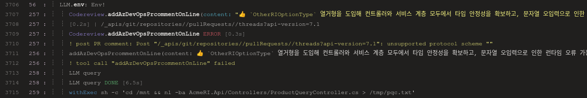
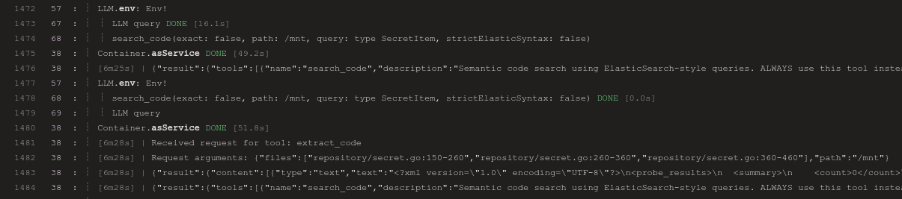

[지난 번 글에서는, Dagger 로 LLM 호출하여 코드리뷰 파이프라인 만든 과정을 소개 하였다.](../2025-11-19-dagger-llm-azdevops-codereview/) 사용 하다보니, AI 코드리뷰를 좀 더 개선하면 좋겠다고 생각을 하였는데, 하나는 관련된 코드도 읽어서 참고 하도록 하되 필요한 것만 찾아 읽어다 빠르게 검토 하도록 하는 것이고, 또 하나는 Pull Request 에 포함된 diff 의 특정 부분에 인라인으로 코멘트를 달도록 하면 좋겠다는 생각을 했다.

Dagger 에서 LLM이 사용할 환경에, 소스코드 포함된 호스트의 디렉토리를 마운트 한 우분투 컨테이너를 주고 거기에서 읽으라고 하면 보통 LLM 루프가 돌면서 필요한 명령줄 실행하여 파일을 잘 읽긴 한다. 다만 간혹 파일 찾는것에 오래 걸리거나 불필요한 파일도 읽거나 하는 경우도 있어서, 코드 검색 프로그램을 활용하도록 수정을 하였다. [Probe](https://probelabs.com/) 라는 코드 검색 도구를 붙였는데, MCP 서버 형태로도 제공이 되어서 최근 Dagger 에 추가된 MCP 연동 기능을 활용하여 붙였다.

인라인으로 코멘트를 다는 부분은, 인라인 코멘트 달도록 Azure DevOps API를 호출하는 Dagger Function 을 만들고 이를 LLM에서 툴로 호출 하도록 구성하는 작업을 하였다.

## LLM이 Dagger Function을 툴로 호출 하도록 하기
직접 만든 Dagger Function을 LLM이 도구로 호출해서 쓰도록 하는 방법은 생각보다 간단하다. 하지만 생각보다 제대로 호출 되도록 하기는 좀 어렵다.

예를 들어 아래와 같이 Azure DevOps Pull Request 에 댓글을 추가하는 Dagger Function 을 만들었다고 가정하면, 
```go
type ThreadContext struct {
	FilePath 				 		string
	LineStart 					int
	LineStartCharOffset int
	LineEnd 						int
	LineEndCharOffset 	int
}
func (m *MyWorkflow) AddAzDevOpsPRComment(
	ctx context.Context,
	comment string,
	threadContext *ThreadContext
) (*MyWorkflow, error) {
	...
	return m
}
```

이를 LLM이 사용하게 하려면 여러 방법이 있는데, 모두 기본적으로 Env 객체에 함수나 모둘을 설치 해 주는 방식이다.

첫번째는 `WithCurrentModule`을 사용해서, 현재 사용중인 모듈을 Env에 설치하는 것이다. 그러면 모듈 안의 함수를 LLM이 툴 호출에 사용할 수 있게 된다. 만약, 현재 LLM이 실행되는 모듈 (여기서는 `MyWorkflow`가 아닌 다른 외부 모듈을 설치 하려면 `Env.WithModule`을 사용할 수 있다.)
```go
func (m *MyWorkflow) MyDaggerFunction(diff string, prTitle string, prDesc string) string {
	environment := dag.Env().
		WithCurrentModule().
		...

	work := dag.LLM().
  	WithEnv(environment).
		WithPrompt(`
			LLM 에 전달 할 프롬프트
			`)

}
```

두번째는 `CurrentEnv` 를 사용해서, 워크플로우 실행 환경을 그대로 사용하는 것이다. 물론 여기에는 별도로 작성한 Dagger Function 도 포함된다.
```go
func (m *MyWorkflow) MyDaggerFunction(diff string, prTitle string, prDesc string) string {
	environment := dag.CurrentEnv().
		...

	work := dag.LLM().
  	WithEnv(environment).
		WithPrompt(`
			LLM 에 전달 할 프롬프트
			`)

}
```

LLM 에서 툴 호출 시 정확한 방법으로 호출할 수 있도록, 호출 방법을 잘 전달하는 것도 중요하다. 호출 방법 전달은 간단하다. 그냥 주석을 함수 이름과 매개변수 등에 적절히 넣어주면 된다. 이렇게 주석을 달면 Dagger 에서는 이를 [Inline Documentation](https://docs.dagger.io/extending/documentation/)으로 보고 처리하여, LLM에도 정보를 같이 전달하게 된다.
```go
type ThreadContext struct {
	// Path to the file to add inline comment 
	FilePath 				 		string
	// Start Line number on the file to add inline comment
	LineStart 					int
	// Char offset within the Start Line on the file to add inline comment
	LineStartCharOffset int
	// End Line number on the file to add inline comment
	LineEnd 						int
	// Char offset within the End Line on the file to add inline comment
	LineEndCharOffset 	int
}
// AddAzDevOpsPRComment is used to add comment on pull request.
// Use this tool to add your own comment on specific azure devops pull request.
func (m *MyWorkflow) AddAzDevOpsPRComment(
	ctx context.Context,
	// Comment text of your pull request comment.
	comment string,
	// Reference to line of a specific file you want to add inline comment.
	threadContext *ThreadContext
) (*MyWorkflow, error) {
	...
	return m
}
```

이러한 방법으로, LLM 이 사용할 환경에 모듈을 설치하고 실행하면, 아래처럼 LLM 에서 필요에 따라 모듈 설치를 통해 노출된 Dagger Function 을 호출하게 된다.


정상적으로 호출되는 경우도 있지만, 비정상적인 매개변수를 넣어 호출 되거나 호출 실패하는 경우도 자주 있다. 이런 경우 도움이 될 만한 것은, 우선 LLM 에서 사용할 Dagger Function 에 주석을 좀 더 명확하게 넣어주는 것도 있고, 매개변수가 조금 복잡하다면 단순화 하는 것도 방법이다. 예를 들어 바로 위에서 본 `AddAzDevOpsPRComment`은 아래와 같이 구조체 없이 좀 더 단순하게 넣어볼 수 있다.
```go
// AddAzDevOpsPRComment is used to add comment on pull request.
// Use this tool to add your own comment on specific azure devops pull request.
func (m *MyWorkflow) AddAzDevOpsPRComment(
	ctx context.Context,
	// Comment text of your pull request comment.
	comment string,
	// Path to the file to add inline comment 
	FilePath 				 		string
	// Start Line number on the file to add inline comment
	LineStart 					int
	// Char offset within the Start Line on the file to add inline comment
	LineStartCharOffset int
	// End Line number on the file to add inline comment
	LineEnd 						int
	// Char offset within the End Line on the file to add inline comment
	LineEndCharOffset 	int
) (*MyWorkflow, error) {
	...
	return m
}
```

## MCP 서버 붙이기
Dagger 에서는 최근 출시된 [0.19 버전 부터 MCP 서버를 Dagger 에 붙이는 것을 지원한다.](https://dagger.io/blog/dagger-0-19) (최근에 나와서 그런지 아직 공식 문서에는 설명이 없는 것 같기도 하다.) LLM 객체에서 사용 가능한 새 메소드인 `WithMCPServer` 호출해서 설정하는 방식이다.

필자가 만든 워크플로에는 Probe 라는 코드베이스 검색 도구를 MCP 서버로 붙였는데, 이를 예로 들어 MCP 서버 연동 방법에 대해 알아보면 아래와 같다.

```go
probeContainer := dag.Container().
		From("ghcr.io/***/probe-oci:latest").
		WithMountedDirectory("/mnt", source).
		WithWorkdir("/mnt").
		WithEnvVariable("PROBE_DEFAULT_PATHS", "/mnt")

	probeMCPService := probeContainer.
		AsService(dagger.ContainerAsServiceOpts{Args: []string{"probe", "mcp"}})
```
먼저 MCP 서버를 포함한 컨테이너 이미지로 컨테이너를 하나 만들어 준다. 그리고 `AsService`를 호출하여 워크플로의 다른 컨테이너 등에서 네트워크 통신을 할 수 있는 서비스 형태로 사용할 수 있도록 한다. 매개변수로는 컨테이너를 시작할 때 실행할 명령어를 넣는데, 여기서는 MCP 서버 시작을 위한 명령어를 넣어준다.

```go
...
work := dag.LLM().
		WithEnv(environment).
		WithMCPServer("probe", probeMCPService).
		WithPrompt(`
			LLM 에 전달 할 프롬프트
			`)
```

그리고 이를, LLM 객체를 만들 때 `WithMCPServer` 를 호출해서 이름을 함께 지정해서 설정하면 된다. 여기서는 "probe" 로 설정 하였다. 프롬프트 상에서 `probe 도구를 사용하여 작업을 수행하라` 와 같은 형태로 지시를 넣어서, LLM이 MCP 서버를 사용하도록 할 수 있다.



그러면 위와 같이 MCP 서버도 필요에 따라 호출되는 것을 확인할 수 있다.

## 정리
아무튼, 이렇게 하여 MCP 서버를 붙여서 코드 리뷰에 필요한 관련된 다른 코드도 좀 더 빠르게 읽도록 하고, 인라인 코멘트를 달도록 하는 기능도 붙여 보았다.

이번 글을 작성하며 참고한 자료는 아래와 같다.

- [Dagger 0.19: performance, new APIs, build-an-agent!](https://dagger.io/blog/dagger-0-19)
- [Dagger - Services](https://docs.dagger.io/getting-started/types/service)
- [Dagger - Inline Documentation](https://docs.dagger.io/extending/documentation)
- [Dagger - LLM Integration - Tool use](https://docs.dagger.io/features/llm#tool-use)
