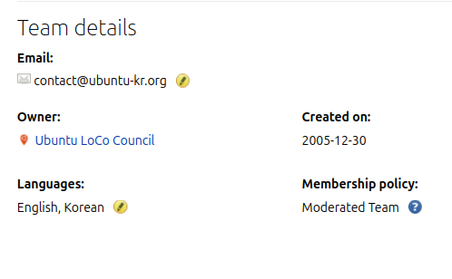

기존에 우분투 커뮤니티에서 많이 활동 해 왔지만 (주로 한국 로컬 커뮤니티 위주), 작년부터는 우분투 커뮤니티에서 LoCo (Local Community 의 약자) Council 이라는 의사결정 조직에서도 활동을 할 수 있는 기회가 있어 쭉 활동을 해 왔다. 이 조직의 임기는 2년이여서, 2년마다 다시 구성원을 선출 하는데 어느덧 임기가 끝나가서 뭐하는 조직이고 이 조직에서 무슨 활동을 하였는지 정리하면 좋을 것 같아서 글로 정리 해 보게 되었다.

## Ubuntu LoCo Council
먼저 우분투 커뮤니티의 전체적인 조직 구성에 대해 설명을 하면 좋을 것 같다. 우선 우분투 커뮤니티의 조직은 대략 아래 그림처럼 되어 있다.

먼저 가장 위에, 많은 사람들의 오해(?)와 달리 캐노니컬이는 회사가 아니라 Mark Shuttleworth 라는 사람이 앉아 있다. 우분투 프로젝트의 파운더이자 캐노니컬이라는 회사를 창업한 사람이기도 하다. 우분투 프로젝트에서는 SABDFL(Self-Appointed Benevolent Dictator For Life, 자칭 자비로운 종신 독재자)을 담당하고 있다. 대부분의 권한을 하위 조직에 위임하고 있지만, 그렇다고 아무것도 안 하는 것은 아니고 중요한 일은 직접 처리 하시는 것으로 보인다. Ubuntu Developer Membership 지원자 심사에 참여 한다거나, 모종의 이유로(?) 하위 우분투 커뮤니티 조직이 다 사라지만(?) 이럴 때 직접 선거 운영해서 다시 구성하는 것도 결정하곤 하는 것 같다.

그리고 그 아래에, Community Council 과 Technical Board 조직이 있다. 전자는 우분투 커뮤니티에서 행정적인 부분이나 사회적인 부분을 담당하고, 행동강령이 실제로 작동 하도록 하는 조직이기도 하다. 실제로 Ubuntu Discourse 같은 온라인 공간이나 지역 커뮤니티에 개최한 행사에서 행동강령 위반이나 분쟁이 발생하면, Community Council 에서 직접 해결하는 경우도 많이 있다. Technical Board 는 말 그대로, 우분투 프로젝트의 기술적인 부분을 책임지는 조직이다. 우분투라는 리눅스 배포판의 개발 방향, 안에 어떤 소프트웨어를 포함할지, 시스템 구성은 어떻게 할지 등에 대해 의사결정을 하고 이끄는 조직이라고 보면 될 것 같다.

그리고 Community Council 아래에 다양한 기능별 조직이 또 있는데, 그 중 하나가 이 글에서 소개할 LoCo Council 이다. LoCo 는 Local Community 즉 지역 커뮤니티의 약자인데, 보통 줄임말로 쓰고 "로코" 라고 읽다보니 처음 듣는 사람을은 또 오해를 많이 하곤 한다. "로코(로맨틱 코미디) 드라마 인가요?" 하는 사람도 있고, 어느 스페인 사람은 "Loco" 가 스페인어로는 부정적 의미라고 약간의 불만을 표하는 사람도 본것 같다. (검색 해 보니 스페인어로 loco는 "제정신이 아닌"이라는 의미인 듯 하다...) 아무튼 그런 의미 아니고 "지역 커뮤니티", "Local Community"의 줄임 말이다. 그러면 여기서 말하는 지역 커뮤니티는 무엇인가 하면, 바로 Ubuntu Korea, Ubuntu Taiwan, Ubuntu Japan, Ubuntu Nepal 등등의 커뮤니티가 해당되는데, 각 지역별로 사람 모여서 우분투에 관해서 이야기 하고, 오프라인 모임 행사도 하고, 온라인으로는 각 지역별 우분투 사용하면서 겪는 이슈 공유하곤 하는 지역별 커뮤니티라고 보면 되겠다.

그럼 LoCo Council 이 하는 일은? 이렇게 다양한 우분투 지역 커뮤니티들이 잘 운영되고, 또 우분투 커뮤니티의 조직 및 구성원 모두와 잘 소통하고 필요하면 적절한 지원을 받을 수 있도록 돕는 역할 그리고 이를 위한 다양한 일을 한다. 예를 들면, 처음 막 만들어진 지역 커뮤니티에 커뮤니티 운영을 어떻게 시작하면 좋을지 가이드를 제공하는 일, 오래되어 방치된 지역 커뮤니티를 기존 운영진에서 새로 운영진을 하고 싶은 사람들에게 넘겨주는 일, 각 지역 커뮤니티가 활동 잘 하나 주기적으로 모니터링 하는 일, 지역 커뮤니티가 필요한 자원 (웹사이트 도메인, Matrix 채팅방, Ubuntu Discourse 에 전용 카테고리 등) 이용할 수 있도록 돕는 일 등을 한다고 보면 된다.

## 몇년간 죽어있다가 부활한 조직
[2019년 말에서 2020년 초 쯤에, 우분투 커뮤니티의 의사결정 조직이 모두 공중분해된 적이 있었다.](https://discourse.ubuntu.com/t/future-of-ubuntu-community/17593) 다른 조직 (예를 들면 Community Council)은 대부분 몇달 정도 후에 복구가 되었는데, LoCo Council 의 경우 그 이후로도 2-3년간 복구가 잘 되지가 않았다. 많은 수의 지역 커뮤니티가 과거에는 활발했지만, 지금은 그렇지 않은 경우가 많은 것이 원인인지는 몰라도 충분한 입후보자를 받아서 구성원 선출이 어려웠던 것 같기도 하였고, 대신 [Local Community Research Committee](https://discourse.ubuntu.com/t/local-communities-research-committee/20186/) 도 운영이 되었는데, 이것도 성과가 크게 있지는 않았던 것 같다. 그럼에도 논의를 시작하는데는 도움이 되었던 것 같다. 

아무튼, LoCo Council 을 다시 만들자는 논의는 2022년에 Ubuntu Summit 에서 잠깐 참가자들 끼리 논의가 되었다가, [2023년 초 부터 논의가 본격적으로 시작이 되었다.](https://discourse.ubuntu.com/t/loco-council-and-loco-teams-resurrection/33545) 1년 가까이 논의를 진행한 끝에, [Community Council 에서 LoCo Council 구성원을 선출하여 다시 구성하기로 결정을 하였다.](https://new.ubottu.com/meetingology/logs/ubuntu-meeting/2023/ubuntu-meeting.2023-09-26-20.14.html) 그리고 Ubuntu Summit 2023 폐회식 때, LoCo Council 구성원 선거에 출마할 후보자 접수 하겠다고 발표가 되었다.

## 출마
그리고 Ubuntu LoCo Council 선거에 출마 하였다. 정확하는 스스로 추천 (Self nominate) 하여 후보로 들어갔다. 이미 Ubuntu Korea 에서 여러 해 운영진으로 참여하면서 쌓은 경험도 있고, UbuCon Asia 준비 위원회에도 수년간 참여 하면서 다른 지역의 우분투 로컬 커뮤니티와도 교류 한 적이 있어서, 이러한 경험을 바탕으로 LoCo Council 에 많은 기여를 할 수 있을 것이라 생각하였기 때문이다.

아무튼 그렇게 출마하였고, 투표한 많은 Ubuntu Member 분들이 선택해 주신 덕에 [당선이 되어 LoCo Council 구성원으로 임기를 시작하게 되었다.](https://discourse.ubuntu.com/t/new-ubuntu-loco-council/41515)

## 첫 일거리
다른 LoCo Council 구성원 분들과 회의를 잡고, 앞으로 어떤 활동을 할지 논의 하는것이 먼저였다. 블로그 글로 정리한다고 여기저기 찾아보니, [첫 회의는 2024년 2월 9일에 IRC로 진행을 하였었다.](https://new.ubottu.com/meetingology/logs/ubuntu-meeting/2024/ubuntu-meeting.2024-02-09-12.26.html) 주로 LoCo Council 정기 회의는 얼마나 자주 하고, 어느 시간대에 할 것인지, LoCo Council 구성원간 연락과 의사소통은 어떻게 할 것인지, 개선된 LoCo 재인증 프로세스, 다시 부활한 LoCo Council 어떻게 홍보할지, 활동중인 LoCo나 이름만 있고 활동은 없어서 사실상 사라진 것이나 다름없는 LoCo 연락 해 보고 어떻게 할 것인지 등등 논의를 하였다.

## LoCo Handover Process
2024년에 LoCo Council 활동 하면서 나온 주요 성과가 아닐까 싶다. 임기를 시작했을 당시, Local Community 가 다시 조금씩 활성화가 되고 있는 시기였는데, 기존에 운영하던 사람들이 다시 활성화 시키거나 아니면 이를 이어 받아서 하는 경우도 있었지만, 이전 세대와 관계가 없는 새로운 사람들이 나타나서 운영하고 싶어하는 경우도 여럿 있었다. 대부분의 LoCo는 10년 이상 활동이 없는 상태고 운영진 연락도 불가한 상태였어서 어쩌면 자연스럽게 나타나는 현상 이였던 것 같다. [대표적인 경우가 에콰도르 로컬 커뮤니티의 경우였다.](https://discourse.ubuntu.com/t/reactivation-of-the-ubuntu-ecuador-community/45740)

다만, 그렇다고 LoCo Council 에서 자기 지역의 LoCo 를 되살려서 운영하고 싶어하는 새로운 새대의 사람들에게 그냥 바로 인계를 해 줄수는 없어서 이에 대한 기준과 인계 프로세스를 만들기로 하였다. 6월 중순 부터 논의를 시작해서 8월 말 쯤에 확정하고 본격적으로 프로세스에 따라 요청을 받아 처리하기 시작 하였는데, 아래와 같은 부분을 중점적으로 고려하면서 프로세스 문서를 다른 LoCo Council 멤버 분들과 함께 만들었다.
- 인계할 LoCo의 기존 운영진 연락시도: 인계 요청 당시 Launchpad 등 시스템 상에서 운영자로 등록된 사람 연락이 가능한지, 연락이 가능하면 여전히 지역 커뮤니티 운영 중인지, 운영중이지 않다면 새로운 사람들에게 인계할 의향이 있는지 등에 대한 고려를 하였다. 언급하였듯 수많은 대부분의 LoCo가 비활성화 상태여서, 기존 운영진 연락이 불가능한 경우도 고려하여, 일정 기간동안 연락 자체가 불가하면 다음 단계로 넘어가는 등의 고려도 하였다.
- LoCo를 인계받을 새로운 운영진 확인 절차: 기존 운영진 분들로부터 인계 의사를 확인 하여도, 새로 운영하고자 하는 사람들에게 그냥 넘겨 줄 수는 없다. 어떤 사람들이 새 운영진으로 참여 할 것인지, 앞으로 지역 커뮤니티 운영을 하면서 어떤 활동을 할 것인지, 무엇보다 필요할때 연락을 할 수 있도록 우분투 커뮤니티에서 공식적으로 사용하는 의사소통 및 연락 수단 계정이 있는지 (Ubuntu Discourse, Matrix, 이메일, Launchpad 계정 등) 등을 확인 하는 것 위주로 고려를 하였다.

그 외에는 필요에 따라서 LoCo를 인계받은 새로운 운영진 분들에게 인계할 LoCo 리소스(Matrix 채팅방, 메일링 리스트, Launchpad 팀, 도메인 주소)등을 추리거나, 인계 요청 서식 등을 만드는 것을 하면서 LoCo Handover Process 문서 초안을 만들어 나갔다.

LoCo Handover Process 에 대해 논의를 하면서 지지부진한 때도 있었는데, [또 운 좋게 7월 말 8월 초에 열린 DebConf24 에서 몇몇 LoCo Council 멤버 분들(Mattia Rizzolo, Lucas Kanashiro)과 캐노니컬 커뮤니티 팀의 Mauro Gaspari님도 만나 현장에서 논의를 진행 하면서 꽤나 많은 진전을 이룰 수 있었다.](https://discourse.ubuntu.com/t/ubuntu-loco-council-meeting-at-debconf-24-2024-08-01/46992) 이후, 초안이 어느정도 만들어 지고, [8월 말에 최종적으로 투표를 통해서 LoCo Handover Process 를 확정해 공식적으로 적용하기 시작했다.](https://discourse.ubuntu.com/t/vote-approving-proposed-loco-handover-process/47479) 투표는 보통 IRC 회의에서 하는데, 회의 시간 맞추기가 쉽지가 않아서 결국 Ubuntu Discourse 에 투표를 열고 몇일정도 투표 기간 가지고 결정 하는 방식으로 의사 결정을 진행 하였다.

## LoCo Handover Process 적용 사례

[LoCo Handover Process 를 통해서 새로운 운영진분들께 인계한 LoCo 첫 사례는 네팔 커뮤니티였다.](https://discourse.ubuntu.com/t/nepalese-loco-loco-handover-request/52306) 아마 인수인계 해 준 LoCo 중에 가장 성공적인 사례가 아닌가 싶고, 지금도 활발하게 활동중인 LoCo 중 하나이다. 우분투 네팔의 경우, 인계를 요청한 분들이 UbuCon Asia 2025 유치 입찰에도 참여하신 분들이고(심지어 가이드대로 따라서 모범적으로 잘 작성하여 제출하신) 이미 네팔에서 우분투나 다른 오픈소스 관련 활동은 물론 앞으로의 계획도 자세히 잘 적어 주셔서, LoCo Council 에서 이에 대한 이견은 크게 없었던 것 같다. 기존의 운영진 분들(지금은 활동하지 않으시는)연락해서 인계 의향이 있는지 확인 하는 것에서 시간이 좀 걸렸고, 새 운영진 대부분이 St. Xavier's College 소속인거 같아서 다양성 부분이나, 추후 취직 후 지속 가능성 등에 대한 우려가 있다고 비공개로 접수가 되긴 하였는데 이런것도 잘 답변 해 주신 덕에 우려도 불식 되어 새 운영진 분들에계 성공적으로 네팔 LoCo 를 인계할 수 있었다.

또 이 프로세스에 따라서 인계 절차 잘 진행된 LoCo 는 영국(UK) LoCo 사례도 해당하지 않을까 싶다. 영국 LoCo 의 경우는 몇 해 전에, 영국 쪽에서 활동 하시던 우분투 커뮤니티 멤버 분들이 다시 활동을 시작 하시면서 로고도 다시 만들고, 웹사이트도 개편하고, 조그마한 모임도 주기적으로 여는 등 다시 활발하게 활동을 하는 듯 하였다. 그러다가 의견 충돌이라도 있었는지 내부 분쟁으로 주요 운영진 분들이 LoCo 에서 떠나시고, 캐노니컬 커뮤니티 팀의 Aaron Prisk 님이 인계 받아서 임시로 운영진으로 있으시던 중이였다. 해당 LoCo 의 경우는 인계 요청 당시 기존 운영진이 Aaron Prisk 님이였으니, 기존 운영진 연락이야 크게 문제는 없었고, [인계 요청 서식도 꼼꼼하게 잘 작성 해 주셨던지라,](https://discourse.ubuntu.com/t/uk-loco-loco-handover-request/61893) 큰 문제 없이 새로 운영진을 하려는 분께 영국 LoCo 를 인계 해 드리고 필요한 IT 리소스도 넘겨드릴 수 있었다.

안타깝게도 LoCo Handove Process 를 만들게 된 동기가 된 에콰도르 LoCo 의 경우는, 프로세스 다 만들고 나서 다시 연락드려서 인계 요청 써서 제출 해 달라고 하려고 하였으나 너무 늦었던 탓이였던 것지, 제안 드린 이후 별다른 답변도 없곤 하여 에콰도르 LoCo 를 공식적으로 프로세스 통해 인계 처리 해 드리지는 못하였다. 언젠가 다시 요청이 오면 그때는 잘 안내를 드려야 할까 싶다.

## LoCo 관련 추가적인 조치
LoCo Handove Process 관련 논의를 하면서 함께 논의 된 사안 중 하나가, Launchpad 에 등록 되어 있는 각 LoCo 팀의 소유자를 모두 LoCo Council 로 교체하는 것에 대한 의제였다. 우분투 커뮤니티의 경우, 그동안 각 커뮤니티 조직이 Launchpad 에 팀으로 등록 된 것과 이 각 팀별로 등록된 구성원, 관리자, 소유자 등을 기준으로 행정처리가 되어 왔는데, LoCo 또한 그랬기 때문이다. 각 LoCo 도 Launchpad 에 등록 되어 있고, 해당 Launchpad 팀별로 등록된 소유자를 실제 각 LoCo의 대표 혹은 연락 담당자로 간주 해 왔다. 그러다 보니, 인계 절차를 통해서 운영진이 바뀌면 해당 Launchpad 팀 소유자도 변경되어야 하는데, 기존에 소유자로 등록된 사람과 연락이 안되면 이를 진행할 수 없다는 문제가 있었다. 그래서 논의 끝에, Launchpad 에 등록된 모든 LoCo 팀의 소유자를 LoCo Council 로 일괄적으로 바꾸기로 하였다. 대신, 각 LoCo 별 운영진은 해당 Launchpad 팀별로 관리자로 등록 하는 형태로 하기로 하였다. 캐노니컬 커뮤니티 팀에서 Launchpad 팀에 관련 도움을 요청 해 준 덕에 이 또한 잘 진행될 수 있었다.

## 리브랜딩과 각 LoCo 별 활동범위 조정
이거는 올해 LoCo Council 분들과 논의를 하면서 의사결정 한 것들 중에 주요한 것이 아닐까 싶다. 리브랜딩과 LoCo 활동 범위 조정에 관한 것은 사실 캐노니컬 커뮤니티 팀에서 먼저 요청을 하여 검토를 하게 되었다. 대략 아래와 같은 요청이였다.

- 로컬 커뮤니티 (Local Community, LoCo) 에서 써클(Circle) 로 리브랜딩. LoCo 의 경우 사실 커뮤니티 외부에서 보기에는 무슨 의미인지 알기도 어렵고, 앞서 언급 되었는 스페인어로 "loco" 는 비속어 느낌이다 보니, 우분투의 로고인 Circle of Friends 와도 잘 맞는 "Ubuntu Circles" 로 리브랜딩 하는 것을 제안 해 주셨다.
- 각 LoCo 별로 다루는 활동 지역 범위 조정: 지금까지 대부분의 LoCo 는 국가 단위로 활동을 전개하는 형태 였는데, 그러다 보니 새로 LoCo 를 시작하려는 사람들은 이에 대해서 진입장벽을 느낀다는 의견이였다. 그래서 한 나라 전체에서 활동을 전개하는 LoCo 뿐만 아니라, 도시 단위나 대학교 캠퍼스 단위 등 비교적 작은 영역에서 활동을 하는 LoCo 도 허용 해 달라는 요청 이였다. 예를 들면 기존에는 Ubuntu Korea, Ubuntu Nepal, Ubuntu Taiwan 만 가능했지만, 앞으로는 Ubuntu London (영국 런던 위주로 활동하는 LoCo), Ubuntu Chicago (미국 시카고 지역 위주로 활동하는 LoCo), Ubuntu IIT Kanpur(인도 공과대학교 칸푸르 학생 위주로 구성된 LoCo) 등도 허용하자는 것이다.

이것도 아무튼 여전히 회의 시간 잡고 의논 하기는 힘들어서, Ubuntu Discourse 에서 비공개 쓰레드를 하나 만들고 비동기로 의논을 하였다.
- 로컬 커뮤니티가 활동할 수 있는 지역 영역을 더 다양하게 하자는 의견(각 나라 전체 뿐만 아니라, 도시 영역이나, 대학교 단위 등도 허용)은 LoCo Council 멤버분들 모두 기본적으로 동의 하셔서 기본적인 결론은 어렵지 않게 이끌어 낼 수 있었다. 무엇보다, 이미 나라 단위가 아닌 LoCo 가 존재하기도 했다 보니 결론까지 가기가 좀 더 수월하였다.(대표적으로 미국에 있는 LoCo 는 주 단위로 구성이 되어 있다.) 이 외에 추가적으로, 각 나라별로 LoCo 를 두고 그 아래에 도시별 LoCo, 대학교별 LoCo 등을 두어서 계층적인 구조를 만들거나, 이미 그렇게 존재 하는 경우라면 상호 협력하는 구조로 만드는 방안도 조금 논의가 되었다. 이 부분은 의견차도 있고, 모든 지역에 꼭 맞는 방법은 아니여서 우선은 추후 더 논의 하기로 하였다.
- 로컬 커뮤니티(Local Community)를 써클(Circle)로 리브랜딩 하는 것에 대해서는, 마찬가지로 대부분 동의 하셨고 GDG 등 사례를 참고하여 "챕터(Chapter)"를 추가로 제안 한 경우도 있었다. 소수의 반대 의견도 있었다. "LoCo" 라는 명칭을 이미 오랜 기간 사용 해 왔고, 이에 대해 가치도 쌓여 있으니 그대로 사용하는 것이 더 좋고, 단지 특정 언어에서 부정적인 의미로 들린다고 하여 리브랜딩을 하는 것은 이상하다는 의견이였다.

이 건에 대해서는 9월 초 부터 논의를 본격적으로 시작 하였고,(사실 그 전부터 관련된 제안은 계속 있어 왔다.) 투표는 10월에 진행을 하였다. 세부적인 사안 까지는 논의 하자니 시간이 더 오래 걸릴 것 같고, 그러면 또 LoCo Council 의 결정을 기다리는 각 LoCo 운영진들이 기다리다 지칠 수 있다는 의견이 있기도 해서, [기본적인 사안만 우선 투표로 결정하여 공지하는 형태로 진행 하였다.](https://discourse.ubuntu.com/t/vote-loco-rebranding-and-rescoping-resolution/69325) 

이렇게 하여, [리브랜딩과 LoCo 활동범위에 대해서 기본적인 부분은 LoCo Council 에서 의논 끝에 결정을 하였고,](https://discourse.ubuntu.com/t/vote-result-loco-rebranding-and-rescoping-resolution/70080) 이제 후속조치가 필요한 상태이다. 새로운 LoCo 시작하는 가이드나, 문서에서 용어를 교체하기도 하는 등 여러 후속 조치가 필요한 상태인데, 본인이나 LoCo Council 다른 멤버 분들이나 다들 본업으로 바쁘셔서 진행이 되지는 못하였다. 아마 내년에 새로 혹은 다시 선출된 LoCo Council 멤버 분들이 잘 해 주시길 기대해야 할 것 같다.
