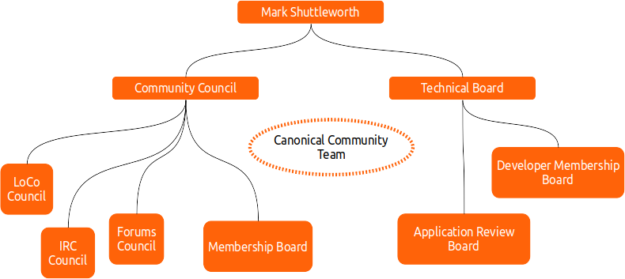
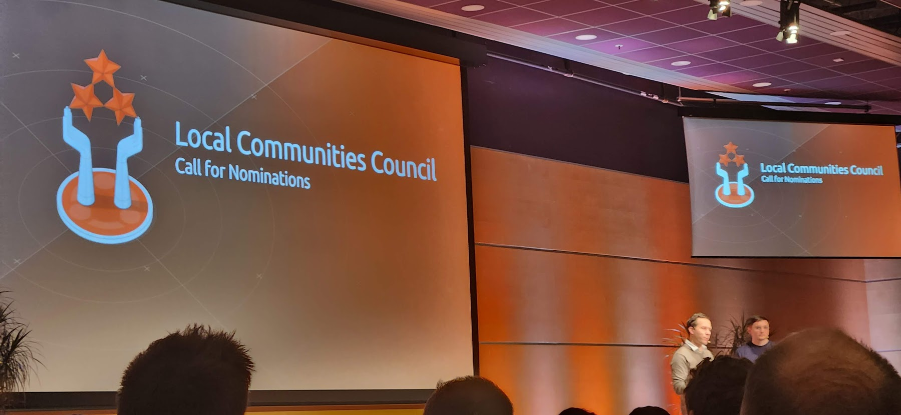
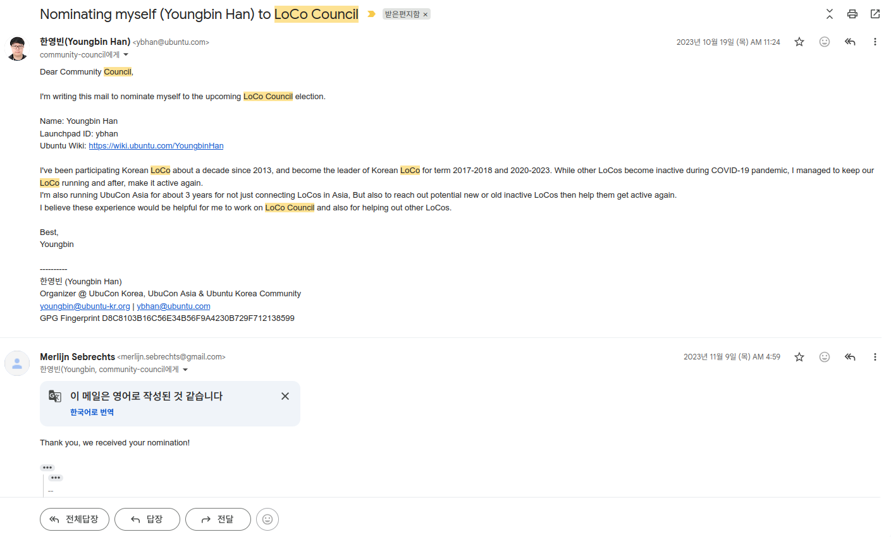
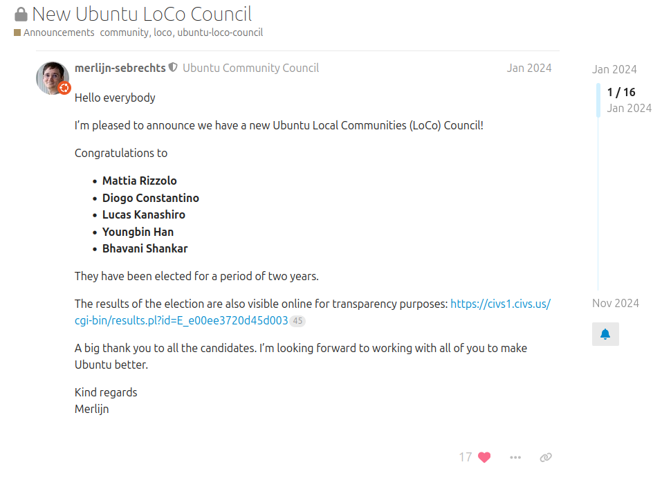

기존에 우분투 커뮤니티에서 많이 활동 해 왔지만 (주로 한국 로컬 커뮤니티 위주), 작년부터는 우분투 커뮤니티에서 LoCo (Local Community 의 약자) Council 이라는 의사결정 조직에서도 활동을 할 수 있는 기회가 있어 쭉 활동을 해 왔다. 이 조직의 임기는 2년이여서, 2년마다 다시 구성원을 선출 하는데 어느덧 임기가 끝나가서 뭐하는 조직이고 이 조직에서 무슨 활동을 하였는지 정리하면 좋을 것 같아서 글로 정리 해 보게 되었다.

## Ubuntu LoCo Council
먼저 우분투 커뮤니티의 전체적인 조직 구성에 대해 설명을 하면 좋을 것 같다. 우선 우분투 커뮤니티의 조직은 대략 아래 그림처럼 되어 있다.

먼저 가장 위에, 많은 사람들의 오해(?)와 달리 캐노니컬이는 회사가 아니라 Mark Shuttleworth 라는 사람이 앉아 있다. 우분투 프로젝트의 파운더이자 캐노니컬이라는 회사를 창업한 사람이기도 하다. 우분투 프로젝트에서는 SABDFL(Self-Appointed Benevolent Dictator For Life, 자칭 자비로운 종신 독재자)을 담당하고 있다. 대부분의 권한을 하위 조직에 위임하고 있지만, 그렇다고 아무것도 안 하는 것은 아니고 중요한 일은 직접 처리 하시는 것으로 보인다. Ubuntu Developer Membership 지원자 심사에 참여 한다거나, 모종의 이유로(?) 하위 우분투 커뮤니티 조직이 다 사라지만(?) 이럴 때 직접 선거 운영해서 다시 구성하는 것도 결정하곤 하는 것 같다.

그리고 그 아래에, Community Council 과 Technical Board 조직이 있다. 전자는 우분투 커뮤니티에서 행정적인 부분이나 사회적인 부분을 담당하고, 행동강령이 실제로 작동 하도록 하는 조직이기도 하다. 실제로 Ubuntu Discourse 같은 온라인 공간이나 지역 커뮤니티에 개최한 행사에서 행동강령 위반이나 분쟁이 발생하면, Community Council 에서 직접 해결하는 경우도 많이 있다. Technical Board 는 말 그대로, 우분투 프로젝트의 기술적인 부분을 책임지는 조직이다. 우분투라는 리눅스 배포판의 개발 방향, 안에 어떤 소프트웨어를 포함할지, 시스템 구성은 어떻게 할지 등에 대해 의사결정을 하고 이끄는 조직이라고 보면 될 것 같다.

그리고 Community Council 아래에 다양한 기능별 조직이 또 있는데, 그 중 하나가 이 글에서 소개할 LoCo Council 이다. LoCo 는 Local Community 즉 지역 커뮤니티의 약자인데, 보통 줄임말로 쓰고 "로코" 라고 읽다보니 처음 듣는 사람을은 또 오해를 많이 하곤 한다. "로코(로맨틱 코미디) 드라마 인가요?" 하는 사람도 있고, 어느 스페인 사람은 "Loco" 가 스페인어로는 부정적 의미라고 약간의 불만을 표하는 사람도 본것 같다. (검색 해 보니 스페인어로 loco는 "제정신이 아닌"이라는 의미인 듯 하다...) 아무튼 그런 의미 아니고 "지역 커뮤니티", "Local Community"의 줄임 말이다. 그러면 여기서 말하는 지역 커뮤니티는 무엇인가 하면, 바로 Ubuntu Korea, Ubuntu Taiwan, Ubuntu Japan, Ubuntu Nepal 등등의 커뮤니티가 해당되는데, 각 지역별로 사람 모여서 우분투에 관해서 이야기 하고, 오프라인 모임 행사도 하고, 온라인으로는 각 지역별 우분투 사용하면서 겪는 이슈 공유하곤 하는 지역별 커뮤니티라고 보면 되겠다.

그럼 LoCo Council 이 하는 일은? 이렇게 다양한 우분투 지역 커뮤니티들이 잘 운영되고, 또 우분투 커뮤니티의 조직 및 구성원 모두와 잘 소통하고 필요하면 적절한 지원을 받을 수 있도록 돕는 역할 그리고 이를 위한 다양한 일을 한다. 예를 들면, 처음 막 만들어진 지역 커뮤니티에 커뮤니티 운영을 어떻게 시작하면 좋을지 가이드를 제공하는 일, 오래되어 방치된 지역 커뮤니티를 기존 운영진에서 새로 운영진을 하고 싶은 사람들에게 넘겨주는 일, 각 지역 커뮤니티가 활동 잘 하나 주기적으로 모니터링 하는 일, 지역 커뮤니티가 필요한 자원 (웹사이트 도메인, Matrix 채팅방, Ubuntu Discourse 에 전용 카테고리 등) 이용할 수 있도록 돕는 일 등을 한다고 보면 된다.

## 몇년간 죽어있다가 부활한 조직
[2019년 말에서 2020년 초 쯤에, 우분투 커뮤니티의 의사결정 조직이 모두 공중분해된 적이 있었다.](https://discourse.ubuntu.com/t/future-of-ubuntu-community/17593) 다른 조직 (예를 들면 Community Council)은 대부분 몇달 정도 후에 복구가 되었는데, LoCo Council 의 경우 그 이후로도 2-3년간 복구가 잘 되지가 않았다. 많은 수의 지역 커뮤니티가 과거에는 활발했지만, 지금은 그렇지 않은 경우가 많은 것이 원인인지는 몰라도 충분한 입후보자를 받아서 구성원 선출이 어려웠던 것 같기도 하였고, 대신 [Local Community Research Committee](https://discourse.ubuntu.com/t/local-communities-research-committee/20186/) 도 운영이 되었는데, 이것도 성과가 크게 있지는 않았던 것 같다. 그럼에도 논의를 시작하는데는 도움이 되었던 것 같다. 

아무튼, LoCo Council 을 다시 만들자는 논의는 2022년에 Ubuntu Summit 에서 잠깐 참가자들 끼리 논의가 되었다가, [2023년 초 부터 논의가 본격적으로 시작이 되었다.](https://discourse.ubuntu.com/t/loco-council-and-loco-teams-resurrection/33545) 1년 가까이 논의를 진행한 끝에, Community Council 에서 LoCo Council 구성원을 선출하여 다시 구성하기로 결정을 하였다. 그리고 Ubuntu Summit 2023 폐회식 때, LoCo Council 구성원 선거에 출마할 후보자 접수 하겠다고 발표가 되었다.

## 출마
그리고 Ubuntu LoCo Council 선거에 출마 하였다. 정확하는 스스로 추천 (Self nominate) 하여 후보로 들어갔다. 이미 Ubuntu Korea 에서 여러 해 운영진으로 참여하면서 쌓은 경험도 있고, UbuCon Asia 준비 위원회에도 수년간 참여 하면서 다른 지역의 우분투 로컬 커뮤니티와도 교류 한 적이 있어서, 이러한 경험을 바탕으로 LoCo Council 에 많은 기여를 할 수 있을 것이라 생각하였기 때문이다.

아무튼 그렇게 출마하였고, 투표한 많은 Ubuntu Member 분들이 선택해 주신 덕에 [당선이 되어 LoCo Council 구성원으로 임기를 시작하게 되었다.](https://discourse.ubuntu.com/t/new-ubuntu-loco-council/41515)

