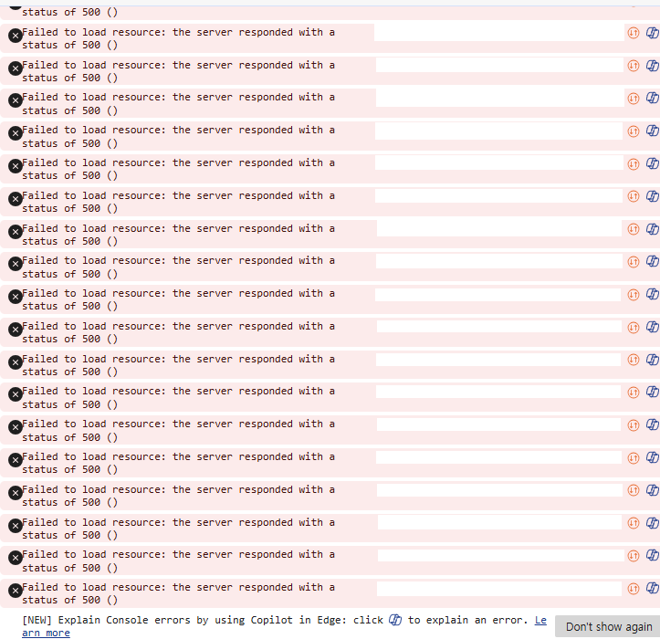
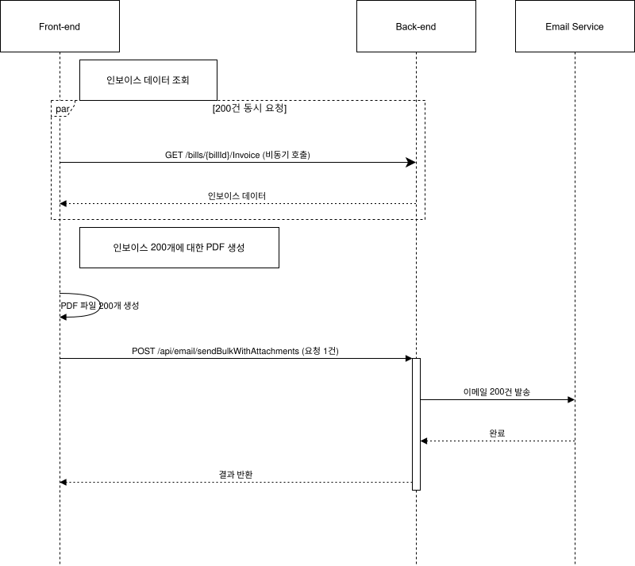
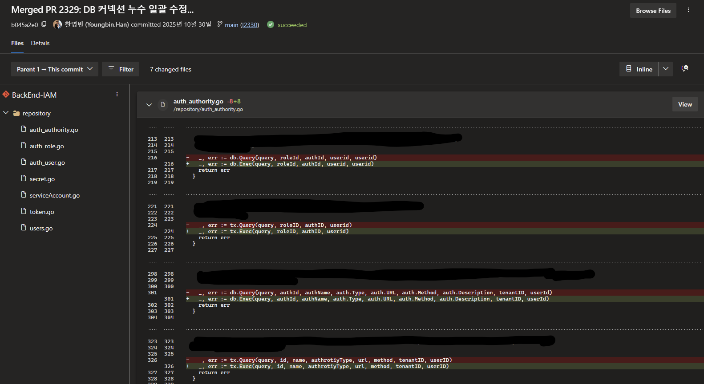
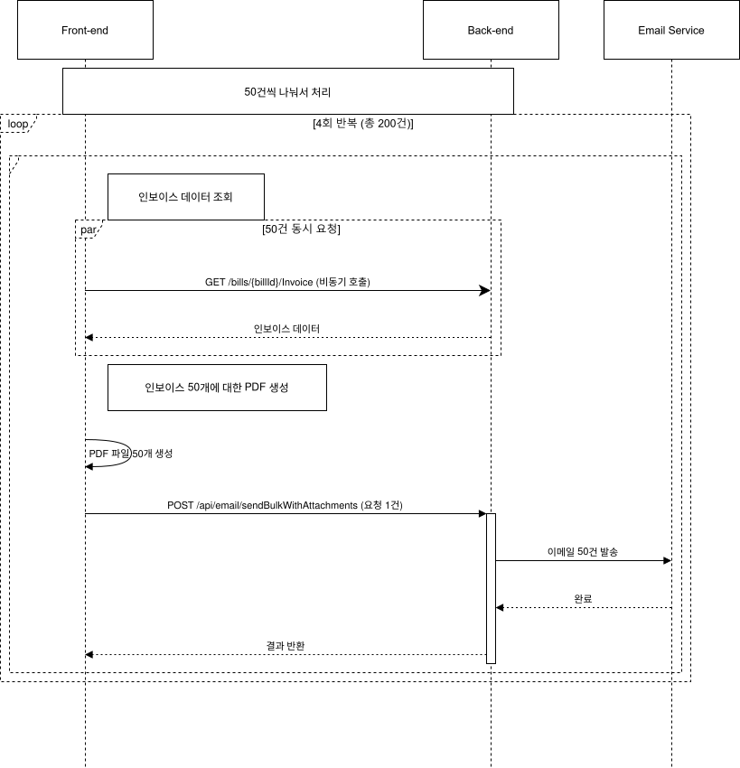

회사에서 지난 해 가을에 고객사를 대상으로 새로 개편된 빌링 포털 서비스를 오픈 하였다. 서비스 오픈 후, 몇가지 예상치 못한 이슈가 있었는데, 그중 하나가 매월 청구 시기마다 인보이스 200건 정도를 일괄 발송하면 성능 저하 혹은 서버 장애가 발생하는 이슈였다.

여러 시행착오를 한 끝에 성능저하 이슈를 어느정도 해결할 수 있었다. 이 글에서는 성능저하 이슈를 해결하기 위해 원인을 분석한 것과 어떻게 해결 하였는지 등에 대해 정리해 보고자 한다. 글을 여러 포스팅으로 나눠서 정리할 예정인데, 이번 글에서는 발생한 문제를 해결한 방법을 알아보고, 다음 글에서는 OpenTelemetry 와 Azure Application Insights 를 활용한 관측가능성 구축, 그리고 K6를 활용한 부하테스트로 추가적은 문제를 미리 확인하여 개선한 사례를 정리 할 예정이다.

## 어떤 이슈가 발생 하였는가
당시 출시한 지 얼마 안 된 빌링 3.0 에서 발생한 이슈는, 청구 담당자 분들이 매달 청구서를 발행하는 작업을 실제로 하시면서 발견이 되었다. 담당자 분들께서 발송할 청구서를 모두 체크하여 일괄 발송을 하였는데, 서비스 오픈 전 테스트 한 것과 달리 대부분의 청구서 발행 및 이메일 발송을 정상적으로 처리하지 못하는 문제가 발견 되어 원인 파악을 시작 하였다.


문제가 되었던 청구서 발송 기능은, 선택한 청구서에 대해 청구서 정보 조회를 개별적으로 호출하여 취합하고 한번에 이메일 발송을 요청하는 형태였는데, 서비스 오픈 천 10건 이하씩 테스트 할 때는 문제가 없었지만. 실제로는 200건 이상을 한번에 요청하니 크게 아래와 같은 문제가 발생하여 정상적으로 처리되지 않는 문제였다.

- 각 건별로 인보이스 데이터 조회 시 DB 쿼리 타임아웃 오류
- 이메일 발송 시 SMTP 서버 업체의 Rate limit 으로 인한 발송 지연
- 이메일 발송 등에 필요한 사용자 및 고객사 정보 조회 시 DB 최대 커넥션 초과 오류

## 원인 파악하기
원인을 파악하기 위해 먼저 인보이스가 어떤 과정을 거쳐 만들어지고 발송 되는지 다시한번 확인 해 보았다. 당시 빌링 3.0 에서 사용자가 발송할 인보이스를 선택하고 발송을 누르면 아래와 같은 작업이 수행 되도록 구현 되어 있었다.



- 먼저 발송 대상 인보이스를 체크박스를 활성화 해서 선택한다. 그러면 선택한 각 인보이스에 대한 정보를 조회하기 위해 각 인보이스마다 백엔드의 해당 API를 호출하여 조회한다.
- 발송 버튼을 누르면 선택한 인보이스 항목에 대해 아래와 같은 작업을 수행한다.
    - 프론트엔드에서 각 인보이스 PDF 파일을 렌더링.
    - 그리고 백엔드의 인보이스 발송 API 를 호출하여 이메일 발송을 요청한다. 인보이스 ID, 공급자 및 공급받는자 식별코드, 인보이스 PDF 파일 등을 Request Body 에 넣어 요청하는데, 조회했던 여러 인보이스에 대한 데이터를 모두 넣어(배열 형태로) 일괄 발송을 요청한다.
    - 백엔드에서는 해당 인보이스에 대한 기본적인 정보를 조회하고, 이를 바탕으로 이메일 발송에 필요한 고객사 정보와 해당 고객사에 대한 담당자 정보등을 IAM 서비스의 API 로 조회한다. 그리고 각 인보이스별로 이메일 발송 작업을 하고, 결과값을 정리하여 응답으로 반환한다.

실제로 200건 정도 선택을 하고 실행을 해 보면, 발송 단계로 가기도 전에 인보이스 조회 여러 건을 한번에 호출 하면서 문제가 발생하였다. 이전에도 10건 이하를 선택하면서 각각 API 호출을 하면 조회는 되었지만 수초 정도 소요가 되어 바로 조회가 되는 편은 아니였는데, 한번에 200건 정도 API 호출로 조회가 발생하니 정상적으로 쿼리가 수행되지 않고 쿼리 타임아웃이 발생하는 문제가 발생했다.

이 문제를 어느정도 해결한 후에는, 실제 인보이스 발송을 수행하는 과정에서도 오류가 발생했다. 발송 하기 앞서 필요한 고객 및 담당자 정보를 IAM 에서 조회하는데, 처음 수십건은 잘 처리 되었지만 이후 IAM 쪽에서 응답이 지연 되거나 IAM 쪽에서 사용하는 DB 쪽에서 Too many connection 오류가 발생 하였던 것이다.

## 인보이스 조회 시 쿼리 타임아웃 해결하기

먼저 인보이스 목록에서 인보이스 항목 200건 정도를 체크하면 각각 발생하는 200건의 API 호출에서 대부분의 API 응답이 오류가 발생하는 것을 고쳐보고자 했다.

이럴 때 많이 나올법한 방안이 아마 캐시를 도입하는 것이 될 것 같다. 캐시라고 하면 또 여러 방안이 있을 수 있다. HTTP 응답 헤더에 ETag와 Last-Modified 등을 설정하여 웹 브라우저 쪽에서 캐싱이 되도록 하는 방법도 있고, 서버 단에서 자주 쿼리되는 항목에 대한 데이터를 서버 애플리케이션의 메모리에 캐시 하거나 Redis 같은 인 메모리 데이터 저장소를 도입해서 캐시로 사용하는 방법 등 여러 방안이 있다. 하지만 결론적으로 캐시를 도입하지는 않았다. 

캐시의 경우 자주 조회되는 항목을 메모리에 임시로 넣어두고 필요할 때 이를 빠르게 꺼내서 사용하는 형태인데, 매월 청구 주기마다 수행하는 인보이스 다량 발송의 경우, 작업 수행 때 마다 서로 다른 그리고 새로운 데이터 200건 이상에 대해 조회 및 발송 작업을 수행하는 형태였기 때문이다. 즉, 같은 데이터를 자주 조회하는 경우가 아니다.

대신에 인보이스 조회 호출시 실행되는 쿼리를 개선하거나, 쿼리와 관련된 테이블 구성을 조금 수정하여 성능을 개선하였다. 인보이스 ID 로 해당 인보이스 기본정보화 세부 사항을 조회하는 API는 여러 외부 API 호출이나 다른 쿼리도 수행을 하지만, 그 중에서 복잡하고 비교적 오래 걸릴만한 쿼리는 청구서(Bill) 아래에 포함되는 실제 사용 내역 항목(NcpDetails) 여러개를 조회하는 쿼리였다.

해당 쿼리의 경우, Join 을 할 때 사용하는 서브쿼리 안에 KeyId 별로 그룹화 한 후, 각 그룹에서 가장 최근 batchDate 를 선택하는 쿼리가 포함이 되어 있었다. 하지만 해당 두 컬럼에 대해서 따로 설정된 인덱스가 없어서, 이로 인해 쿼리 실행 시 10건 이하면 수초 이내로 실행은 되었지만, 한번에 200건 정도 쿼리가 들어오면 정상적으로 쿼리가 실행되지 않는 문제가 발생 하였던 것이다.

```sql
CREATE INDEX [idx_NCP_Detail_KeyId_BatchDateDesc] 
ON [dbo].[NCP_Detail] (
  [KeyId] ASC,
  [batchDate] DESC
);
```

그래서 위와 같이 두 컬럼에 대한 복합 인덱스(Composite Index) 를 하나 생성하여 쿼리가 느린 문제를 개선 하였다. KeyId 로 먼저 그룹화를 하기 때문에 이를 먼저 넣고, 이후 그 안에서 batchDate 가장 나중 날짜를 찾기 때문에 batchDate 도 넣되 내림차순으로 지정하여 인덱스를 생성하였다.

## DB 커넥션 고갈 문제 해결하기

또 한가지 겪은 문제는, 인보이스 발송 작업 뿐만 아니라 고객사 사용자 일괄 초대 등 다른 API 호출시에도 발생하는 DB 커넥션 고갈 문제였다. 주로 빌링 3.0의 백엔드에서 내부적으로 IAM 서비스의 API 를 호출하여 조회하는 작업을 하거나, 일부 테이블이 IAM 서비스가가 사용하는 MySQL DB에 있어 해당 DB에서 쿼리하는 작업이 포함 된 경우에 문제가 자주 발생하였다.

크게 두 가지 원인으로 파악이 되어 해결 방법을 찾아보기로 하였다.

- 다수의 요청이 빌링 및 IAM 서비스 백엔드 양쪽에 모두 몰리면서, MySQL 쪽의 기본 최대 커넥션 수인 151을 초과하여 MySQL 쪽에서 Too many connection 오류 발생
- IAM 서비스 백엔드에서 단순 조회 쿼리 시, 사용한 커넥션을 제대로 반환하지 않아 IAM 서비스에서 관리하는 커넥션 수가 고갈하여, 이후 요청이 들어와 쿼리해야 할 때 커넥션이 반환될 때 까지 계속 대기.

### Too many connection

먼저 MySQL 에서 설정한 최대 커넥션을 초과하는 문제는, MySQL 및 빌링 3.0 백엔드 양쪽 모두의 커넥션 수 설정을 수정해서 어느정도 완화할 수 있었다. 사용하던 MySQL 의 경우는 Ubuntu VM 에 간단히 설치하여 구성 한 것이라서, 관련 설정을 수정하여 커넥션을 최대 250까지 허용하도록 수정했다. 평소에는 커넥션 수가 많을 일은 잘 없고, 이 글에서 언급한 인보이스 대량 조회와 발송 등 작업 때 한시작으로 발생하는 것이여서 간단히 최대 커넥션 설정만 수정하고 적용 하였다.

```jsx
# /etc/mysql/mysql.conf.d/mysqld.cnf

...
# 기본값 151 에서 250 으로 수정
max_connections        = 250   
...
```

한편 빌링 3.0 백엔드에서는 MySQL 에 대한 최대 커넥션 수를 80 정도로 조정하였다. 빌링 백엔드에서 DB 접속/쿼리에 사용 하는 ORM 인 EF Core 에서는 아래와 같이 연결 문자열의 `MaximumPoolSize` 를 지정해서 최대 커넥션 수를 설정하는 기능이 있어 이를 활용하여 적용 하였다. 

```jsx
Server=<host>;Port=<port>;Database=<db>;MaximumPoolSize=80;Uid=<user>;Pwd=<password>;
```

### 커넥션 반환을 기다리지만 반환되지 않는 이슈

IAM 서비스의 백엔드의 경우 Go 언어로 개발되어 있다. 커넥션 풀을 만들어서 관리하도록 구성은 되어 있었지만, 앞서 언급 한 것 처럼 커넥션이 제대로 반환되지 않아 풀이 꽉 차고, 그러다 보니 이후 들어오는 요청에서 실행하고자 하는 쿼리는 처리하지 못하는 문제가 있었다.

원인은 생각보다 약간 어이 없을 정도로 간단했는데, 조회나 단순 실행을 위한 쿼리 실행 시  `db.Query` 를 사용 하였으나, 호출 후 반환된 Rows 를 사용 후 `Close` 를 호출하여 커넥션을 반환하지 않아 생긴 문제였다. 예를 들면, 아래와 같이 사용하는 것이 맞는데

```go
// db.Query 로 쿼리 실행
rows, err := db.Query("select * from users")
// 함수 반환 때 rows.Close() 호출하여 커넥션 반환 
defer rows.Close()
```

실제로는 아래처럼 `rows.Close()` 가 누락이 되어 커넥션 반환이 되지 않고 있었다.

```go
// db.Query 로 쿼리 실행
rows, err := db.Query("select * from users")
if err != nil {
  return err
}
// rows.Close() 호출 누락
return nil  
```

또한 문제가 있는 코드 대부분의 경우 쿼리 결과가 반환되지 않거나 결과를 사용하지 않는 작업 이여서, 아래와 같이 반환된 `Rows` 를 변수에 할당하지 않는 경우가 많았다. 그래서 반환된 Row 에 대해 Close 를 호출하여 커넥션을 반환하는 것 또한 대부분 누락되어 있었다.

```go
// db.Query 로 쿼리 실행
userid = 1
_, err := db.Query("delete from users where id = ?", 1)
if err != nil {
  return err
}
// rows.Close() 호출 누락
return nil  
```

그래서 쿼리 실행 후 반환된 것을 사용하지 않는 구문을 모두 `db.Query` 에서 `db.Exec` 를 사용 하도록 수정했다. `db.Exex`  의 경우 작업을 완료한 후 커넥션을 바로 반환하기 때문에, 따로 커넥션 반환을 위한 구문을 넣을 필요가 없어서 `db.Exec` 를 대신 사용 하도록 모두 수정했다.

```go
// db.Exec 로 쿼리 실행
userid = 1
_, err := db.Exec("delete from users where id = ?", 1)
if err != nil {
  return err
}
return nil  
```



생각 해 보면, 이러한 패턴의 코드가 여러 파일에 걸쳐 꽤 많이 있었고 일일이 찾아서 수정 하기가 생각보다 시간도 걸리고 번거로운 작업 이였는데, 요즘은 또 OpenAI Codex나 GitHub Copilot 등의 생성형 AI 개발 도구가 잘 나와있고 유용하다 보니, 이를 활용해서 프로젝트 소스에서 같은 패턴의 코드를 모두 찾아 수정하도록 프롬프트를 넣고 실행해서 일일이 작업해야 하는 수고도 덜고, 일도 조금은 여유있게 할 수 있었다.

## 200건 요청 한번에 들어오기 보단 쪼개서 들어오도록 하기

생각 해 보면 매달 인보이스 발송 작업 때 마다 이러한 문제가 발생하는 것을 해결 하려면, 인보이스 생성 및 발송 로직 전반을 수정해서 다른 방법으로 다시 구현을 하는것이 아마도 가장 좋은 방법일 수도 있다. 현재는 프론트엔드에서 인보이스 200개 정도를 각 건별로 호출하는 것을 한번에 하고, 각 인보이스 PDF 를 생성하고, 이후 다시 백엔드의 인보이스 발송 API 를 호출하면서 PDF 파일을 같이 전달하는 형태로 작동한다.

아마 프론트엔드에서 조회/PDF생성/발송요청 처리를 하기 보단, 백엔드에서 선택된 인보이스 발송 요청을 받으면 별도의 백그라운드 작업 프로세스에서 인보이스 PDF 생성과 이메일 발송을 순차적으로 처리하도록 구현이 되었다면, 발송 속도는 느리겠지만, 이 글에서 언급한 문제가 발생하지는 않았을까 싶긴 하다.

하지만 이 기능을 개발할 당시, 제한된 일정 안에 계획된 것을 개발 해야 하다 보니, 기존 빌링 2.0 에서 사용하던 인보이스 생성 기능 부분의 코드를 재활용 하여, 이미 프론트엔드에서 인보이스를 생성하는 형태로 개발 및 서비스가 시작이 되었고, 인보이스 발송 작업 때 마다 발생하는 문제는 다음 청구 주기 전 까지는 어떻게든 해결을 해야 하는 상태였다.



그래서 이 글에서 언급한 방법으로 인보이스 각 건별 세부정보 조회나, 인보이스 발송을 할 때 성능저하가 발생하는 것을 완화하기 위한 작업을 하였고, 빌링 3.0 개발을 함께 하던 프론트엔드 개발자 분들께도 몇가지 요청을 드렸다. 백엔드 쪽에서 개선을 하였지만, 고객사가 더 많이 늘어나거나 하면 같은 문제가 발생할 수 있으니, 프론트엔드에서 로직을 수정하는 것에 대해 고민을 해 달라고 요청이였다. 구체적으로는 아래와 같은 사항을 고민 해 보고 가능하면 수정 해 주실것을 요청 드렸다.

- 현재 인보이스 목록 화면에서, 인보이스 항목별로 있는 체크박스에 체크를 하면 해당 인보이스 항목에 대한 세부정보 조회 API 호출을 하고 있는데, API 호출을 체크박스 체크를 하고 이에 대한 실제 액션을 실행 할 때 (예를 들면 이메일 발송) 호출 하도록, 호출 시점 변경
- 체크한 인보이스에 대해 한번에 조회 → PDF 생성 → 발송 작업을 하기 보다, 나누어서 처리. 예를 들어 200건 정도를 선택 하면 200건 한번에 조회, PDF 생성, 발송 하는것이 아니라, 50건 정도씩 나누어서 처리.

감사하게도 프론트엔드 개발자 분들께서도 이런 문제에 공감을 해 주시고, 고민 해 보신 것을 바탕으로 요청드린 사항을 반영 해 주셨다. 덕분에 다음 인보이스 청구 주기가 오기 전에, 인보이스 발송 기능이 더 안정적으로 작동할 수 있도록 개선하여 적용할 수 있었다.

## 미리 혹은 바로 파악할 수 있었다면

이번에 빌링 3.0 출시 후 발생한 문제를 해결 해 보면서, 실제 서비스를 출시 하면 개발을 할 때는 예상못한 문제가 발생할 수 있다는 것도 배우긴 했지만, 이러한 문제를 미리 파악하거나 아니면 파악하지 못했다고 해도 문제가 발생 하였을 때 바로 그 원인을 파악할 수 있으면 좋겠다는 생각을 많이 했다. 빌링 3.0 뿐만 아니라 다른 서비스를 개발 하면서도 이러한 생각을 많이 하는 편이다.

그래서, 1차적인 성능 개선 작업 이후 빌링 3.0 에 OpenTelemetry, Azure Application Insight 를 활용한 관측가능성(Observability) 와 k6를 활용한 부하테스트를 도입하여 다른 기능에는 문제가 있는지를 미리 파악 해서 조치 해 보는 작업도 하였다. 이에 대해서는 다음 글에서 자세히 정리 해 볼 예정이다.